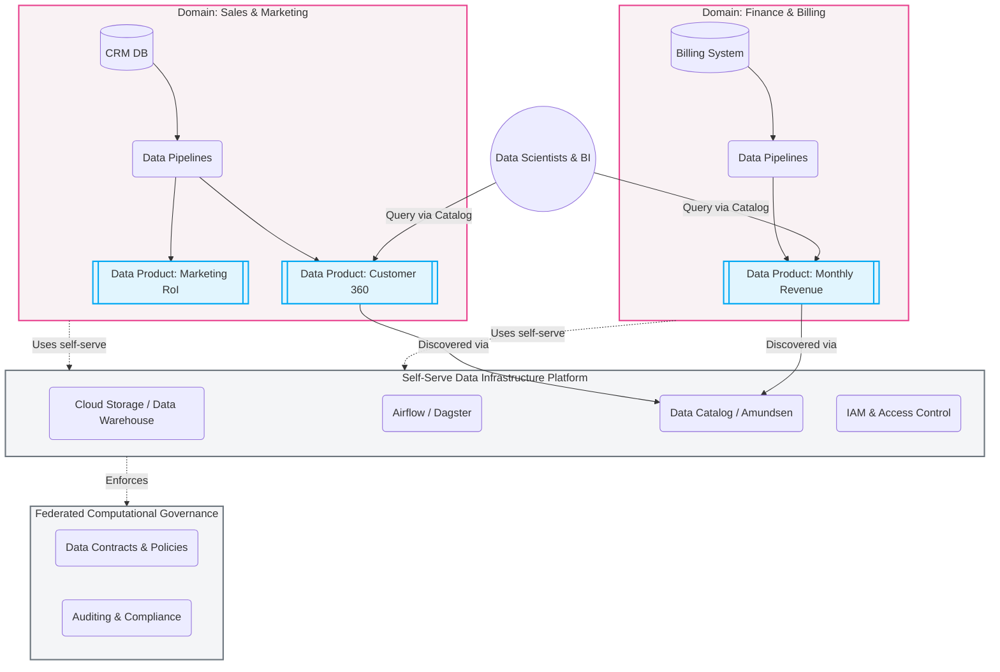
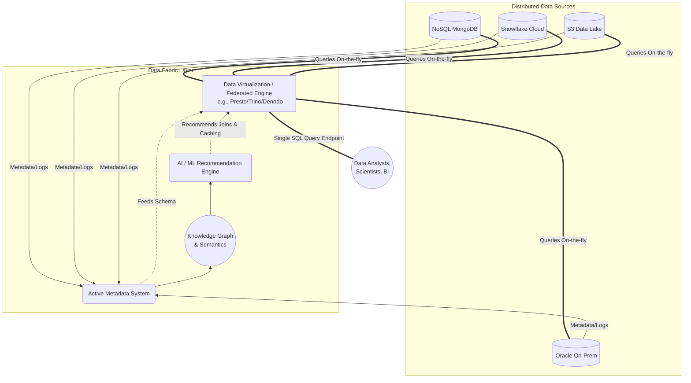

Hai thuật ngữ "Data Mesh" và "Data Fabric" thường bị các nhân viên Sales của các hãng công nghệ hoặc vendor trộn lẫn vào nhau để bán phần mềm giải pháp (buzzwords). Tuy nhiên, đối với một Data Engineer hay Software/System Architect, đây là hai triết lý kiến trúc hoàn toàn khác biệt: Một phương pháp giải quyết vấn đề bằng **Tổ chức con người và phân quyền (Organizational Decentralization)**, phương pháp kia lại giải quyết bằng **Sức mạnh công nghệ và tự động hóa (Technological Automation)**.

Trong bài viết chuyên sâu này, chúng ta sẽ mổ xẻ tận gốc rễ của cả hai kiến trúc, từ lý thuyết thiết kế hệ thống, các nguyên lý cốt lõi, ví dụ code thực tế, cho đến việc làm thế nào để tích hợp cả hai vào một hệ thống dữ liệu doanh nghiệp quy mô hàng Petabyte.

---

## 1. Sự Khủng Hoảng Của Kiến Trúc Monolithic Dữ Liệu Tầm Trung

Trước khi đi sâu vào Data Mesh và Data Fabric, chúng ta cần hiểu tại sao kiến trúc hiện tại lại bộc lộ những điểm yếu chết người, từ đó sinh ra nhu cầu về những kiến trúc mới.

Xuyên suốt thập kỷ qua, thế giới Data Engineering được thống trị bởi hai mô hình trung tâm (Centralized Monolithic Architectures):
1. **Data Warehouse (EDW):** Tất cả dữ liệu có cấu trúc từ nhiều hệ thống nguồn (OLTP) được làm sạch, chuyển đổi bằng quá trình ETL (Extract, Transform, Load) chuyên sâu rồi đẩy vào một kho dữ liệu trung tâm như Teradata, Snowflake, hay BigQuery.
2. **Data Lake:** Nhằm khắc phục tính cứng nhắc của Data Warehouse, dữ liệu thô (có cấu trúc, bán cấu trúc, phi cấu trúc) được đổ thẳng (ELT) vào Data Lake (HDFS, Amazon S3, GCS). Từ đó các Data Scientist mới tự khám phá.

Tuy nhiên, dù là Warehouse hay Lake, quy trình vẫn là tập trung toàn bộ dữ liệu vào một nơi và giao cho một **Central Data Team** (đội ngũ Dữ liệu Trung tâm) quản lý.

**Điểm Nghẽn (The Bottleneck) Bắt Đầu Xuất Hiện:**
* **Disconnect from Domain (Xa rời nghiệp vụ):** Đội ngũ Data Engineer ở trung tâm phải xử lý dữ liệu của mọi phòng ban từ Marketing (Google Ads), HR (Workday), Sales (Salesforce), đến Logistics (SAP). Nhưng họ lại không hiểu ý nghĩa thực sự của một cột dữ liệu chuyên ngành HR.
* **Agility Drop (Giảm tính linh hoạt):** Mỗi lần phòng Sales cần thêm một cột vào báo cáo, họ phải tạo ticket Jira và chờ team Data Engineer làm ETL pipeline. Quá trình này có thể kéo dài hàng tuần.
* **Quality Degradation (Suy giảm chất lượng):** Khi hệ thống nguồn thay đổi (ví dụ dev đổi tên cột `user_id` thành `customer_id` trong MySQL), pipeline ETL vỡ (broken). Đội Data Team lại phải mất hàng giờ debug một hệ thống mà họ không nắm gốc rễ.

Đứng trước sự khủng hoảng đó, Data Mesh và Data Fabric ra đời.

---

## 2. Data Mesh: Sự Phân Quyền Và Tái Cấu Trúc Đội Ngũ (Decentralization)

Được giới thiệu bởi Zhamak Dehghani (ThoughtWorks) vào năm 2019, **Data Mesh** không phải là một công nghệ hay phần mềm cụ thể. Nó là một **paradigm shift (bước ngoặt mô hình)** kết hợp giữa khái niệm *Domain-Driven Design (DDD)* của Software Engineering áp dụng vào hệ thống Data.

Thay vì gom tất cả dữ liệu về trung tâm, Data Mesh trả quyền sở hữu (ownership) dữ liệu về lại cho các phòng ban tạo ra chúng (Domain). 

### 2.1. Bốn Nguyên Lý Cốt Lõi Của Data Mesh

#### A. Domain-Oriented Decentralization (Phân tán theo miền nghiệp vụ)
Mỗi miền (Domain) kinh doanh như Sales, HR, Logistics... sẽ sở hữu một hệ sinh thái dữ liệu riêng biệt. Thay vì đẩy dữ liệu thô vào Data Lake để mặc team Data Trung Tâm tự xử lý, team Logistics giờ đây tự tuyển dụng Data Engineer hoặc Analytics Engineer của riêng mình. Họ sẽ trực tiếp làm sạch và cung cấp dữ liệu Logistics.

#### B. Data as a Product (Dữ liệu là một sản phẩm)
Đây là sự thay đổi về tư duy cực kỳ lớn. Dữ liệu đầu ra của mỗi domain không chỉ là một bảng trong database, nó là một **Sản Phẩm (Product)**. Những người dùng dữ liệu (Data Consumers - như Data Scientists, BI Analysts) là **Khách hàng**.
Để dữ liệu thực sự là một sản phẩm, nó phải đáp ứng các tiêu chuẩn DATSIS:
* **D**iscoverable (Dễ dàng tìm thấy)
* **A**ddressable (Có địa chỉ định danh duy nhất)
* **T**rustworthy (Đáng tin cậy)
* **S**ecure (Bảo mật)
* **I**nteroperable (Tương thích)
* **S**elf-describing (Tự mô tả tốt thông qua schema/metadata)

#### C. Self-serve Data Infrastructure as a Platform (Hạ tầng dữ liệu tự phục vụ)
Để các domain tự xây dựng Data Product mà không phải xây lại từ đầu hạ tầng (storage, compute, pipeline orchestration), cần một Data Platform Team cung cấp công cụ dưới dạng self-service. Platform Team sẽ cung cấp dịch vụ như: "Chỉ cần 1 click để có một môi trường Spark cluster", hoặc "API để đăng ký một dbt project mới". Nền tảng này ẩn đi sự phức tạp của hạ tầng (infrastructure abstraction).

#### D. Federated Computational Governance (Quản trị vận hành liên kết)
Việc phân tán quyền lực dễ dẫn đến tình trạng hỗn loạn (Data Silos) nếu không có luật lệ chung. Do đó, cần một hội đồng (Federated Governance) để thống nhất các chuẩn mực giao tiếp dữ liệu (ví dụ: định dạng thời gian ISO 8601, mã hóa PII - Personally Identifiable Information) được thực thi tự động qua các script (computational).

### 2.2. Kiến Trúc Data Mesh (Mermaid Visualization)



### 2.3. Hiện Thực Hóa Data Product Bằng Data Contract (Hợp Đồng Dữ Liệu)

Một trong những cơ chế để áp dụng Data Mesh thành công là sử dụng **Data Contracts**. Thay vì code pipeline mong manh, domain tạo ra data quy định rõ schema (cấu trúc) bằng các file YAML (YAML driven development).

Ví dụ một **Data Contract** cho Data Product "Monthly Revenue" của phòng Tài Chính:

```yaml
# data_contract.yaml
data_product: monthly_revenue
owner: team-finance@company.com
domain: finance
version: "1.2.0"

dataset:
  name: core_revenue_monthly
  type: table
  database: "snowflake_prod_finance"
  schema: "data_products"

schema:
  columns:
    - name: billing_month
      type: date
      description: "Ngày đầu tiên của tháng báo cáo (e.g., 2026-01-01)"
      is_primary_key: true
    - name: total_revenue_usd
      type: decimal(18,2)
      description: "Tổng doanh thu đã ghi nhận bằng USD"
      tests:
        - not_null
        - value_is_positive
    - name: active_subscribers
      type: integer
      description: "Số lượng khách hàng active trong tháng"

service_level_agreement: (SLA)
  freshness: "Data is updated monthly by 3rd day of the next month at 08:00 UTC."
  availability: "99.9%"
```

Công cụ CI/CD (GitHub Actions) sẽ đọc file này, kiểm tra định dạng và liên kết với schema registry hoặc dbt để đảm bảo **Federated Governance** ngay từ lúc code được push.

---

## 3. Data Fabric: Tấm Lưới Tự Động Hóa Qua Sức Mạnh Siêu Dữ Liệu

Nếu Data Mesh giải bài toán qua góc độ "Tổ chức lại ai là người làm", thì **Data Fabric** giải bài toán qua góc độ "Dùng công nghệ để kết nối mọi thứ". Được Gartner quảng bá mạnh mẽ từ năm 2021, Data Fabric là một khái niệm thuần về **Architecture Framework** kết hợp với **AI/ML**.

### 3.1. Ý Tưởng Chủ Đạo Của Data Fabric

Trong thế giới thực, doanh nghiệp không thể gom hết data vào một chỗ, cũng không thể chia để trị hoàn hảo ngay được. Data nằm phân tán trên S3 (AWS), Blob Storage (Azure), PostgresSQL (On-premise), Snowflake (Cloud Data Warehouse), và MongoDB (NoSQL).

Data Fabric đóng vai trò là một **màng lưới thông minh (fabric/layer)** phủ lên tất cả hệ thống lưu trữ phân tán này. Nó không yêu cầu bạn phải sao chép dữ liệu (copy/ETL) về một nơi. Thay vào đó, nó tạo ra một điểm truy cập hợp nhất cho toàn bộ hệ thống bằng công nghệ **Data Virtualization (Ảo hóa dữ liệu)** và hướng dẫn bằng **Active Metadata**.

### 3.2. Bốn Trụ Cột Kỹ Thuật Của Data Fabric

1. **Active Metadata (Siêu dữ liệu chủ động):** Không giống như Data Catalog thông thường chỉ thụ động chờ người dùng điền thông tin mô tả, hệ thống Active Metadata liên tục phân tích log truy vấn (query logs), đo lường mức độ sử dụng tài nguyên để tự động trích xuất thông tin cấu trúc và dòng chảy (data lineage).
2. **Knowledge Graph (Đồ thị tri thức):** Sử dụng các cơ sở dữ liệu đồ thị (như Neo4j) để mô hình hóa mối quan hệ giữa các dữ liệu. Hệ thống sẽ nhận ra rằng bảng `clients` trong Oracle và `customers` trong S3 thực chất đang đề cập đến cùng một thực thể "Khách Hàng".
3. **AI/ML Augmented Data Integration:** Dựa vào Knowledge Graph và Active Metadata, hệ thống AI sẽ phân tích thói quen query. Nếu AI thấy người dùng thường xuyên JOIN bảng `orders` ở Redshift với `users` ở S3, hệ thống sẽ tự động đề xuất tạo một view ảo hoặc tự động cache dữ liệu vào lớp trung gian để tăng tốc độ.
4. **Data Virtualization (Ảo hóa dữ liệu):** Một engine truy vấn phân tán (Federated Query Engine) cho phép người dùng viết một lệnh SQL duy nhất để query dữ liệu nằm ở nhiều database khác nhau mà không cần làm ETL.

### 3.3. Kiến Trúc Data Fabric (Mermaid Visualization)



### 3.4. Triển Khai Kỹ Thuật: Ảo Hóa Dữ Liệu Bằng Trino (Presto)

Một trong những công cụ Open-source nổi tiếng nhất để thực hiện trụ cột Data Virtualization của Fabric là **Trino (trước đây là PrestoSQL)** - engine ban đầu được phát triển bởi Facebook.

Với Trino, Data Analyst không cần biết dữ liệu thực sự nằm ở đâu, họ chỉ kết nối vào một endpoint JDBC/ODBC duy nhất của Trino và chạy query federated (liên kết đa nguồn):

```sql
-- Ví dụ: Truy vấn Federated Query bằng Trino trong kiến trúc Data Fabric
-- Câu lệnh kết hợp dữ liệu từ PostgreSQL, Hive S3 và Kafka mà không cần pipeline ETL trước đó.

SELECT 
    p.customer_name,           -- Lấy từ Hệ thống CRM (PostgreSQL)
    SUM(h.total_amount) as spent, -- Lấy từ Data Lake lịch sử (Hive/S3)
    k.latest_event             -- Lấy log streaming real-time (Kafka)
FROM postgresql.crm.customers p
LEFT JOIN hive.datalake.sales_history h 
    ON p.customer_id = h.cust_id
LEFT JOIN kafka.realtime.website_clicks k
    ON p.customer_id = k.user_id
WHERE h.transaction_date > DATE '2026-01-01'
GROUP BY 1, 3
ORDER BY 2 DESC;
```
Nhờ cơ chế Pushdown Predicates, Trino sẽ chỉ đẩy các điều kiện `WHERE` xuống dưới database gốc, do đó tiết kiệm băng thông và tăng tốc xử lý cực nhanh, biến hệ thống rải rác thành một mặt phẳng dữ liệu duy nhất.

---

## 4. So Sánh Cốt Lõi: Data Mesh vs Data Fabric

Để phân biệt rạch ròi hai mô hình này, chúng ta sẽ xem xét qua các lăng kính: Bản chất, Trọng tâm thiết kế, và Công nghệ.

| Tiêu chí | Data Mesh (Chia để trị) | Data Fabric (Lưới kết nối thông minh) |
| :--- | :--- | :--- |
| **Bản chất cốt lõi** | Mô hình **tổ chức (Organizational)** kết hợp kiến trúc phân tán. Thay đổi cấu trúc team và quy trình làm việc (Culture shift). | Giải pháp **công nghệ (Technological)** được điều khiển bởi Metadata và AI. Lớp phần mềm thông minh nằm trên hạ tầng có sẵn. |
| **Phương pháp giải quyết** | Phân quyền sở hữu dữ liệu cho các Domain Experts (HR, Sales...). | Tự động hóa quá trình tích hợp bằng Machine Learning và Data Virtualization. |
| **Quản trị dữ liệu (Governance)** | **Federated** - Các quy chuẩn được áp đặt từ trên xuống qua một nền tảng chung, nhưng quyền thực thi thuộc về domain. | **Centralized / Automated** - Tự động nhận diện dữ liệu nhạy cảm (PII), tự động mã hóa thông qua Active Metadata. |
| **Cách xử lý dữ liệu vật lý** | Thúc đẩy việc xử lý và làm sạch dữ liệu trong pipeline của từng Domain. Tạo Data Product ở các storage tương ứng. | Giảm thiểu việc sao chép/di chuyển dữ liệu (No-ETL/Zero-ETL). Sử dụng ảo hóa (Virtualization) để truy cập on-the-fly. |
| **Công nghệ tiêu biểu** | Dựa nhiều vào công nghệ hiện có: Cloud Data Warehouses (BigQuery/Snowflake), dbt, Data Catalog (Datahub), CI/CD. | Trino/Presto, Dremio, Denodo, IBM Cloud Pak for Data, Informatica, Neo4j (Knowledge graph). |
| **Vai trò của AI/ML** | Không yêu cầu hoặc đóng vai trò phụ trong kiến trúc gốc. | **Cực kỳ quan trọng.** AI phân tích metadata để tự động gợi ý cách thiết lập quan hệ dữ liệu. |

---

## 5. Sự Kết Hợp Tối Thượng: Triển Khai Data Mesh Trực Tiếp Trên Nền Data Fabric

Thực tế doanh nghiệp hiện đại chỉ ra rằng: **Bạn không cần (và không nên) phải chọn một trong hai.** Chúng là hai mặt của một đồng xu hoàn hảo trong System Design dữ liệu.

Data Mesh tập trung vào *con người và quy trình tạo ra dữ liệu*. Data Fabric tập trung vào *công nghệ kỹ thuật để liên kết và khám phá dữ liệu*.

**Kiến trúc hợp nhất (Synergistic Architecture):**
1. **Data Mesh tạo ra lớp nội dung có ý nghĩa:** Chuyển đổi công ty sang cấu trúc Domain. Cho phép team E-commerce, Supply Chain xây dựng Data Product bằng công cụ ưa thích của họ. Tuy nhiên, nếu thiếu đi công nghệ kết nối, các Data Product này dễ rơi vào tình trạng phân mảnh (fragmentation).
2. **Data Fabric đóng vai trò là "Nền tảng Tự phục vụ" (Self-Serve Data Infrastructure) của Data Mesh:** Thay vì phải xây dựng hệ thống nền tảng bằng tay cực nhọc, Data Fabric cung cấp sẵn lớp Data Virtualization và Active Metadata. 
   - Một Data Scientist có thể thông qua Data Fabric (với AI Knowledge Graph) để dễ dàng tìm kiếm (Discoverable) thấy Data Product "Monthly Revenue" của team Finance trong mạng lưới Data Mesh.
   - Nhờ Data Virtualization của Fabric, họ có thể Join Data Product của Finance với Data Product của Sales một cách mượt mà mà không phải thực hiện ETL phiền hà.

---

## 6. Bài Học Thực Tế Từ Các Tập Đoàn Lớn (Case Studies)

### 6.1. Zalando và Netflix (Thiên hướng Data Mesh)
**Zalando** (Gã khổng lồ thương mại điện tử châu Âu) là một trong những công ty áp dụng Data Mesh sớm nhất. Họ chuyển đổi từ kiến trúc Data Lake khổng lồ tập trung sang việc trao quyền lại cho hàng trăm microservices team. Mỗi team tự định nghĩa schema, bảo vệ chất lượng dữ liệu và xuất bản (publish) lên một Central Data Catalog dưới định dạng chuẩn hóa.

**Netflix** áp dụng triết lý Data Mesh một phần thông qua kiến trúc **Data Gateway**. Họ định nghĩa dữ liệu là một API (Data as an API). Bằng cách sử dụng GraphQL layer như một dạng Federated Governance, Netflix cho phép mọi team kỹ thuật (từ recommendation, streaming platform đến billing) đóng góp vào một hệ sinh thái dữ liệu chung nhưng vẫn tự chủ hoàn toàn về database (Cassandra, CockroachDB, hay S3) của họ.

### 6.2. Hệ Thống Ngân Hàng Tài Chính Legacy (Thiên hướng Data Fabric)
Trong khối ngân hàng truyền thống, việc tái cơ cấu nhân sự theo Data Mesh là vô cùng rủi ro và phức tạp về mặt chính trị (Office Politics). Thêm vào đó, dữ liệu của họ bị khóa chặt trong các mainframe cũ (như IBM DB2) tồn tại hơn 20 năm, bên cạnh các hệ thống CRM mới trên Cloud.
Thay vì bắt các phòng ban phải tự viết pipeline sinh ra Data Product (vượt quá khả năng nhân sự của phòng ban đó), ngân hàng sử dụng **Data Fabric (như Denodo hay IBM Cloud Pak)**. Họ xây dựng một lớp ảo hóa ở trên cùng, kết nối trực tiếp đến Mainframe và Cloud Database. Bằng Active Metadata, hệ thống Fabric tự động phân tích và tạo ra lớp ngữ nghĩa (Semantic layer) thống nhất mà hầu như không ảnh hưởng tới các hệ thống Legacy đang chạy các giao dịch tài chính nhạy cảm.

---

## 7. Tổng Kết Kiến Trúc Dữ Liệu Tương Lai

Lịch sử kiến trúc hệ thống dữ liệu (Data Architecture) đang diễn ra tương tự như sự tiến hóa của kiến trúc phần mềm (Software Engineering).
Chúng ta đã đi từ Monolithic Applications sang Microservices. Giờ đây, thế giới Data đang đi từ **Monolithic Data Warehouse/Data Lake** sang những hệ thống phân tán, phi tập trung và vi dịch vụ hóa (Micro-oriented).

* **Hãy chọn Data Mesh** làm triết lý định hướng nếu tổ chức của bạn đang bị "thắt cổ chai" bởi đội ngũ Data Engineer trung tâm quá tải, và bạn sở hữu các phòng ban (Domain) có năng lực về kỹ thuật đủ lớn để tự quản lý vòng đời dữ liệu.
* **Hãy chọn Data Fabric** làm nền tảng công nghệ nếu hệ thống của bạn nằm trên quá nhiều môi trường hỗn tạp (On-premise, Hybrid Cloud, Multi-Cloud), và bạn muốn giải bài toán truy cập, tích hợp dữ liệu nhanh nhất có thể dựa vào sức mạnh của AI/ML và ảo hóa, thay vì tái cấu trúc lại bộ máy nhân sự.

Trong dài hạn, những Data Platform hiện đại nhất (như hệ sinh thái của Databricks, Snowflake) đang nỗ lực hỗ trợ doanh nghiệp **hiện thực hóa cả hai**. Việc xây dựng một **Data Mesh** được gia tốc bởi sức mạnh tự động hóa của lưới **Data Fabric** chính là kiến trúc tiêu chuẩn (Gold Standard) cho mọi hệ thống phân tích dữ liệu quy mô lớn trong thập kỷ tới.

---
## Tài Liệu Tham Khảo (Đọc thêm để luyện thi System Design)
* [Data Mesh Principles and Logical Architecture - Zhamak Dehghani (ThoughtWorks)](https://martinfowler.com/articles/data-mesh-principles.html)
* [System Design Interview - Alex Xu (Vol 1 & 2)](https://bytebytego.com/)
* [Designing Data-Intensive Applications - Martin Kleppmann (Part 3: Derived Data)](https://dataintensive.net/)
* [Gartner: Top 10 Data and Analytics Trends (Data Fabric Focus)](https://www.gartner.com/)
* **Uber Architecture and System Design**
* **Netflix Technology Blog: System Architecture**
