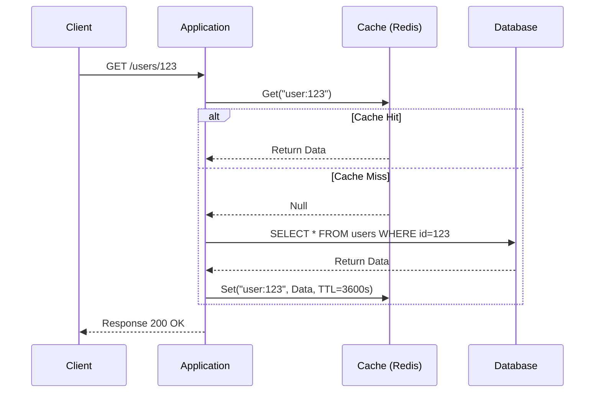
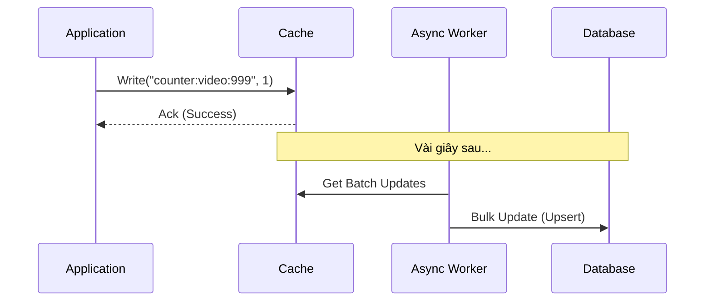
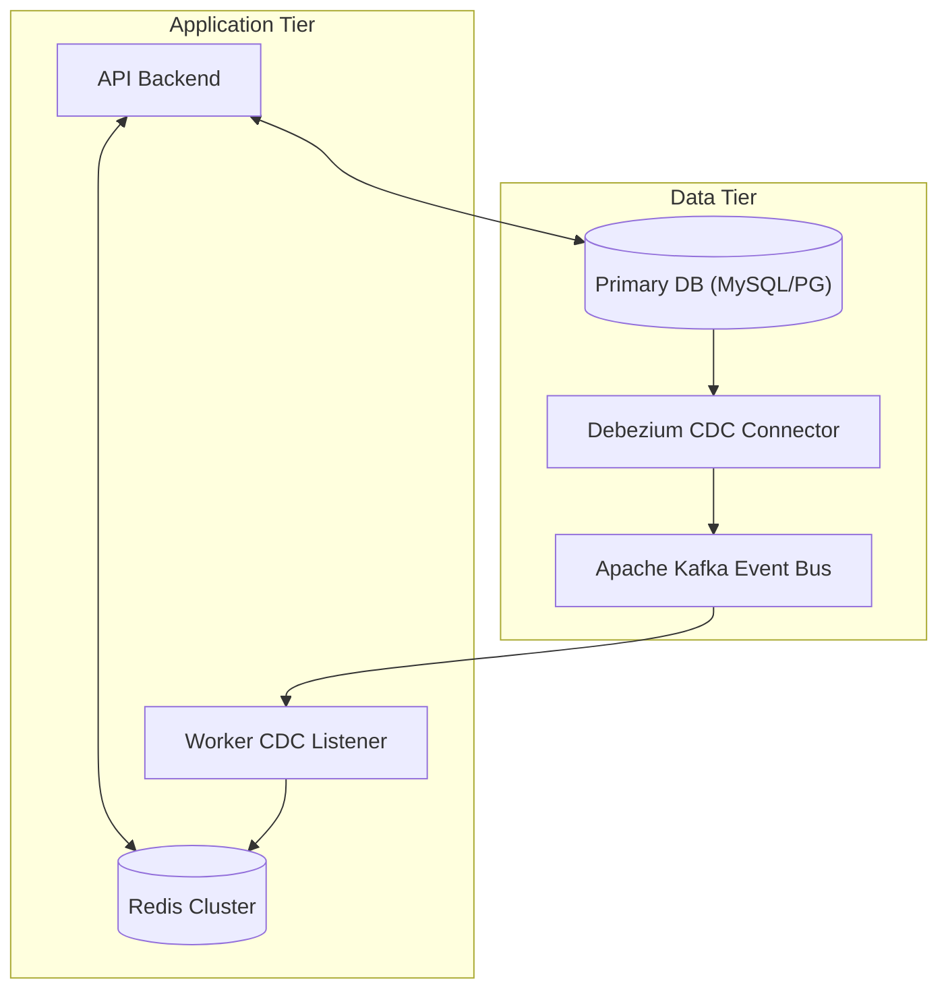

Trong các hệ thống phân tán (Distributed Systems) quy mô lớn, việc xử lý hàng chục ngàn, thậm chí hàng triệu yêu cầu (requests) mỗi giây là một thách thức khổng lồ. Cơ sở dữ liệu quan hệ (RDBMS) như PostgreSQL hay MySQL thường trở thành nút thắt cổ chai (bottleneck) do những giới hạn về I/O trên đĩa cứng (Disk I/O) và chi phí tính toán khi thực thi các truy vấn phức tạp. Để giải quyết bài toán độ trễ (latency) và băng thông (throughput), **Distributed Caching (Cache Phân Tán)** là một trong những vũ khí tối thượng và bắt buộc phải có trong kho tàng System Design của mọi kỹ sư phần mềm và Data Engineer.

Bài viết này không chỉ dừng lại ở các khái niệm cơ bản, mà sẽ đi sâu vào thiết kế kiến trúc, các chiến lược đọc/ghi dữ liệu, xử lý các hiện tượng cực đoan (Cache Stampede, Cache Avalanche, Cache Penetration), và các phương pháp đảm bảo tính nhất quán dữ liệu giữa Cache và Database.

---

## 1. Bản Chất Của Caching Trong Hệ Thống Phân Tán

Cache là việc tận dụng bộ nhớ có tốc độ truy xuất siêu tốc (thường là RAM) để lưu trữ tạm thời các dữ liệu thường xuyên được sử dụng (hot data) hoặc kết quả của các tác vụ tính toán tốn kém. Trong một hệ thống phân tán, Distributed Cache bao gồm nhiều máy chủ (nodes) kết nối với nhau để tạo thành một khối lưu trữ đồng nhất và khổng lồ. 

Việc triển khai cache làm giảm số vòng đời I/O (I/O cycles), giảm tải cho cơ sở dữ liệu chính, và hạ thấp độ trễ từ hàng chục *milliseconds* (ms) xuống chỉ còn vài *microseconds* (µs). Bằng cách thiết lập bộ đệm (cache), hệ thống có khả năng mở rộng (scale) một cách linh hoạt, đáp ứng những đợt tăng vọt lưu lượng truy cập (spikes traffic) mà không đánh sập hệ cơ sở dữ liệu nền tảng.

---

## 2. Các Chiến Lược Giao Tiếp Dữ Liệu (Caching Patterns)

Làm sao để ứng dụng (Application), Cache và Cơ sở dữ liệu (Database) làm việc ăn ý với nhau? Việc thiết kế quy trình luân chuyển dữ liệu quyết định trực tiếp tới tính nhất quán (Consistency) và hiệu suất (Performance) của hệ thống. Dưới đây là những Pattern kinh điển nhất:

### 2.1. Cache-Aside (Lazy Loading)

Đây là pattern phổ biến nhất và an toàn nhất (mặc định trong nhiều hệ thống). Ứng dụng (Application code) đóng vai trò điều phối chính: nó tự giao tiếp độc lập với cả Cache và Database.

**Luồng hoạt động (Read):**
1. Ứng dụng truy vấn dữ liệu từ Cache.
2. Nếu có dữ liệu (**Cache Hit**), ứng dụng trả về ngay cho client.
3. Nếu không có (**Cache Miss**), ứng dụng truy vấn Database để lấy dữ liệu.
4. Sau khi có dữ liệu từ Database, ứng dụng lưu bản sao vào Cache (thường kèm theo thời gian hết hạn TTL) và trả về kết quả.

**Luồng hoạt động (Write):**
1. Ứng dụng ghi (Update/Insert) trực tiếp vào Database.
2. Ứng dụng xóa (Invalidate/Evict) hoặc cập nhật key tương ứng trong Cache. Khuyến nghị phổ biến là **xóa (delete)** thay vì cập nhật (update) để tránh tình trạng Race Condition trong môi trường đồng thời (Concurrency).



**Ưu điểm:** 
- Rất dễ triển khai và có khả năng chống chịu lỗi tốt (Resilient). Nếu Cache sập, ứng dụng vẫn có thể fallback về Database (tuy nhiên nếu traffic quá cao sẽ gây sập DB).
- Chỉ những dữ liệu thực sự cần thiết mới được lưu (Lazy Loading), tối ưu không gian lưu trữ RAM đắt đỏ.

**Nhược điểm:**
- Request đầu tiên bị chậm vì phải đi hai vòng (Cache Miss Penalty).
- Đòi hỏi phải xử lý logic phức tạp ở tầng Application. Dữ liệu có thể bị "stale" (cũ) nếu chiến lược xoá cache bị lỗi.

### 2.2. Read-Through Cache

Gần giống Cache-Aside, nhưng ứng dụng không tự cập nhật Cache. Thay vào đó, nó giao tiếp với một thư viện (hoặc layer trung gian - data provider) chịu trách nhiệm che giấu sự tồn tại của DB. Ứng dụng chỉ biết gọi `Cache.get(key)`. Cache layer tự động query xuống DB nếu Miss và cập nhật chính nó. Kiến trúc này giúp mã nguồn ứng dụng sạch sẽ và tập trung hơn (Separation of Concerns).

### 2.3. Write-Through Cache

Ứng dụng chỉ ghi dữ liệu vào Cache, sau đó Cache (hoặc data access layer) lập tức ghi một cách **đồng bộ (synchronously)** xuống DB. Chỉ khi cả hai tác vụ ghi này thành công, request mới được phản hồi cho người dùng.

**Ưu điểm:**
- Đảm bảo nhất quán dữ liệu (Strong Consistency) giữa Cache và DB. Không có khái niệm Stale Data.
- Khi kết hợp với Read-Through, dữ liệu trong Cache luôn được làm mới sẵn cho lần đọc kế tiếp.

**Nhược điểm:**
- Tốc độ ghi (Write Latency) chậm đi rất nhiều do phải thực hiện hai thao tác I/O đồng bộ (ghi vào RAM và ghi vào Disk DB).

### 2.4. Write-Behind (Write-Back)

Tối thượng cho băng thông ghi (High Write Throughput). Ứng dụng ghi vào Cache và trả về "Thành công" lập tức cho người dùng. Phía sau, một tiến trình chạy ngầm (Asynchronous worker/thread) sẽ gom các bản cập nhật thành các lô (Batches) và đẩy dần xuống Database.



**Ưu điểm:**
- Khả năng ghi siêu tốc. Hoàn hảo cho các hệ thống đếm lượt xem (View counters), like bài viết, IoT sensor data, phân tích click-stream.
- Giảm tải DB nhờ việc gộp nhiều thao tác ghi cùng một item thành một truy vấn (Batching/Coalescing).

**Nhược điểm:**
- **Rủi ro mất dữ liệu (Data Loss):** Nếu node Cache bị mất điện hoặc crash trước khi kịp flush xuống DB, dữ liệu sẽ ra đi vĩnh viễn. Cần kết hợp các kỹ thuật persistence (như AOF của Redis) để giảm thiểu rủi ro nhưng vẫn tiềm ẩn nguy hiểm.

---

## 3. Các Hiểm Họa và Cơn Ác Mộng Của Hệ Thống Caching

Trong thực tế, khi hệ thống đạt mốc hàng triệu concurrent users, những hiện tượng vật lý trong khoa học máy tính bắt đầu bộc lộ các yếu điểm chí mạng. Nếu không lường trước, hệ thống Cache của bạn sẽ chính là nguyên nhân làm sập toàn bộ kiến trúc.

### 3.1. Cache Stampede (Thundering Herd - Hiệu Ứng Giẫm Đạp) / Cache Breakdown

**Kịch bản:** Bạn có một key siêu "nóng" (Hot Key) như danh sách sản phẩm Flash Sale, hoặc dữ liệu trận chung kết World Cup. Key này được thiết lập TTL là 10 phút. Ngay khi đồng hồ điểm phút thứ 10, key bị hết hạn (Expired) và bốc hơi khỏi Cache. Cùng mili-giây đó, 100,000 requests ập vào, tất cả đều nhận được kết quả **Cache Miss**. Application ngay lập tức tạo 100,000 kết nối chọc thẳng xuống Database để thực thi cùng một câu query tính toán nặng nề. Database sụp đổ ngay tắp lự (OOM hoặc Connection Timeout).

**Cách giải quyết:**

1. **Khóa Độc Quyền (Mutex Lock / Singleflight Pattern):**
   Khi một request gặp Cache Miss, nó phải lấy được một phân bổ (Lock/Mutex) phân tán trong Redis (sử dụng lệnh `SETNX` - Set if Not eXists). Chỉ request lấy được lock mới được phép xuống DB. 99,999 requests còn lại sẽ bị bắt "ngủ" (Sleep) trong khoảng vài chục milliseconds, sau đó thức dậy và kiểm tra lại Cache, lúc này dữ liệu đã được request đầu tiên nạp vào.
   
   ```go
   // Pseudo code for Singleflight / Distributed Mutex Lock
   func GetData(key string) (Data, error) {
       // Bước 1: Thử lấy từ Cache
       val := cache.Get(key)
       if val != nil {
           return val, nil
       }
       
       // Bước 2: Cache Miss -> Thử lấy Lock
       lockKey := key + ":lock"
       // SetNX trả về true nếu key chưa tồn tại và tạo thành công
       if cache.SetNX(lockKey, 1, 5*time.Second) { 
           defer cache.Delete(lockKey) // Luôn giải phóng lock khi xong
           
           // Chỉ duy nhất 1 luồng được vào đây
           data := db.Query(key) // Fetch từ Database (Nặng)
           cache.Set(key, data, TTL)
           return data, nil
       } else {
           // Không lấy được Lock -> Chờ một chút và thử lại
           time.Sleep(50 * time.Millisecond)
           return GetData(key) // Gọi đệ quy hoặc dùng vòng lặp
       }
   }
   ```

2. **Probabilistic Early Expiration (PER - XFetch):**
   Thay vì đợi đến đúng thời điểm hết hạn và gây ra "bão", ứng dụng sẽ tung xúc xắc với một thuật toán xác suất. Nếu thời gian gần đến lúc hết hạn, thuật toán sẽ cho phép một request duy nhất (chạm ngưỡng ngẫu nhiên) tự động đi fetch dữ liệu từ DB để cập nhật Cache ở Background (Ngầm) ngay cả khi dữ liệu hiện tại vẫn còn có thể sử dụng được. Người dùng vẫn nhận được dữ liệu cũ trong lúc dữ liệu mới đang được fetch.

### 3.2. Cache Penetration (Xuyên Thủng Cache)

**Kịch bản:** Kẻ tấn công (Hacker) cố tình tạo hàng triệu request với các `id` **không hề tồn tại** (ví dụ: `GET /user/-1`, hoặc chèn các UUID rác liên tục). Vì `id` không tồn tại, nó không bao giờ có trong Cache (Cache Miss). Ứng dụng lao xuống DB tìm kiếm nhưng cũng không thấy. Do không tìm thấy, nó chả có gì để lưu vào Cache. 
Kết quả: Một vòng lặp tử thần. Mọi request chứa `id` rác đều bay thẳng xuyên qua Cache và đập thẳng vào DB, gây kiệt quệ tài nguyên.

**Cách giải quyết:**
1. **Cache Null/Empty Values:** Cực kỳ đơn giản nhưng hiệu quả. Ngay cả khi kết quả DB trả về rỗng, hãy lưu một đối tượng đại diện "Null" hoặc "{}" vào Cache với một TTL ngắn (VD: 60 giây). Request độc hại tiếp theo cho `id` đó sẽ trúng Cache Hit ở giá trị Null và bị ứng dụng từ chối ở ngay vòng gửi xe (trả về 404).
2. **Bloom Filter (Cấu trúc dữ liệu xác suất):** Nâng cao hơn, ta lưu trữ dấu vân tay của tất cả `id` hợp lệ vào một Bloom Filter (được host trên RAM hoặc ngay trong Redis). Khi một request tới, ứng dụng hỏi Bloom Filter: "ID này có tồn tại trong hệ thống không?". Đặc tính của Bloom Filter là siêu tiết kiệm bộ nhớ (hàng tỉ keys chỉ mất vài trăm MB) và trả lời cực nhanh. Nếu Bloom Filter trả lời "Chắc chắn Không", ứng dụng chặn đứng request lập tức. Nếu trả lời "Có thể Có", request mới được đi tiếp.

### 3.3. Cache Avalanche (Tuyết Lở)

**Kịch bản:** Đội ngũ kỹ sư tiến hành deploy một tính năng mới, pre-warm (nạp sẵn) vào Cache 1 triệu keys lúc 12:00 PM và tất cả đều set cùng một mức `TTL = 1 giờ`. Đúng 1:00 PM, 1 triệu keys đồng loạt hết hạn (Expired) trong cùng một giây. Hàng triệu truy vấn bị Cache Miss trải đều trên mọi dữ liệu, tạo ra một cơn sóng thần đè bẹp cả Network Bandwidth lẫn Database. Nặng nề hơn cả Thundering Herd vì nó xảy ra trên diện rộng toàn bộ dữ liệu.

**Cách giải quyết:**
1. **Thêm Random Jitter vào TTL:** Khắc cốt ghi tâm nguyên tắc: Không bao giờ set TTL là một hằng số cố định cho hàng loạt dữ liệu. Hãy cộng/trừ một khoảng thời gian ngẫu nhiên.
   `TTL = Base_TTL + Random(0, 300) seconds`. Điều này khiến các keys hết hạn rải rác một cách mềm mại (smooth decay), tránh hiệu ứng giật sập cục bộ.
2. **Circuit Breaker (Cầu dao tự ngắt) & Fallback:** Sử dụng các thư viện như Resilience4j hoặc Hystrix. Nếu hệ thống nhận thấy DB phản hồi quá chậm (thường xuyên timeout), nó sẽ kích hoạt trạng thái "Mở cầu dao", ngắt toàn bộ các request xuống DB và tự động trả về một giao diện Fallback (ví dụ: "Dịch vụ đang bận, xin thử lại sau") để câu giờ cho hệ thống phục hồi.

---

## 4. Nghệ Thuật Đồng Bộ Hóa Data (Cache Consistency)

Đảm bảo Cache và Database luôn đồng nhất là một trong những bài toán hóc búa nhất của Khoa học máy tính phân tán.

### 4.1. Vấn Đề Dual Writes & Race Condition
Khi Update Database, bạn Update hay Delete Cache? Nếu có hai requests đồng thời (A và B) cùng cập nhật một bản ghi (row):
- Request A update DB (Giá sản phẩm = 10$)
- Request B update DB (Giá sản phẩm = 20$)
- Request B update Cache (Giá = 20$)
- Request A bị trễ mạng (Network delay), nhảy vào chậm trễ và update Cache (Giá = 10$).
=> Kết quả: Database lưu giá trị mới chuẩn xác (20), nhưng Cache lưu giữ giá trị cũ (10). Từ đó về sau người mua sẽ mua hàng với giá 10$. Thảm hoạ! **Inconsistent!**

**Rule of Thumb (Nguyên tắc vàng):**
> **Luôn xóa (Invalidate/Delete) Cache thay vì Update nó sau khi ghi vào DB.** Việc Delete có tính "Idempotent" (an toàn khi lặp lại) cao hơn. (Đây là mô hình Cache-Aside kết hợp Delete). Tuy nhiên, cách này vẫn có tỉ lệ rất nhỏ gây lỗi nếu xảy ra "Delayed Read" xen kẽ.

### 4.2. Khắc Phục Bằng Change Data Capture (CDC) - Kiến trúc Event-Driven

Cách tiên tiến nhất và đảm bảo tính nhất quán cao nhất được áp dụng tại các Big Tech (Uber, Netflix, LinkedIn) là tách bạch hoàn toàn việc đọc và cập nhật. Ứng dụng chỉ biết ghi xuống Database và không đụng tay vào Cache. 

Họ sử dụng công cụ **Debezium** đứng lắng nghe (theo dõi) sự thay đổi của Database ở mức độ rất sâu (qua Binlog của MySQL hoặc Write-Ahead Log của PostgreSQL). Khi có bất kỳ row nào bị Insert/Update/Delete, Debezium phát ra một sự kiện (Event) đẩy vào **Apache Kafka**. Một cụm worker service (Cache Updater) lắng nghe Kafka và tiến hành cập nhật/xóa Cache một cách tuần tự (Ordered).


*Lợi ích:* 
- Tách biệt (Decoupling): Ứng dụng không phải lo việc gọi hàm xóa Cache bị thất bại do lỗi mạng tạm thời (Network glitch).
- Robustness: Mọi sự thay đổi DB đều được Kafka lưu giữ và đảm bảo Delivery (Retry-ability). Dù Redis sập 1 tiếng, khi bật lại Kafka sẽ tuần tự "phát lại" (replay) các updates giúp Cache bắt kịp hiện tại.

---

## 5. Phân Mảnh Dữ Liệu và Chiến Lược Trục Xuất (Eviction Policies)

Khi dung lượng của Cache đạt ngưỡng giới hạn bộ nhớ (ví dụ Max Memory 32GB) (OOM), nó buộc phải "hy sinh" xóa bớt các dữ liệu cũ để nhường chỗ cho dữ liệu nóng hổi mới.

### Các thuật toán Eviction phổ biến:
1. **LRU (Least Recently Used):** Xóa các mục lâu rồi không ai đụng đến (dựa trên thời điểm truy cập cuối). Phù hợp nhất cho đa số bài toán thực tế.
2. **LFU (Least Frequently Used):** Xóa các mục ít được truy cập nhất về mặt tổng số lần (tần suất). Khó cài đặt tối ưu hơn LRU vì chi phí bảo trì bộ đếm (counter).
3. **FIFO (First In First Out):** Xóa các mục được nạp vào sớm nhất. Rất ít hiệu quả vì một Hot key được nạp vào sớm cũng có thể bị đuổi ra oan uổng.
4. **W-TinyLFU:** Một thuật toán hiện đại, tối ưu đỉnh cao kết hợp sự phản xạ nhanh của LRU và tỉ lệ chính xác của LFU, hiện diện trong các thư viện in-memory cache nổi tiếng thế giới như Caffeine (Java) hay Ristretto (Go).

### Hashing và Phân Mảnh (Partitioning / Sharding)
Với một cụm Redis có 10 nodes (máy chủ), làm sao để ứng dụng biết key `"user:123"` nằm ở node số mấy?
- **Modulo Hashing:** Tính toán `Hash(key) % N` (N là số node). Thuật toán này rất tệ. Nếu bạn thêm hoặc bớt 1 node (N thay đổi), ví dụ từ 10 xuống 9, kết quả Modulo sẽ thay đổi hoàn toàn. Hầu như 90% keys sẽ bị tính toán sai vị trí dẫn đến Cache Miss toàn diện.
- **Consistent Hashing (Băm nhất quán):** Biểu diễn các nodes và keys trên một vòng tròn (Hash Ring) có chu vi từ $0$ đến $2^{32}-1$. Khi thêm hoặc xóa node, chỉ có một lượng rất nhỏ (khoảng 1/N) keys bị ảnh hưởng (chỉ di chuyển sang node kề cận tiếp theo).
- **Redis Cluster Slots:** Hệ thống Redis hiện đại phân chia không gian keys thành 16384 Hash Slots cố định. Cụm 10 node sẽ chia nhau quản lý số slot này. Khi scale-out thêm node thứ 11, Cluster tự động di dời (migrate) một số slots từ node cũ sang node mới một cách mượt mà và an toàn trong nền (background).

---

## 6. So Sánh: Redis vs Memcached

Mặc dù Redis là "Vua" của thế giới Cache hiện tại, Memcached vẫn có chỗ đứng vô cùng vững chắc trong các hệ thống đòi hỏi thiết kế cực kỳ tối giản nhưng tốc độ bàn thờ.

| Tiêu chí | Redis | Memcached |
| :--- | :--- | :--- |
| **Cấu trúc dữ liệu** | Đa dạng tuyệt vời: String, Hash, List, Set, Sorted Set, Bitmaps, HyperLogLog, Geospatial... | Rất đơn giản: Chỉ hỗ trợ Key-Value thuần túy (Strings và Object nhỏ). |
| **Kiến trúc luồng** | Đơn luồng (Single-threaded) cho xử lý lệnh chính (tránh context switch). V6.0+ đã hỗ trợ I/O multi-thread | Đa luồng thực sự (Multi-threaded architecture) tận dụng tối đa CPU nhiều nhân. |
| **Độ bền dữ liệu (Persistence)** | Có. Hỗ trợ ghi xuống đĩa cứng qua RDB (Snapshots định kỳ) và AOF (Ghi log từng lệnh - Append Only). | Không. Dữ liệu bay hơi 100%. Tắt điện là về cát bụi. |
| **Replication & HA** | Đồ sộ: Hỗ trợ Master-Replica, Sentinel (tự động failover), và kiến trúc Redis Cluster (Sharding). | Không hỗ trợ native replication. Kỹ sư phải tự viết code client để xử lý. |
| **Quản lý bộ nhớ** | Phức tạp, cung cấp các thao tác eviction tùy chỉnh, chạy script Lua nguyên tử. | Đơn giản, cực kỳ tối ưu cho bộ nhớ qua kiến trúc Slab Allocator (chống phân mảnh RAM cực tốt). |
| **Use Cases Điển Hình** | Cache phức tạp, Bảng xếp hạng (Leaderboards), Đếm like realtime, Message Queue (Pub/Sub, Redis Streams), Rate Limiter. | Caching các block HTML nhỏ, Object caching quy mô siêu siêu khổng lồ (giống mô hình Facebook). |

---

## 7. Các Mô Hình Thiết Kế Thực Tế (Real-World Architectures)

### 7.1 Kiến trúc Cache hai lớp (L1 & L2 Caching)
Trong các kiến trúc microservices xử lý HFT (High-Frequency Trading) hoặc hệ thống quảng cáo Real-Time Bidding, việc gọi mạng qua cụm Redis (tốn khoảng 1-2ms round-trip) đôi khi vẫn là... một sự chậm trễ không thể chấp nhận. 

Các kỹ sư lão luyện sử dụng **L1 Cache (In-Memory/Local Cache)** nằm trực tiếp trên bộ nhớ RAM của chính Process chạy ứng dụng (sử dụng Guava/Caffeine cho Java, ARC cho Go, hoặc struct Dictionary).
* **Luồng đi:** Request -> Quét L1 Cache (tốc độ nanosecond) -> Nếu Miss, chạy qua L2 Cache (Redis Cluster) -> Nếu Miss tiếp mới xuống Database.
* **Đánh đổi lớn nhất:** Vấn đề "Stale L1". Khi 1 node server cập nhật Database, L1 của các node server khác hoàn toàn mù tịt. Để giải quyết, người ta phải dùng hệ thống Pub/Sub (Redis Pub/Sub hoặc Kafka) để broadcast (phát thanh) một thông điệp "Invalidate key X" đến tất cả các node server yêu cầu chúng tự dọn dẹp L1 cache cục bộ của mình.

### 7.2 Mở rộng Memcached tại Facebook (Meta)
Facebook là minh chứng điển hình và vĩ đại nhất của việc scale Memcached lên quy mô vô tiền khoáng hậu (hàng chục ngàn nodes). Đối mặt với lượng requests read siêu khủng, họ không dùng Redis. Họ sử dụng mô hình Look-aside (Cache-aside) cache trên một mạng lưới các Cluster theo khu vực địa lý (Regions). Để tối ưu, họ tự xây dựng proxy trung gian mã nguồn mở là **Mcrouter** để quản lý connection pooling, failover, gộp truy vấn (multicast) và định tuyến (routing) thông minh hàng tỉ keys đến chính xác đúng cụm memcached. Bài toán của họ không chỉ là phần mềm, mà là tối ưu network routing (UDP cho GET requests để giảm chi phí TCP bắt tay) ở mức độ Data Center.

---

## Kết Luận

Distributed Caching là một bài toán nghệ thuật của sự đánh đổi (Trade-offs). Bạn đánh đổi sự Nhất Quán Tuyệt Đối (Strong Consistency) của dữ liệu và nhồi nhét thêm sự phức tạp vào kiến trúc hệ thống để nhận lại Độ Trễ Cực Thấp (Low Latency) và Băng Thông Cực Cao (High Throughput). 

Việc rải Cache bừa bãi vào hệ thống không những không làm nó chạy nhanh hơn mà còn tạo ra một "bãi mìn" các lỗi bí ẩn (stale data, split-brain). Lời khuyên cuối cùng dành cho System Design: Hãy bắt đầu thật đơn giản với **Cache-Aside**, làm quen với việc thiết lập **TTL kết hợp Random Jitter**, luôn luôn chuẩn bị tâm lý xử lý **Cache Stampede** bằng khóa Mutex, và chỉ áp dụng kiến trúc Event-Driven CDC khi bài toán thực sự yêu cầu mức độ nhất quán dữ liệu gay gắt.

---

## Tài Liệu Tham Khảo Nâng Cao (Deep Dives)
* [Scaling Memcache at Facebook (Whitepaper)](https://www.usenix.org/system/files/conference/nsdi13/nsdi13-final170_update.pdf)
* [System Design Interview - Alex Xu (Vol 1 & 2)](https://bytebytego.com/)
* [Designing Data-Intensive Applications - Martin Kleppmann (Part 3: Derived Data)](https://dataintensive.net/)
* [Grokking the System Design Interview - Design Gurus](https://www.designgurus.io/course/grokking-the-system-design-interview)
* **Caching Best Practices - AWS Architecture Blog**
* [Debezium Documentation for CDC Implementation](https://debezium.io/)
