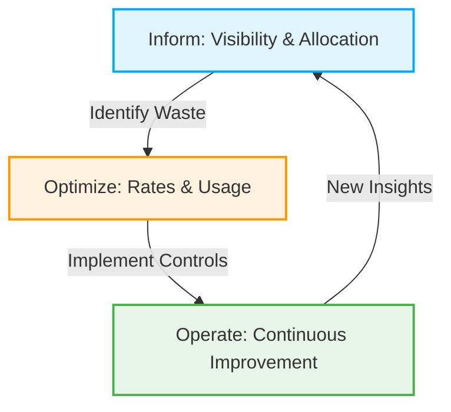
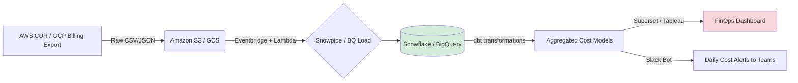
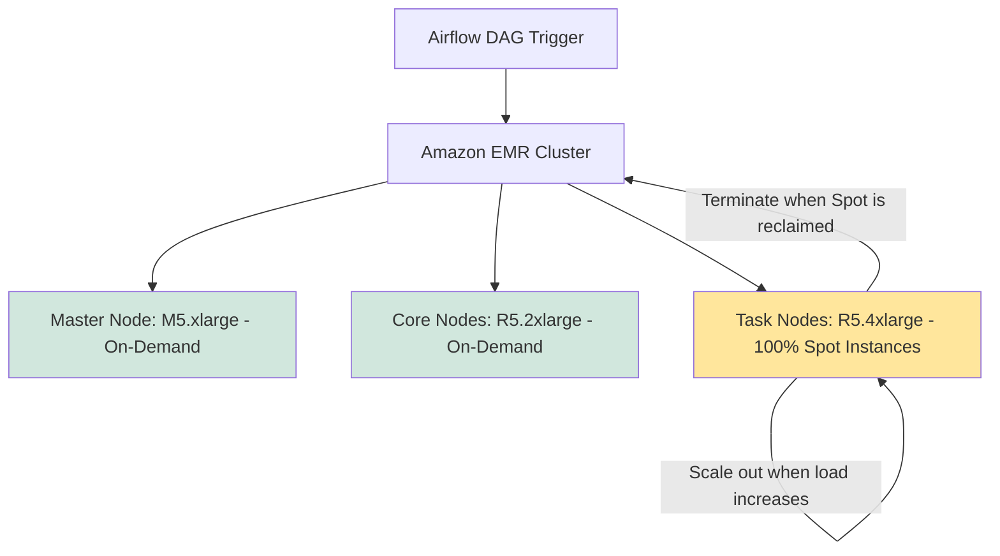
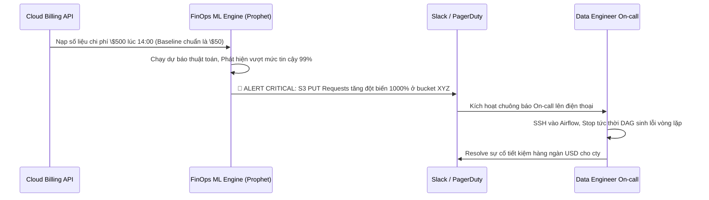

Trong kỷ nguyên Cloud, một Data Engineer xuất sắc không chỉ cần biết viết code chạy nhanh, thiết kế hệ thống có khả năng mở rộng (scalable), mà còn phải đảm bảo hệ thống đó chạy "rẻ" và tối ưu về mặt tài chính. Khái niệm **FinOps (Financial Operations)** ra đời nhằm xóa bỏ bức tường ngăn cách giữa team Kỹ thuật, Tài chính và Business, đảm bảo mỗi USD chi cho các nhà cung cấp Cloud (AWS, GCP, Azure, Snowflake, Databricks) đều mang lại giá trị tương xứng nhất.

Trong bài viết chuyên sâu này, chúng ta sẽ mổ xẻ các khía cạnh kỹ thuật phức tạp nhất của FinOps, cách đưa tư duy tối ưu chi phí vào từng dòng code, từng quyết định kiến trúc, và cách xây dựng các công cụ nội bộ để tự động hóa việc quản trị chi phí.

---

## 1. Nỗi Đau Cloud Cost: Nghịch Lý Của Sự Linh Hoạt (The Cloud Cost Nightmare)


### Sự chuyển dịch từ CapEx sang OpEx
Hạ tầng On-premise truyền thống hoạt động dựa trên mô hình **CapEx (Capital Expenditure)**: doanh nghiệp đầu tư một khoản tiền lớn trả trước để mua server, switch, ổ cứng. Đội ngũ kỹ sư có thể viết code không tối ưu, server chạy full 100% CPU hay chạy chậm thì chi phí phần cứng vẫn không tăng lên (chỉ làm chậm tiến độ).

Khi chuyển sang Cloud, mô hình tài chính chuyển sang **OpEx (Operational Expenditure)**: chi trả theo dung lượng tiêu thụ (Pay-as-you-go). Đây là con dao hai lưỡi. Đám mây cung cấp khả năng mở rộng vô hạn, nhưng đi kèm với nó là khả năng "đốt tiền" vô hạn.

### Ví dụ thực tế: Cú click chuột trị giá 500 USD
Giả sử hệ thống lưu trữ log của người dùng (Clickstream Data) trên Google BigQuery có kích thước 100TB. Nếu một Data Engineer, Data Analyst hoặc thậm chí là một đoạn mã tự động trong Airflow thực hiện câu truy vấn sau:

```sql
SELECT user_id, count(*) 
FROM `company_data.clickstream_logs` 
WHERE event_date = '2023-10-15'
GROUP BY user_id;
```

Nếu bảng `clickstream_logs` không được chia vùng (Partitioned) theo cột `event_date`, BigQuery sẽ buộc phải quét toàn bộ 100TB dữ liệu (Full Table Scan). Với mức giá khoảng \$5/TB dữ liệu được quét, câu truy vấn này tiêu tốn **\$500**. Tệ hơn nữa, nếu câu truy vấn này được lập lịch chạy mỗi giờ một lần trong Apache Airflow, công ty sẽ mất **\$12.000 / ngày**, tương đương **\$360.000 / tháng** chỉ cho một sự thiếu hiểu biết cơ bản về tối ưu hóa.

### Những chi phí "ẩn" (Hidden Costs)
Ngoài việc quét dữ liệu lớn, các hệ thống Data Platform thường bị rò rỉ chi phí ở các khía cạnh:
1. **Network Egress (Phí truyền tải dữ liệu ra ngoài):** Việc chuyển dữ liệu giữa các Region hoặc kéo dữ liệu từ Cloud ra ngoài Internet vô cùng đắt đỏ.
2. **Zombie Infrastructure:** Các cụm EMR, EC2, Databricks cluster được bật lên để test nhưng quên không tắt hoặc bị treo.
3. **API Calls & PUT/GET Requests:** Hàng triệu file nhỏ (small files problem) ghi vào S3 có thể tiêu tốn hàng nghìn USD tiền PUT requests dù tổng dung lượng chỉ vài GB.

---

## 2. Vòng đời FinOps (FinOps Lifecycle) và Các Trụ Cột Kiến Trúc

Theo FinOps Foundation, thực hành FinOps bao gồm ba giai đoạn liên tục: **Inform (Nhận thức)**, **Optimize (Tối ưu)**, và **Operate (Vận hành)**. Để hỗ trợ 3 giai đoạn này, kiến trúc dữ liệu cần xoay quanh các trụ cột kỹ thuật.



---

## 3. Trụ Cột 1: Tagging, Chargeback và Pipeline Phân Bổ Chi Phí (Inform)

Bước đầu tiên của FinOps là phải biết dòng tiền đang chảy đi đâu. Điều này đòi hỏi một chiến lược Gắn nhãn (Tagging) nghiêm ngặt và một hệ thống **Chargeback** (đòi tiền phòng ban) hoặc **Showback** (hiển thị chi phí cho phòng ban).

### Chiến lược Tagging bằng Infrastructure as Code (IaC)
Mọi tài nguyên (EC2, S3 bucket, RDS, dbt models, Airflow DAGs) đều phải có tags. Nếu không có tag, tài nguyên đó không được phép tồn tại trên môi trường Production. Để thực thi điều này, chúng ta sử dụng Terraform và các công cụ kiểm tra tĩnh như Checkov hoặc OPA (Open Policy Agent) tích hợp vào CI/CD pipeline.

**Ví dụ Terraform yêu cầu Tags:**

```hcl
# main.tf
provider "aws" {
  region = "us-east-1"
  default_tags {
    tags = {
      Environment = "Production"
      Department  = "DataEngineering"
      Project     = "RecommendationEngine"
      CostCenter  = "CC-10293"
      Owner       = "duclinh@company.com"
      ManagedBy   = "Terraform"
    }
  }
}

resource "aws_s3_bucket" "data_lake_raw" {
  bucket = "company-datalake-raw-zone"
  # Mặc định sẽ kế thừa và nhận được tất cả các tags định nghĩa ở provider
}
```

### Xây dựng Chargeback Data Pipeline tự động
Dựa trên Tags, đội ngũ Data Engineering có thể tự tay xây dựng một Data Pipeline nội bộ để tổng hợp hóa đơn Cloud, xử lý và trực quan hóa chi phí theo từng team.



**Mô tả quy trình:**
1. **Cloud Billing Export:** Kích hoạt tính năng xuất dữ liệu chi phí chi tiết (AWS Cost & Usage Report - CUR hoặc GCP Cloud Billing Export) vào một bucket S3/GCS lưu trữ mỗi ngày.
2. **Ingestion:** Sử dụng Serverless functions (Lambda/Cloud Functions) hoặc Snowpipe để tự động nạp dữ liệu chi phí (Raw Billing Data) này vào Data Warehouse nội bộ.
3. **Data Modeling (dbt):** Xử lý làm sạch, mapping các `CostCenter` với các phòng ban thực tế trên hệ thống nhân sự (HR). Phân bổ các chi phí dùng chung (Shared resources như Kubernetes cluster, Snowflake Compute) bằng cách sử dụng các chỉ số phần trăm sử dụng tài nguyên (CPU/Memory usage metrics lấy từ Datadog/Prometheus).
4. **Chargeback:** Khi Marketing yêu cầu thiết kế một Data Mart riêng, họ sẽ có một Dashboard hiển thị chính xác Data Mart đó tiêu tốn bao nhiêu tài nguyên tính toán và lưu trữ mỗi ngày, qua đó họ tự cân đối lợi ích thu được với chi phí bỏ ra.

---

## 4. Trụ Cột 2: Right-Sizing, Auto-Scaling và Spot Instance Orchestration (Optimize Compute)

### Tối ưu hóa tính toán (Compute Optimization)
"Vừa đủ mặc" là nguyên tắc cốt lõi của Right-sizing. Chẳng hạn, không cấp một cụm Spark 100 Nodes (máy tính) cấu hình khủng để chạy một batch xử lý file Excel 10MB.

Trong các kiến trúc dữ liệu hiện đại sử dụng Kubernetes (EKS, GKE), việc tối ưu hóa tài nguyên tính toán được thực hiện thông qua:
- **VPA (Vertical Pod Autoscaler):** Tự động phân tích lịch sử sử dụng để điều chỉnh các thông số CPU/Memory `requests` và `limits` của Pod, tránh việc khai báo (provision) quá tay tài nguyên.
- **Karpenter / Cluster Autoscaler:** Công cụ cung cấp node động thông minh. Tự động scale up/down số lượng EC2/VM nodes dựa trên số lượng Pod đang pending, chọn đúng loại instance phù hợp nhất với requirements của pod.

### Nghệ thuật sử dụng Spot Instances cho Data Batch Jobs
**Spot Instances (AWS) / Preemptible VMs (GCP) / Spot VMs (Azure)** là những máy chủ dôi dư chưa sử dụng của nhà cung cấp Cloud, được bán đấu giá với giá siêu rẻ, tiết kiệm đến 80-90% so với máy chủ trả theo nhu cầu (On-Demand). Điểm nghẽn duy nhất là nhà cung cấp Cloud có quyền "đòi lại" (Terminate) máy chủ này bất cứ lúc nào với thời gian báo trước rất ngắn (khoảng 2 phút).

Mặc dù vậy, tính chất chịu lỗi (fault-tolerant) bẩm sinh của các framework xử lý phân tán như Apache Spark, Hadoop làm cho chúng trở thành ứng cử viên hoàn hảo để tận dụng Spot Instances cho các Data Batch Jobs.

**Kiến trúc Cụm EMR Spark tối ưu với Spot Instances:**



*Giải thích kiến trúc:* 
- **Master Node** quản lý cluster phải ổn định tuyệt đối -> dùng On-Demand.
- **Core Nodes** lưu trữ HDFS Data Nodes cần sự an toàn cho dữ liệu chưa replicate xong -> dùng On-Demand.
- **Task Nodes** chỉ thuần túy tính toán bộ nhớ RAM/CPU (Stateless) -> cấu hình sử dụng 100% Spot Instances.

**Apache Airflow Operator triển khai Fallback Strategy:**
Khi yêu cầu Spot instance không thành công (thị trường hết máy rảnh rỗi), Airflow Operator có thể tự động triển khai cơ chế dự phòng chạy lại (fallback) sang máy On-Demand để đảm bảo SLA của luồng dữ liệu (Data Pipeline).

```python
from airflow import DAG
from airflow.providers.amazon.aws.operators.emr import EmrCreateJobFlowOperator
from datetime import datetime

# Cấu hình EMR sử dụng chiến lược Spot Allocation
JOB_FLOW_OVERRIDES = {
    "Name": "Daily_ETL_Spark_Cluster",
    "ReleaseLabel": "emr-6.10.0",
    "Instances": {
        "InstanceGroups": [
            {
                "Name": "Master",
                "Market": "ON_DEMAND",
                "InstanceRole": "MASTER",
                "InstanceType": "m5.xlarge",
                "InstanceCount": 1,
            },
            {
                "Name": "Core",
                "Market": "ON_DEMAND", # Lưu trữ dữ liệu trung gian, cần an toàn
                "InstanceRole": "CORE",
                "InstanceType": "m5.xlarge",
                "InstanceCount": 2,
            },
            {
                "Name": "Task",
                "Market": "SPOT", # Tính toán stateless, siêu tiết kiệm
                "InstanceRole": "TASK",
                "InstanceType": "r5.2xlarge",
                "InstanceCount": 10,
            }
        ],
        "KeepJobFlowAliveWhenNoSteps": False,
        "TerminationProtected": False,
    }
}

with DAG("finops_spot_emr_pipeline", start_date=datetime(2023, 1, 1), schedule_interval="@daily", catchup=False) as dag:
    create_cluster = EmrCreateJobFlowOperator(
        task_id="create_emr_cluster",
        job_flow_overrides=JOB_FLOW_OVERRIDES,
        aws_conn_id="aws_default",
    )
```

---

## 5. Trụ Cột 3: Tối Ưu Hóa Truy Vấn Trong Data Warehouse (Query Optimization)

Đối với các Data Warehouse hiện đại hoạt động theo mô hình Serverless tính tiền theo dung lượng quét (Google BigQuery, AWS Athena) hoặc tính tiền theo thời gian bật máy chủ ảo (Snowflake Virtual Warehouse), kỹ thuật tối ưu hóa lưu trữ vật lý và câu lệnh SQL là yếu tố sống còn của FinOps.

### 1. Partitioning và Clustering
Nguyên tắc cơ bản nhất: Tuyệt đối không để xảy ra Full Table Scan. Dữ liệu vật lý cần được chia vùng (Partition) theo mốc thời gian (thường là ngày tạo `created_at` hoặc `event_timestamp`) và phân cụm (Cluster) theo các trường có độ chọn lọc cao, hay được sử dụng trong mệnh đề `WHERE` hoặc `JOIN` (ví dụ: `customer_id`, `country_code`).

**Ví dụ sửa lỗi câu truy vấn triệu đô trên BigQuery:**

```sql
-- Bước 1: DDL thiết kế lại bảng sử dụng Partition và Cluster
CREATE TABLE `company_data.clickstream_logs_optimized`
PARTITION BY DATE(event_timestamp)
CLUSTER BY user_id, event_type
AS 
SELECT * FROM `company_data.clickstream_logs`;

-- Bước 2: Truy vấn sau khi tối ưu CHỈ quét phân vùng của 1 ngày duy nhất
SELECT user_id, count(*) 
FROM `company_data.clickstream_logs_optimized` 
WHERE DATE(event_timestamp) = '2023-10-15'
GROUP BY user_id;
```
*Hiệu quả FinOps:* Thay vì quét 100TB, hệ thống storage engine chỉ đọc dữ liệu cục bộ trong đúng 1 thư mục vật lý chứa dữ liệu ngày 15/10/2023. Lượng dữ liệu quét giảm xuống còn 500GB (chia 200 lần chi phí, từ \$500 xuống chỉ còn \$2.5 cho một cú Enter).

### 2. Thiết lập Rào chắn bảo vệ (Safeguards)
Công nghệ không thể chỉ dựa vào ý thức con người. Để ngăn chặn rủi ro các user "lỡ tay", kiến trúc Data Platform phải thiết lập Quota Limits cứng bằng công cụ phân quyền.

**Giải pháp trên BigQuery:**
- Ràng buộc bắt buộc mệnh đề `WHERE` phải chứa điều kiện lọc Partition filter:
  ```sql
  ALTER TABLE `company_data.clickstream_logs_optimized`
  SET OPTIONS (require_partition_filter = true);
  ```
- Cấu hình **Custom Quota**: Giới hạn mỗi User Account hoặc Service Account không được phép quét vượt quá định mức 5TB dữ liệu mỗi ngày. Câu query vi phạm sẽ bị reject tự động (Dry run sẽ báo lỗi ngay lập tức trước khi chạy).

### 3. Tối ưu hóa Snowflake Virtual Warehouse (Compute Scaling)
Với Snowflake, chi phí được tính bằng Credit dựa trên cấu hình (T-Shirt Size) và thời gian uptime của Virtual Warehouse.
- **Auto-suspend tuning:** Thiết lập tự động tắt Warehouse (Auto-suspend) sau 1 phút không có truy vấn nào thay vì để giá trị mặc định là 10 phút.
- **Workload Isolation (Tách biệt khối lượng công việc):** Không bao giờ gộp chung khối lượng công việc phân tích nhẹ nhàng và ETL nặng nề vào chung một Warehouse. Tạo một Warehouse siêu nhỏ (`X-Small`) cho team Data Analyst truy vấn báo cáo trong giờ làm việc. Tạo một Warehouse rất lớn (`L`, `XL`) dành riêng cho công cụ dbt chạy hàng loạt các lệnh transformation heavy-join vào lúc nửa đêm và tự động tắt ngay sau khi xong job trong vòng vài phút.

---

## 6. Trụ Cột 4: Quản Lý Vòng Đời Lưu Trữ (Storage Lifecycle & Compaction)

Lưu trữ Object Storage (S3, GCS) rất rẻ, nhưng giữ lại toàn bộ lịch sử hàng Petabyte dữ liệu chưa nén không định dạng chuẩn trong 5-10 năm thì là một sự lãng phí khủng khiếp. Kiến trúc FinOps chuẩn mực yêu cầu tự động hóa việc dịch chuyển cấp độ lưu trữ (Storage Tiering) và tối ưu hóa định dạng file vật lý định kỳ.

### S3 Storage Tiering Lifecycle Rules
AWS S3, GCP Cloud Storage đều cung cấp nhiều lớp lưu trữ với mức giá thay đổi tùy theo tần suất truy cập. Bảng so sánh chi phí tham khảo đối với AWS S3 (giá tính trên Region `us-east-1`):

| Lớp lưu trữ (Storage Class) | Chi phí lưu trữ (/GB/tháng) | Phí truy xuất (/GB) | Kịch bản sử dụng FinOps |
|-----------------------------|----------------------------|---------------------|-------------------------|
| **S3 Standard** | ~\$0.023 | \$0.00 | Dữ liệu siêu nóng, truy cập liên tục hàng giờ (Raw data mới nạp vào, Bảng Delta đang active) |
| **S3 Standard-IA** | ~\$0.0125 | \$0.01 | Dữ liệu nguội dần (truy cập đếm trên đầu ngón tay < 1 lần/tháng), ví dụ data của năm ngoái. |
| **S3 Glacier Flexible Retrieval**| ~\$0.0036 | \$0.03 (Bulk) | Dữ liệu lưu trữ Archive, tốn vài tiếng để khôi phục. Dùng cho Backup hệ thống. |
| **S3 Glacier Deep Archive** | ~\$0.00099 | \$0.02 (Bulk) | Dữ liệu cực lạnh, đóng băng giữ vài năm đáp ứng luật định compliance. Lấy lại mất 12-48 tiếng. |

**Triển khai Terraform S3 Lifecycle Policy tự động:**

Đoạn mã IaC sau đây thiết lập quy tắc tự động bào mòn chi phí lưu trữ theo thời gian bằng cách "dìm" dữ liệu lạnh xuống các tier rẻ tiền hơn một cách tự động, con người không cần phải can thiệp thao tác thủ công nào:

```hcl
resource "aws_s3_bucket_lifecycle_configuration" "data_lake_lifecycle_rules" {
  bucket = aws_s3_bucket.data_lake_raw.id

  rule {
    id     = "archive_cold_historical_data"
    status = "Enabled"

    filter {
      prefix = "historical_logs/"
    }

    # Chuyển dịch xuống tầng Infrequent Access để giảm giá còn 1 nửa sau 30 ngày
    transition {
      days          = 30
      storage_class = "STANDARD_IA"
    }

    # Đóng băng cất vào tủ lạnh Glacier Deep Archive siêu rẻ sau 90 ngày
    transition {
      days          = 90
      storage_class = "DEEP_ARCHIVE"
    }

    # Xóa hoàn toàn vĩnh viễn sau 7 năm (đáp ứng điều kiện lưu trữ của Luật kế toán pháp lý)
    expiration {
      days = 2555
    }
  }
}
```

### Xử lý Vấn Đề File Nhỏ (Small Files Problem) với Delta Lake / Apache Iceberg
Trong các hệ thống kiến trúc dữ liệu Streaming (chẳng hạn Kafka đẩy xuống Spark Structured Streaming), hệ thống có thể liên tục ghi hàng chục nghìn file định dạng JSON hoặc Parquet cực nhỏ mỗi phút xuống Data Lake S3.
- **Vấn đề Performance:** Khi các Query Engine như Trino hay Spark muốn quét dữ liệu này, chúng mất phần lớn thời gian cho I/O overhead để mở/đóng hàng nghìn file thay vì đọc nội dung thực sự của dữ liệu.
- **Vấn đề FinOps (Chi phí AWS S3 API):** AWS không chỉ tính tiền dung lượng, mà tính tiền trên từng HTTP Request. 1 triệu file dung lượng 1KB tốn tiền gọi API thao tác S3 đắt đỏ hơn gấp hàng nghìn lần so với 1 file khổng lồ dung lượng 1GB.

**Giải pháp (Data Compaction):**
Các định dạng bảng mở hiện đại (Open Table Formats) như Delta Lake hoặc Apache Iceberg cung cấp cơ chế bảo trì tự động. Data Engineer cần lên lịch chạy các luồng Job bảo trì định kỳ để gom file nhỏ thành file lớn, và xóa bớt rác vật lý của các phiên bản cũ.

```sql
-- Dọn dẹp hàng ngày chạy qua Databricks hoặc Spark SQL
-- 1. Gom các file nhỏ lẻ tẻ thành file lớn lý tưởng ~1GB, đồng thời gom nhóm vật lý các user ID cạnh nhau (Z-Order) để tối ưu Read 
OPTIMIZE clickstream_events ZORDER BY (user_id);

-- 2. Dọn rác (Vacuum) xóa vật lý triệt để các file phiên bản lịch sử cũ sinh ra trong quá trình update/delete không còn dùng nữa, tiết kiệm Storage. (Ví dụ chỉ giữ lại tính năng Time Travel trong vòng 7 ngày = 168 giờ)
VACUUM clickstream_events RETAIN 168 HOURS;
```

---

## 7. Trụ Cột 5: Giám Sát và Cảnh Báo Dòng Tiền Bất Thường (Observability & Anomaly Detection)

Dù hệ thống có rào chắn bảo vệ vững chắc đến đâu, những "tai nạn sự cố" lãng phí chi phí vẫn luôn xảy ra. Ví dụ: Một đoạn code vòng lặp vô hạn (infinite loop) bị lỗi trong Lambda gọi API S3 liên tục. Trong kỷ nguyên Cloud, bạn không được phép chờ đến cuối tháng tài chính kế toán gửi hóa đơn tiền tỷ mới tá hỏa nhận ra hệ thống lỗi.

### Phát hiện bất thường chi phí theo thời gian thực (Real-time Cost Anomaly Detection)
Một hệ thống FinOps Data Platform trưởng thành phải có các hệ thống giám sát và phát hiện ra chi phí bất thường, đột biến trong thời gian thực hoặc gần thời gian thực (near real-time) bằng học máy (Machine Learning).

**Kiến trúc xử lý cảnh báo:**
1. Thu thập liên tục các CloudWatch Metrics / Billing API vài giờ một lần.
2. Nạp dữ liệu metrics qua một mô hình dự báo chuỗi thời gian (Time-series forecasting algorithms, ví dụ mô hình Facebook Prophet tự train, hoặc dịch vụ native AWS Cost Anomaly Detection).
3. Hệ thống ML sẽ vạch ra ranh giới ngưỡng giới hạn trên dưới (Confidence Interval) dựa trên chu kỳ ngày đêm/cuối tuần. Nếu chi phí thực tế (Actual Spend Cost) vọt ra khỏi ngưỡng dự báo trên -> Bắn tín hiệu Alert lập tức.



---

## 8. Kết Luận: FinOps Là Sự Thích Nghi Về Văn Hóa, Không Chỉ Là Công Cụ

FinOps về bản chất sâu xa nhất không phải là cài đặt tool cắt giảm chi phí một cách mù quáng. Đó là việc nâng tầm khái niệm **"Chi phí (Cost)"** trở thành một First-class Metric (thước đo vận hành hạng nhất), đứng ngang hàng với các chỉ số kỹ thuật khô khan khác như **Độ trễ (Latency)**, **Độ tin cậy (Reliability/Availability)**, và **Bảo mật (Security)**. 

Thay vì duy trì tư duy bảo thủ của thời On-premise là "Cứ build code chạy ra kết quả trước đi, chi phí tính sau" (và thực tế là sẽ không bao giờ có thì giờ để tối ưu lại), Data Engineer cần phải áp dụng chiến lược **"Shift-Left Cost"** — tức là dịch chuyển công tác dự toán và nhận thức ngân sách ngay từ thời điểm ngồi viết bản System Design Document trước khi gõ dòng code đầu tiên. 

Một kiến trúc dữ liệu hoàn hảo nhất không phải là một hệ thống siêu khổng lồ có khả năng chịu tải hàng Exabyte lớn nhất thế giới, mà là hệ thống thông minh tinh gọn nhất, giải quyết được bài toán kinh doanh thực tế nhưng với mức **TCO (Total Cost of Ownership)** — Tổng chi phí sở hữu vận hành là thấp nhất có thể. Đó mới là nghệ thuật tối thượng mang lại biên độ lợi nhuận ròng tối đa cho doanh nghiệp, khẳng định đẳng cấp của người Kỹ sư dữ liệu.

---

## Tài Liệu Tham Khảo Nâng Cao
* **[FinOps Foundation Framework](https://www.finops.org/framework/)** - Bộ tiêu chuẩn lý thuyết quy trình toàn cầu về quản trị tài chính đám mây.
* ****AWS Cloud Financial Management**** - Kiến trúc tài liệu thực hành Best practices trực tiếp từ các kỹ sư Amazon Web Services.
* **[Designing Data-Intensive Applications - Martin Kleppmann](https://dataintensive.net/)** - Cuốn kinh thánh về thiết kế dữ liệu lớn, kiến trúc lưu trữ, định dạng file chuyên sâu.
* ****Databricks: Cost Optimization on Lakehouse**** - Hướng dẫn kỹ thuật cụ thể để tối ưu engine phân tán và lưu trữ với kiến trúc Lakehouse Delta Lake.
* **[Google Cloud: BigQuery Cost Optimization Best Practices](https://cloud.google.com/bigquery/docs/best-practices-costs)** - Các mẹo kỹ thuật kiểm soát chặt dung lượng xử lý truy vấn phân tích.
* ****Uber Architecture and System Design**** - Case study chi tiết cách gã khổng lồ Uber xử lý hàng Exabyte dữ liệu và tối ưu chi phí hạ tầng trên Hadoop/Spark.
* ****Netflix Technology Blog: Cloud Migration & FinOps**** - Kinh nghiệm thực tiễn quản lý và theo dõi chi phí hóa đơn hạ tầng AWS siêu khổng lồ đến từ đội ngũ Data platform của Netflix.
