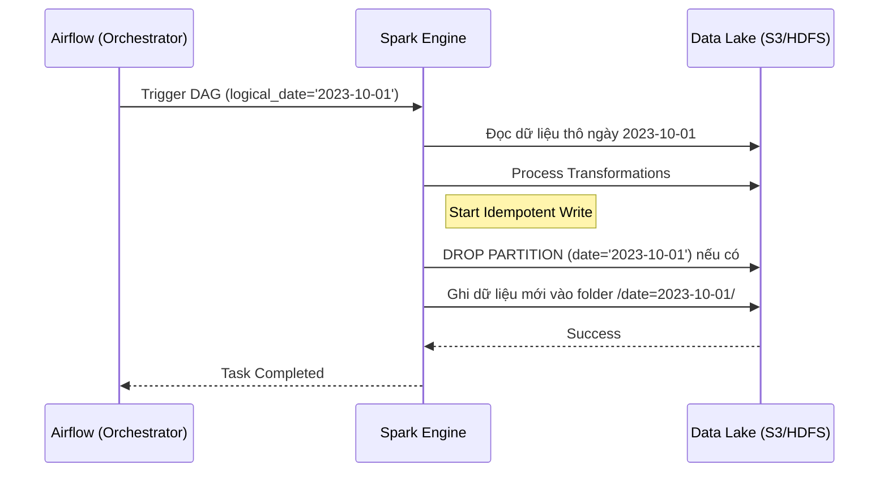

Khi vận hành các hệ thống phân tán và xử lý dữ liệu lớn (Big Data), có một định luật luôn đúng mà mọi Data Engineer đều phải khắc cốt ghi tâm: **Mọi thứ đều có thể hỏng**. Mạng sẽ chập chờn, Database sẽ báo timeout, API rate limit sẽ chặn bạn, và Spark Job của bạn sẽ crash ở phút 99% vì lỗi Out of Memory. 

Khi hệ thống báo lỗi, hành động bản năng của chúng ta là bấm nút **"Retry" (Chạy lại)**. Nhưng điều gì sẽ xảy ra nếu job đã ghi được một nửa dữ liệu vào bảng đích trước khi chết? Nếu Pipeline của bạn không được thiết kế theo nguyên lý **Idempotency (Tính Lũy Đẳng)**, thao tác Retry tưởng chừng vô hại đó sẽ phá hủy hoàn toàn tính toàn vẹn dữ liệu của công ty (nhân đôi, dữ liệu rác, sai lệch báo cáo tài chính).

Trong bài viết chuyên sâu này, chúng ta sẽ bóc tách mọi khía cạnh của Idempotency trong Data Engineering, từ lý thuyết toán học cơ bản, các anti-pattern gây hậu quả nghiêm trọng, cho đến những kỹ thuật kiến trúc hệ thống tiên tiến để đảm bảo Data Pipelines của bạn có thể "tự phục hồi" mà không cần can thiệp thủ công.

---

## 1. Idempotency Là Gì? Từ Toán Học Đến Khoa Học Máy Tính

Trong toán học và khoa học máy tính, **Idempotency (Tính Lũy Đẳng)** mô tả một tính chất của các thao tác hoặc hàm số: Một thao tác dù bạn thực hiện 1 lần, 2 lần, 10 lần hay hàng triệu lần liên tiếp thì **kết quả cuối cùng của hệ thống vẫn giống hệt như khi bạn chỉ thực hiện thao tác đó duy nhất 1 lần**.

Dưới dạng công thức toán học, hàm $f$ là lũy đẳng nếu: 
$$f(f(x)) = f(x)$$

### Ví dụ trong đời sống và kỹ thuật:
- **Nút bấm thang máy:** Bạn bấm nút gọi thang máy ở tầng 1 một lần hay bấm liên tục 100 lần trong sự nôn nóng, hệ thống vẫn chỉ ghi nhận một lệnh "mang thang máy đến tầng 1". Đây là một hành động Idempotent.
- **Trong giao thức HTTP (RESTful API):**
  - `GET`, `PUT`, `DELETE` được thiết kế mặc định là Idempotent. Gọi `DELETE /users/123` mười lần thì kết quả cuối cùng vẫn là user 123 không tồn tại.
  - `POST` thường là **Non-Idempotent**. Gọi `POST /users` với cùng payload 10 lần có thể tạo ra 10 user khác nhau.
- **Trong SQL & Database:**
  - *Non-Idempotent:* `UPDATE account SET balance = balance + 100 WHERE id = 1` (Chạy lại 5 lần, tài khoản được cộng 500. Rất nguy hiểm nếu bị retry tự động do network timeout).
  - *Idempotent:* `UPDATE account SET balance = 500 WHERE id = 1` (Chạy bao nhiêu lần thì balance vẫn là 500).

---

## 2. Thảm Họa "Partial Success" Trong Data Pipelines

### Anti-Pattern: Sự ngây thơ của "Append-Only" (INSERT INTO)
Nhiều Data/Analytics Engineer mới vào nghề thường xây dựng pipeline lấy dữ liệu từ một nguồn (MySQL/PostgreSQL) và đổ vào Data Warehouse (BigQuery/Snowflake) với tư duy **Append-only**.

```sql
-- Pipeline chạy vào lúc 01:00 AM hàng ngày
INSERT INTO Fact_DoanhThu (
    SELECT * 
    FROM ODS_GiaoDich 
    WHERE created_at::date = '2023-10-01'
);
```

**Kịch bản thảm họa:**
1. Apache Airflow trigger job này. 
2. Database nguồn có 10 triệu records của ngày `2023-10-01`. 
3. Job chạy được 30 phút, đẩy được 9 triệu records vào bảng `Fact_DoanhThu` thì một node trong cluster sập mạng. Job **Failed**.
4. Sáng hôm sau, Data Engineer nhận được alert. Hành động đầu tiên: Vào Airflow UI và bấm nút **Clear & Retry**.
5. Job chạy lại từ đầu thành công và đẩy toàn bộ 10 triệu records vào bảng đích.
6. **Kết quả:** Bảng `Fact_DoanhThu` hiện chứa 19 triệu records cho ngày 10/01 (9 triệu bị lặp lại). Dashboard của CEO báo cáo doanh thu tăng gấp đôi, team Marketing ăn mừng vì chiến dịch "thành công rực rỡ" ảo tưởng.

Đây là vấn đề **Partial Success (Thành công một nửa)** - trạng thái tồi tệ nhất của hệ thống phân tán. Hệ thống không hoàn toàn thành công cũng không hoàn toàn thất bại. Dữ liệu rác đã bị rò rỉ vào Production.

### Tại sao "Exactly-Once Semantics" (EOS) là một lời nói dối?
Nhiều kỹ sư tin rằng việc sử dụng các hệ thống Message Queue như Kafka với cấu hình *Exactly-once* sẽ giải quyết được mọi việc. Tuy nhiên, hệ thống phân tán thường chỉ có thể đảm bảo **At-least-once (Ít nhất một lần)** trong quá trình truyền tải. 

Công thức vàng trong Data Engineering thực thụ là:
> **Exactly-Once Semantics = At-Least-Once Delivery + Idempotent Processing/Sink**

Dù Kafka có gửi message đó 5 lần (do rebalance, timeout, network split), chỉ cần quá trình Consume và ghi vào Database (Sink) có tính Lũy Đẳng, toàn bộ hệ thống sẽ đạt được trạng thái như thể event đó chỉ được xử lý đúng một lần.

---

## 3. Kiến Trúc & Các Chiến Lược Thiết Kế Pipeline Lũy Đẳng

Để xây dựng các đường ống dữ liệu miễn nhiễm với rủi ro Duplicate Data khi Retry, chúng ta áp dụng các chiến lược Design Pattern sau, tùy thuộc vào bài toán và quy mô dữ liệu.

### Chiến Lược 1: Ghi đè toàn bộ (Full Overwrite / Replace)
Đây là chiến lược đơn giản và "cục súc" nhất. Nó cực kỳ hiệu quả đối với các Dimension tables (Bảng chiều) có kích thước nhỏ hoặc dữ liệu dạng Snapshot lấy nguyên trạng từ nguồn (như bảng danh sách quốc gia, phòng ban, danh mục sản phẩm).

Mỗi khi job chạy, hệ thống đơn giản là `TRUNCATE` (xóa sạch) bảng đích và `INSERT` lại toàn bộ dữ liệu mới nhất.

*Công cụ tiêu biểu:*
- Trong dbt (Data Build Tool): `materialized='table'`.
- Trong Spark: `df.write.mode("overwrite").saveAsTable("dim_products")`.

**Nhược điểm:** Rất tốn kém chi phí tính toán và I/O nếu bảng chứa hàng trăm triệu dòng. Không thể áp dụng cho Fact tables hoặc dữ liệu lưu trữ theo lịch sử (SCD Type 2).

### Chiến Lược 2: Ghi đè theo phân vùng (Partition-level Overwrite)
Đây là **tiêu chuẩn vàng (Golden Standard)** trong thế giới Batch Processing. Hầu hết dữ liệu lớn đều được chia nhỏ (Partitioned) theo thời gian, thông thường là theo ngày (`date` hoặc `execution_date`).

Khi một Data Job phụ trách ngày `2023-10-01` chạy lại, nó phải tuân thủ nguyên tắc:
1. Xác định đúng phạm vi phân vùng (Ví dụ: `date='2023-10-01'`).
2. Xóa toàn bộ dữ liệu hiện có trong phân vùng này.
3. Ghi dữ liệu mới vào phân vùng.

Với cách tiếp cận này, chạy job của ngày mùng 1 bao nhiêu lần đi nữa, nó cũng chỉ ảnh hưởng và thay thế chính xác dữ liệu của ngày mùng 1.



**Kỹ thuật quan trọng trong Apache Spark:**
Nếu bạn sử dụng Spark SQL, hãy chú ý cấu hình `spark.sql.sources.partitionOverwriteMode`.
- `STATIC` (Mặc định): Sẽ ghi đè **tất cả** các partition mà job hiện tại có chạm đến, đôi khi vô tình xóa mất partition khác nếu bạn cấu hình nhầm.
- `DYNAMIC`: Spark sẽ chỉ ghi đè những partition nào mà DataFrame hiện tại *thực sự chứa dữ liệu*. Đây là cấu hình an toàn hơn nhiều.
```python
spark.conf.set("spark.sql.sources.partitionOverwriteMode", "dynamic")
df.write.mode("overwrite").insertInto("fact_sales")
```

### Chiến Lược 3: Upsert/Merge với Khóa Chính (Primary Key)
Khi xử lý dữ liệu Streaming (Kafka, Flink) hoặc kiến trúc Lambda/Kappa, hay Change Data Capture (CDC), việc ghi đè cả một partition là bất khả thi vì dữ liệu chảy đến liên tục, từng bản ghi một.

Trong trường hợp này, Idempotency phải được thực thi ở **mức độ bản ghi (Row-level)** thay vì mức độ tập tin (File/Partition-level). Bạn bắt buộc phải thiết kế một **Primary Key (Khóa chính)** mang tính duy nhất (Unique) cho mỗi sự kiện/dòng dữ liệu (ví dụ: `Transaction_ID` + `Timestamp`).

Sử dụng cú pháp `MERGE INTO` (Upsert: Update + Insert) được hỗ trợ bởi các định dạng Table format hiện đại (Delta Lake, Apache Iceberg, Apache Hudi) hoặc các Cloud Data Warehouses (BigQuery, Snowflake).

```sql
-- Ví dụ Delta Lake / Snowflake MERGE INTO
MERGE INTO target_table AS t
USING source_stream AS s
ON t.transaction_id = s.transaction_id
WHEN MATCHED AND s.updated_at > t.updated_at THEN 
    -- Nếu đã có và bản tin nguồn mới hơn -> UPDATE (Sửa lại thông tin mới nhất)
    UPDATE SET 
        t.status = s.status,
        t.amount = s.amount,
        t.updated_at = s.updated_at
WHEN NOT MATCHED THEN 
    -- Nếu chưa có -> INSERT (Thêm mới)
    INSERT (transaction_id, amount, status, updated_at) 
    VALUES (s.transaction_id, s.amount, s.status, s.updated_at);
```

**Tại sao MERGE đảm bảo Lũy Đẳng?**
- Nếu Kafka gửi lại một event (`transaction_id=999`) lần thứ hai, hệ thống sẽ chạy vào nhánh `WHEN MATCHED`. Nó sẽ UPDATE đúng thông tin đó đè lên thông tin cũ (về bản chất dữ liệu không đổi), tránh sinh ra 2 dòng.
- Lưu ý điều kiện `s.updated_at > t.updated_at`. Đây là kỹ thuật giải quyết **Out-of-order events (Sự kiện đến không theo thứ tự)**. Nếu hệ thống nhận được bản cập nhật "Cũ" sau khi đã xử lý bản "Mới", nó sẽ vứt bỏ (Ignore) để giữ tính nhất quán.

### Chiến Lược 4: Sử dụng Idempotency Keys trong API Ingestion
Khi bạn xây dựng pipeline gọi API từ các hệ thống bên ngoài (Ví dụ: Stripe, PayPal, Salesforce API) bằng Webhooks hoặc Polling, bạn thường phải đối mặt với rủi ro mạng ngắt kết nối giữa lúc nhận phản hồi. API đã ghi nhận giao dịch nhưng hệ thống nội bộ thì chưa.

Chuẩn mực của các API hiện đại là cung cấp một `Idempotency-Key` ở Header. 
- Khi Data Ingestion worker của bạn nhận một event, tạo ra một Hash UUID làm `Idempotency-Key`.
- Đẩy key này vào một in-memory Database xử lý cực nhanh như Redis hoặc DynamoDB kèm thời gian sống (TTL).
- Nếu Worker bị crash và retry sự kiện đó, nó check Redis và thấy `Idempotency-Key` đã tồn tại -> Bỏ qua tiến trình xử lý (Silent success).

### Chiến Lược 5: Tách Biệt Logical Date và Processing Date
Một sai lầm chí mạng phá vỡ tính Lũy Đẳng là việc sử dụng trực tiếp các hàm thời gian của hệ thống thực thi trong code SQL/Spark:

**Anti-pattern:**
```sql
SELECT * FROM raw_data WHERE created_date = CURRENT_DATE()
```
Nếu bạn chạy job ngày 10/01 vào lúc nửa đêm, `CURRENT_DATE()` là ngày 10. Nhưng nếu job đó fail, và sáng ngày 11 bạn ngủ dậy bấm Retry, `CURRENT_DATE()` giờ đã biến thành ngày 11. Cùng một task của Airflow nhưng hành vi lại thay đổi tùy thuộc vào "lúc nào bạn bấm chạy". Tính Lũy Đẳng bị phá vỡ.

**Best Practice:**
Luôn truyền **Logical Date** (Thời điểm logic mà job phụ trách) từ Orchestrator vào Pipeline như một tham số tĩnh. Dù chạy lại vào năm sau, tham số này vẫn không thay đổi.

Ví dụ dùng Jinja Template trong Airflow:
```sql
-- Dù bạn có retry job này vào ngày 15, {{ ds }} vẫn giữ giá trị là '2023-10-01'
SELECT * FROM raw_data WHERE created_date = '{{ ds }}'
```

---

## 4. Bảng So Sánh Các Chiến Lược Idempotency

| Chiến Lược | Chi Phí Tính Toán | Độ Trễ (Latency) | Mức Độ Phức Tạp | Use Cases Điển Hình | Công Nghệ Áp Dụng |
| :--- | :--- | :--- | :--- | :--- | :--- |
| **Full Overwrite** | Rất cao | Batch (Giờ/Ngày) | Thấp nhất | Dimension tables nhỏ, lookup data, views | SQL `TRUNCATE`/`INSERT`, Spark `mode(overwrite)` |
| **Partition Overwrite** | Thấp - Trung bình | Batch (Giờ/Ngày) | Trung bình | Daily/Hourly Fact tables, Append-only logs | Hive, Iceberg, Spark `insertInto`, BigQuery |
| **Upsert (MERGE)** | Rất cao (Tùy indexing)| Streaming / Micro-batch| Cao | CDC, Stateful data, Streaming Sinks | Delta Lake, Apache Hudi, Snowflake, Postgres |
| **Deduplication State**| Cao (RAM/Storage) | Real-time (Ms) | Rất cao | Streaming filters, Exactly-once processing | Flink, Spark Structured Streaming (Watermarking) |
| **Idempotency Key** | Rất thấp | Real-time API | Trung bình | Webhooks, Payment pipelines, API Ingestion| Redis, DynamoDB, Cassandra |

---

## 5. Case Studies Từ Các Big Tech

### A. Uber: Hệ Thống Xử Lý Thanh Toán (Payment Systems)
Hệ thống tính cước chuyến đi và thanh toán của Uber phụ thuộc nặng nề vào các luồng sự kiện Kafka. Việc một tài xế bị trừ tiền hai lần cho cùng một cuốc xe là lỗi không thể chấp nhận được.
- Uber sử dụng **Apache Flink** để duy trì trạng thái phân tương (Distributed State).
- Mọi sự kiện từ App gửi về đều được gán một Unique UUID tại nguồn (Client-side generation).
- Flink stateful operators lưu giữ lịch sử các UUID đã được xử lý trong một "cửa sổ thời gian" (Time window) nhất định và lọc bỏ lập tức mọi bản sao (duplications) sinh ra do rớt mạng trước khi luồng dữ liệu chạm đến các Database thanh toán cốt lõi.

### B. Netflix: Xây dựng Data Warehouse Khổng Lồ với Apache Iceberg
Với hàng tỷ lượt play, pause, rewind mỗi ngày, dữ liệu Telemetry của Netflix là một dòng chảy khổng lồ. Tuy nhiên, sự kiện từ các thiết bị offline (như xem phim trên máy bay rồi mới kết nối wifi) khiến dữ liệu bị out-of-order (đến muộn) trầm trọng.
- Thay vì ghi đè lại toàn bộ partition mỗi khi có dữ liệu late-arriving (tốn hàng ngàn giờ compute), Netflix đã tiên phong phát triển **Apache Iceberg**.
- Họ áp dụng Idempotency bằng các lệnh `MERGE INTO` tại mức row-level, chỉ update hoặc insert những bản ghi phát sinh, đảm bảo Pipeline có thể được chạy lặp đi lặp lại một cách mù quáng (blindly retried) bởi Scheduler mà không bao giờ làm sai lệch bảng phân tích hành vi người dùng.

---

## 6. Tổng Kết: Checklist Xây Dựng Pipeline Lũy Đẳng

Để đánh giá một Data Pipeline đã đạt "chuẩn" hay chưa, hãy tự hỏi các câu hỏi sau:
1. **[ ]** Nếu tôi bấm "Clear & Run" toàn bộ DAG từ 1 tháng trước ngay lúc này, dữ liệu cuối cùng có bị nhân đôi hay sai lệch không?
2. **[ ]** Pipeline của tôi có dựa trên các biến môi trường thay đổi liên tục như `CURRENT_TIMESTAMP()`, `NOW()` thay vì biến `execution_date` cố định của workflow không?
3. **[ ]** Bảng đích đã có cơ chế UNIQUE Constraints, Primary Keys rõ ràng, hoặc được định nghĩa Partition chuẩn xác chưa?
4. **[ ]** Code chuyển đổi dữ liệu (Transformations) của tôi có phải là Pure Functions (Đầu vào y hệt luôn trả ra kết quả y hệt) hay phụ thuộc vào side-effects?

Idempotency không phải là một "tính năng nice-to-have" để thêm vào sau. Nó là **nguyên tắc kiến trúc nền tảng (Foundation Architecture)** tách biệt một Data Engineer chuyên nghiệp với một kỹ sư nghiệp dư. Hãy thiết kế mọi pipeline với tâm thế: "Nó sẽ hỏng, nó sẽ crash, và người vận hành sẽ nhấn Retry rất nhiều lần."

---

## 7. Tài Liệu Tham Khảo Mở Rộng
* [Designing Data-Intensive Applications - Martin Kleppmann (Part 3: Derived Data)](https://dataintensive.net/) - Cuốn "Kinh thánh" về hệ thống phân tán.
* [Stripe Engineering: Designing robust and predictable APIs with idempotency](https://stripe.com/blog/idempotency)
* [Delta Lake Documentation: Table Deletes, Updates, and Merges](https://docs.delta.io/latest/delta-update.html)
* [System Design Interview - Alex Xu (Vol 1 & 2)](https://bytebytego.com/)
* [Grokking the System Design Interview - Design Gurus](https://www.designgurus.io/course/grokking-the-system-design-interview)
* **Netflix Technology Blog: Data Engineering**
