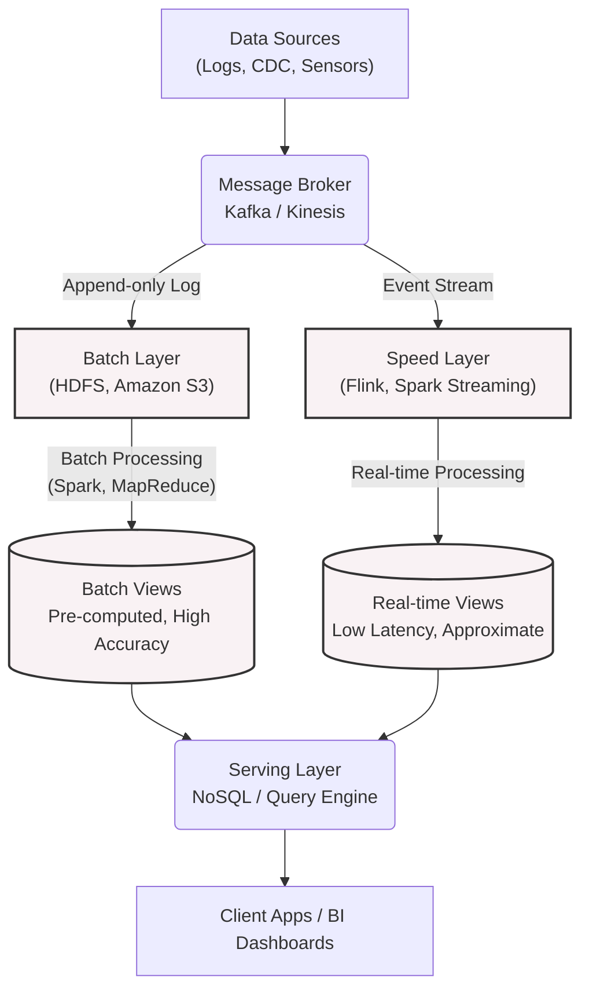
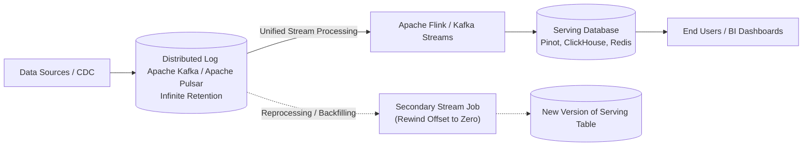
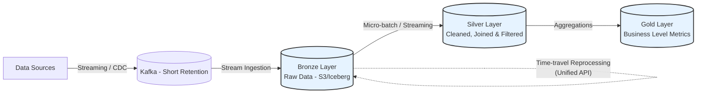

Sự tiến hóa của Kỹ thuật Dữ liệu (Data Engineering) và Thiết kế Hệ thống (System Design) luôn xoay quanh một cuộc chiến bất tận: Làm sao để cân bằng giữa **Độ trễ thấp (Low Latency)** của dữ liệu thời gian thực và **Tính chính xác tuyệt đối (High Accuracy)** của các báo cáo lịch sử quy mô lớn?

Trong kỷ nguyên của Big Data, các doanh nghiệp không thể chờ đợi 24 giờ để chạy xong một cụm Hadoop MapReduce chỉ để phát hiện gian lận thẻ tín dụng (Credit Card Fraud Detection) hoặc hệ thống gợi ý sản phẩm (Recommendation Systems). Họ cần kết quả phân tích ngay lập tức (Real-time). Tuy nhiên, các hệ thống Real-time đời đầu lại đối mặt với việc rớt mạng, mất gói tin, hoặc dữ liệu đến trễ (Late data), khiến kết quả không bao giờ chính xác 100%.

Từ bài toán hóc búa này, hai triết lý thiết kế hệ thống vĩ đại đã ra đời và định hình lại toàn bộ ngành dữ liệu: **Lambda Architecture** và **Kappa Architecture**. Bài viết này sẽ đi sâu vào cấu trúc phần mềm, nguyên lý vận hành, những điểm yếu chí mạng của chúng, các khái niệm nâng cao như State Management, Reprocessing, và cuối cùng là lý do tại sao thế giới hiện đại đang dần rời bỏ chúng để hướng tới **Data Lakehouse**.

---

## 1. Lambda Architecture: Giải pháp Thỏa hiệp An toàn (The Safe Compromise)

### 1.1. Lịch sử và Triết lý
Kiến trúc Lambda được Nathan Marz (tác giả của Apache Storm) đề xuất vào khoảng năm 2011. Trong thế giới của Marz, hệ thống tính toán (compute) là thứ cực kỳ mong manh và dễ gặp lỗi — do bug phần mềm, do lỗi phần cứng (node crash), hay đơn giản là do thuật toán xấp xỉ của luồng dữ liệu nhanh. Tuy nhiên, nếu bạn bảo vệ được **Dữ liệu thô (Raw Data)** ở trạng thái không thể thay đổi (Immutable), bạn có thể luôn luôn thiết lập các luồng tính toán lại từ đầu để sửa mọi sai sót.

Triết lý của Lambda: Chấp nhận rằng hệ thống Streaming có thể sai số, do đó ta sẽ chạy song song một hệ thống Batch khổng lồ ở phía sau để định kỳ đối chiếu và sửa lỗi hệ thống Real-time.

### 1.2. Kiến trúc Tổng quan (Architecture Overview)

Kiến trúc Lambda tách luồng dữ liệu (Data Pipeline) thành 3 lớp (Layers) tính toán riêng biệt:



#### a) Batch Layer (Lớp Xử lý Lô)
- **Nhiệm vụ:** Lưu trữ toàn bộ raw data ở định dạng append-only (thường trên HDFS hoặc Object Storage như S3) và chạy các batch job định kỳ (ví dụ: mỗi đêm một lần) để tính toán ra các **Batch Views**.
- **Đặc điểm:** Tốc độ rất chậm (tốn hàng giờ đồng hồ chạy job) nhưng độ chính xác là tuyệt đối 100%. Lớp xử lý này có khả năng nhìn thấy bức tranh toàn cảnh của dữ liệu, bao gồm cả các dữ kiện mạng gửi đến trễ.
- **Công nghệ phổ biến:** Apache Hadoop (HDFS), Apache Spark, Apache Hive.

#### b) Speed Layer (Lớp Tốc độ)
- **Nhiệm vụ:** Xử lý luồng dữ liệu vừa mới phát sinh trong thời gian gần nhất (thường là lượng data nhỏ kể từ lần chạy Batch Job cuối cùng). Lớp này lấp đầy khoảng trống thời gian mà Batch Layer chưa kịp xử lý để tạo ra các **Real-time Views**.
- **Đặc điểm:** Tốc độ phản hồi cực nhanh (milliseconds đến seconds) nhưng chấp nhận sai số do phải hy sinh tính toàn vẹn, thường chỉ sử dụng các thuật toán xấp xỉ (Approximate Algorithms - như HyperLogLog cho Count Distinct) hoặc bị mất dữ liệu khi network delay quá lớn.
- **Công nghệ phổ biến:** Apache Storm, Apache Flink, Spark Structured Streaming.

#### c) Serving Layer (Lớp Phục vụ)
- **Nhiệm vụ:** Đây là cửa ngõ giao tiếp trực tiếp với người dùng và các API nội bộ. Nó có khả năng hợp nhất (Merge) kết quả từ Batch View và Real-time View động trong quá trình query.
- **Cơ chế sửa sai (Correction):** Ngay khi Batch Layer chạy xong một lô dữ liệu lịch sử và đẩy view mới vào Serving Layer, các bản ghi tương ứng bên trong Real-time View sẽ bị xóa bỏ hoặc ghi đè, đảm bảo hệ thống đạt được tính nhất quán cuối cùng (Eventual Consistency).

### 1.3. Khác biệt trong Codebase (Code Snippet)
Trong kiến trúc Lambda, một nghiệp vụ đơn giản (Ví dụ: Tính tổng doanh thu theo sản phẩm) bắt buộc phải được lập trình hai lần trên hai framework hoàn toàn khác biệt.

**1. Mã nguồn bên Batch Layer (ví dụ dùng PySpark DataFrame API):**
```python
# Chạy hằng đêm trên cụm Spark Batch khổng lồ
raw_batch_df = spark.read.parquet("s3a://data-lake/raw/sales/date=2026-06-15/")

daily_sales = raw_batch_df \
    .groupBy("product_id") \
    .agg(sum("revenue").alias("total_revenue"))

# Ghi đè toàn bộ dữ liệu vào Serving Database (Tạo Batch View)
daily_sales.write \
    .mode("overwrite") \
    .jdbc("jdbc:cassandra://serving-db/batch_sales", "batch_sales_table")
```

**2. Mã nguồn bên Speed Layer (ví dụ dùng Spark Structured Streaming):**
```python
# Streaming Job chạy liên tục 24/7 (Real-time)
stream_df = spark.readStream \
    .format("kafka") \
    .option("subscribe", "sales_topic") \
    .load()

# Tính toán trên dữ liệu stream (chỉ quan tâm window 1 phút gần nhất)
realtime_sales = stream_df \
    .groupBy(window("timestamp", "1 minute"), "product_id") \
    .agg(sum("revenue").alias("realtime_revenue"))

# Liên tục upsert dữ liệu vào Serving Database (Tạo Real-time View)
realtime_sales.writeStream \
    .outputMode("update") \
    .format("jdbc") \
    .start()
```

> [!WARNING]
> **Nhược điểm chí mạng của Lambda:** 
> Gánh nặng bảo trì (Maintenance Overhead) là ác mộng của kỹ sư. Bạn phải duy trì hai luồng code (Ví dụ: Code Java cho Storm/Flink ở tầng Stream và Python/SQL cho Spark ở tầng Batch) để thực thi cùng một nghiệp vụ phân tích. Đội ngũ Data Engineer thường xuyên cạn kiệt tài nguyên cho việc giải quyết các ticket bug dạng: *"Tại sao con số doanh thu ở Real-time Dashboard và báo cáo ngày hôm sau lại chênh lệch nhau?"*. Sự phân mảnh logic giữa hai engine này mang lại chi phí phát triển quá đắt đỏ.

---

## 2. Kappa Architecture: Mọi Thứ Đều Là Streaming

### 2.1. Sự ra đời và Triết lý Log-Centric
Năm 2014, Jay Kreps (đồng tác giả của Apache Kafka và là CEO của Confluent) đã đặt ra một câu hỏi mang tính cách mạng cho toàn bộ giới Big Data: *"Tại sao chúng ta phải xây dựng và duy trì hai hệ thống phức tạp trong khi một luồng Batch thực chất chỉ là một luồng Stream có điểm kết thúc?"*

Kiến trúc **Kappa** mạnh tay chặt bỏ hoàn toàn Batch Layer, đưa ra triết lý **Log-Centric**: Mọi sự kiện phát sinh trong hệ thống (Log) phải được xem là nguồn chân lý duy nhất (Single Source of Truth), và một công cụ Stream Processing tối thượng có thể giải quyết được cả khối lượng phân tích Real-time lẫn Historical.

### 2.2. Kiến trúc Tổng quan



- Toàn bộ dữ liệu của tổ chức phải được nạp và lưu trữ trong một hệ thống Message Broker mạnh mẽ. Khác với Lambda (nơi Kafka chỉ giữ data vài giờ hoặc vài ngày), Kafka trong kiến trúc Kappa phải được cấu hình để giữ dữ liệu vĩnh viễn (**Infinite Retention**).
- Thay vì tách đôi hệ thống, có duy nhất một codebase: Luồng Stream Processing.

### 2.3. Sức mạnh thực sự: Reprocessing và Backfilling
Rào cản lớn nhất khi loại bỏ Batch Layer là: "Nếu phát hiện ra bug trong code Streaming khiến data đã tính trong 1 năm qua bị sai, làm thế nào tính toán lại (Reprocess) dữ liệu cũ?".
Kappa giải quyết bài toán Reprocessing bằng một Workflow Pipeline zero-downtime cực kỳ thanh lịch:
1. Bạn sửa bug và tạo ra một phiên bản code Stream Processing mới (gọi là Job v2).
2. Bạn deploy Job v2 song song với luồng hiện tại, nhưng cấu hình cho nó đọc Kafka từ offset 0 (hoặc tua lại chính xác khoảng thời gian xảy ra lỗi).
3. Job v2 sẽ đọc dữ liệu lịch sử cực kỳ nhanh, chạy ngầm như một luồng batch mạnh mẽ, và ghi luồng kết quả chuẩn xác vào một bảng Serving mới (Table v2).
4. Khi quá trình đọc lịch sử hoàn tất và Job v2 bắt kịp (catch up) với luồng dữ liệu theo thời gian thực hiện hành.
5. Cập nhật Gateway / Query Routing để chuyển toàn bộ user traffic sang Table v2. Sau đó, kill Job v1 và drop Table v1. Hệ thống hoàn toàn không có downtime.

### 2.4. Code Snippet: Unified API với Apache Flink
Với sự phát triển của công nghệ, Flink SQL hiện tại là minh chứng hoàn hảo cho triết lý Kappa. Bạn chỉ cần viết một luồng truy vấn duy nhất có thể giải quyết mọi môi trường xử lý.

```sql
-- Định nghĩa bảng Source đọc từ Kafka (Hỗ trợ Watermarks để xử lý Late Data)
CREATE TABLE clickstream (
    user_id STRING,
    page_url STRING,
    event_time TIMESTAMP(3),
    WATERMARK FOR event_time AS event_time - INTERVAL '5' SECOND
) WITH (
    'connector' = 'kafka',
    'topic' = 'clicks_log',
    'scan.startup.mode' = 'earliest-offset' -- Tham số lõi để Reprocess từ đầu lịch sử
);

-- Truy vấn này được biên dịch tĩnh và áp dụng cho cả real-time lẫn lúc reprocessing
SELECT TUMBLE_END(event_time, INTERVAL '1' HOUR) AS window_end, 
       COUNT(DISTINCT user_id) AS unique_visitors
FROM clickstream 
GROUP BY TUMBLE(event_time, INTERVAL '1' HOUR);
```

### 2.5. Những Cơn Ác Mộng Của Kappa (The Hard Truth)
Dù tinh gọn về mặt thiết kế codebase, Kappa Architecture trong thực tiễn lại bộc lộ những điểm yếu khổng lồ, đòi hỏi trình độ vận hành cơ sở hạ tầng (DevOps/SRE) đẳng cấp thế giới:

1. **Chi phí lưu trữ siêu đắt đỏ (Infinite Storage Cost):** Kafka sử dụng ổ cứng SSD/SAS hiệu năng cao để đáp ứng latency. Việc bắt Kafka lưu toàn bộ dữ liệu Petabytes vĩnh viễn là một sự "đốt tiền" khủng khiếp so với lưu ở Amazon S3. *(Dù Kafka Tiered Storage với S3 đã xuất hiện gần đây, nhưng việc cấu hình, backup và tối ưu hiệu suất đọc lại lịch sử từ S3 lên Broker vẫn đầy rủi ro).*
2. **Quản lý Trạng thái khổng lồ (State Management):** Khi Reprocess nhiều Terabytes dữ liệu stream, Stream Engine bắt buộc phải ghi nhớ Trạng thái (State) của tất cả các phép Joins, Windows hay Deduplications. Kích thước State (thường lưu ở RocksDB) có thể phình to vô tận, khiến quá trình Checkpoint mất hàng chục phút, gây ra nghẽn I/O, Out-of-Memory (OOM) làm sập cụm tính toán một cách thường xuyên.
3. **Thứ tự dữ liệu và Event Time:** Trong quá trình backfill lịch sử, do phải đọc từ nhiều Kafka Partitions khác nhau với tốc độ tối đa, tình trạng out-of-order (dữ liệu đến không theo thứ tự thời gian) xảy ra trầm trọng. Kỹ sư phải có kiến thức sâu rộng về thiết lập **Watermarks** và Allowed Lateness để đảm bảo tính chuẩn xác.

> [!IMPORTANT]  
> **Đạt được Exactly-Once Semantics (EOS) với Two-Phase Commit:**
> Lambda xử lý trùng lặp rất dễ bằng cách (Overwrite) đè sạch dữ liệu cũ. Với Kappa, Engine phải đảm bảo không bao giờ ghi double dữ liệu khi có sự cố mạng. Apache Flink áp dụng **Two-Phase Commit (2PC)** kết nối với Kafka:
> - **Phase 1 (Pre-commit):** Flink xử lý xong lô sự kiện, tạo Snapshot/Checkpoint (lưu state vào S3) và gửi dữ liệu lên Kafka nhưng đánh dấu là "chưa được commit".
> - **Phase 2 (Commit):** Khi hệ thống giám sát Checkpoint phân tán (Dựa trên thuật toán Chandy-Lamport) xác nhận tất cả node đều thành công, tín hiệu Commit chính thức được phát ra. Dữ liệu trên Kafka mới hiện hình (visible) cho người dùng cuối. Bất cứ lỗi nhỏ nào cũng sẽ trigger Rollback. Cơ chế này siêu an toàn nhưng đòi hỏi băng thông mạng và sức mạnh CPU rất lớn.

---

## 3. So Sánh Chuyên Sâu (Deep Dive Comparison)

Bảng dưới đây tổng hợp những chiều kích System Design cốt lõi, giúp bạn quyết định khi đứng trước ngã ba đường kiến trúc:

| Tiêu chí | Lambda Architecture | Kappa Architecture |
| :--- | :--- | :--- |
| **Bản chất logic (Codebase)** | Phức tạp, dễ lỗi: Phải duy trì 2 bộ code riêng rẽ (Batch vs Stream). Phân mảnh logic nghiệp vụ nghiêm trọng. | Tối giản, hợp nhất: Chỉ 1 bộ code Streaming duy nhất, chia sẻ chung một logic nghiệp vụ từ A-Z. |
| **Chi phí Lưu trữ & Hạ tầng** | Cực kỳ tối ưu: Dữ liệu lớn (Historical) nằm yên tĩnh trên Object Storage (S3, HDFS) với chi phí rác. | Siêu đắt đỏ: Bắt buộc duy trì Kafka Clusters cực lớn, tốn kém tài nguyên SSD/Memory cho Broker Logs. |
| **Tính Toàn Vẹn & Chính Xác** | Tuyệt đối an toàn: Batch Layer đóng vai trò như cỗ xe ủi, luôn dọn dẹp và sửa mọi sai sót do Stream Layer gây ra ngày hôm trước. | Phụ thuộc năng lực đội ngũ: Yêu cầu thiết lập Watermark chính xác và quản lý RocksDB cẩn thận để tránh mất dữ liệu. |
| **Reprocessing (Xử lý lại)** | Native & Dễ dàng: Chỉ cần trigger lại Spark Job. | Nặng nề & Phức tạp: Phải chạy luồng stream lại từ offset sớm nhất, gánh nặng State Storage khổng lồ. |
| **Use Case điển hình** | Chuyển đổi hệ thống Legacy có sẵn sang Real-time, Data Analytics có các thuật toán phức tạp chưa thể stream (VD: Machine Learning Training quy mô lớn). | Hệ thống Event-driven Greenfield hoàn toàn mới, Dữ liệu Time-series/IoT, và team Tech cực mạnh về Kafka/Pulsar. |

---

## 4. Kiến Trúc Sự Của Khái Niệm Thời Gian: Event Time vs Processing Time

Một trong những lý do khiến Kỹ sư Dữ liệu thường "vỡ mộng" khi vận hành Kappa Architecture là sự nhầm lẫn về Semantics của thời gian.

- **Processing Time:** Thời điểm thiết bị chủ (Server/Flink/Spark) nhận được gói tin và tiến hành tính toán.
- **Event Time:** Thời điểm thực tế tại đó sự kiện xảy ra ở thiết bị nguồn (VD: User bấm nút "Mua hàng" trên điện thoại di động lúc 9:00 sáng).

Trong thế giới Batch (Lambda), vì dữ liệu của ngày hôm qua đã hoàn toàn nằm yên trong Data Lake, việc gom nhóm (Group-By) dựa trên *Event Time* là chính xác 100%. Không có khái niệm dữ liệu bay lơ lửng trên mạng.
Tuy nhiên, trong thế giới Streaming liên tục (Kappa), người dùng click lúc 9:00 AM (Event Time) nhưng bị mất sóng 3G. Đến 11:00 AM họ mới có mạng và ứng dụng mobile mới xả log về server (Processing Time). Nếu Engine của bạn đóng Window tính toán lúc 10:00 AM, dữ liệu "Late Data" này sẽ bị vứt bỏ vĩnh viễn (Dropped).

Để kiến trúc Kappa tính toán chính xác như Lambda, kỹ sư bắt buộc phải áp dụng **Watermarks**. Watermark đóng vai trò là cột mốc khẳng định với hệ thống: *"Ta tin rằng không còn gói tin nào mang Event Time nhỏ hơn T sẽ cập bến nữa. Hãy bắt đầu đóng sổ và kích hoạt (Trigger) các logic tính toán"*. Việc hiệu chỉnh độ trễ cho Watermarks là nghệ thuật đỉnh cao, quyết định sinh tử đến độ tin cậy của mô hình Kappa.

---

## 5. Hiện Tại Và Tương Lai: Sự Lên Ngôi Của Data Lakehouse (Kiến Trúc Hợp Nhất)

Vào những năm 2020 trở đi, thế giới phân tích dữ liệu nhận ra một sự thật cay đắng: *Chúng ta thèm khát sự tinh giản của 1 Codebase (Kappa) nhưng chúng ta không đủ giàu và nhân lực để chịu đựng chi phí Kafka khổng lồ, và chúng ta cũng muốn sự an toàn, vững chãi của Batch lưu trữ trên S3 (Lambda).*

Đây chính là mảnh đất màu mỡ khai sinh ra **Data Lakehouse** với các Open Table Formats như **Apache Iceberg**, **Delta Lake** và **Apache Hudi**.

### 5.1. Triết lý Medallion / Delta Architecture (Kappa-Inspired)

Kiến trúc này lấy cảm hứng mạnh mẽ từ Kappa nhưng giải quyết triệt để khuyết điểm lưu trữ. Thay vì dùng Kafka lưu vĩnh viễn, Lakehouse tận dụng Object Storage rẻ tiền (Amazon S3 / GCS) nhưng trang bị thêm cơ chế **ACID Transactions** và **Time-Travel**.



Trong Data Lakehouse (Unified Architecture):
- **Kafka** được trả về đúng vai trò của nó: Hệ thống Buffer ngắn hạn (chỉ lưu 1-3 ngày để chịu tải).
- Luồng dữ liệu Streaming được "xả" thẳng liên tục thành các Micro-batch/Stream nhỏ gọn xuống Data Lake ở định dạng Parquet kèm theo Transaction Logs.
- Khả năng **Unified API**: Apache Spark và Flink đều đã hội tụ. Kỹ sư chỉ cần viết một kịch bản SQL duy nhất. Nó có thể đọc ở chế độ streaming (`.readStream()`) đuổi theo dữ liệu realtime (tương tự Kappa), hoặc đọc toàn bộ thư mục S3 ở chế độ Batch (`.read()`) khi cần Reprocess mạnh mẽ (tương tự Lambda) với chi phí lưu trữ gần như bằng 0.

---

## 6. Case Studies Từ Các "Gã Khổng Lồ" (Big Tech)

### 6.1. Uber: Hành trình từ Lambda đến Kappa và sự khai sinh Apache Hudi
Thời kỳ hoàng kim của Hadoop, Uber sử dụng Lambda Architecture. Tuy nhiên với lượng cuốc xe khổng lồ trải khắp toàn cầu, việc chạy song song hai pipeline Batch và Stream cho cùng một thuật toán ETA (Dự đoán thời gian đến) trở thành một "đống nợ kỹ thuật" không thể bảo trì. 
Họ mạnh dạn chuyển sang Kappa nhưng nhanh chóng chạm tường. Bản chất dữ liệu chuyến đi của Uber chứa đầy các thao tác **Update/Delete** muộn (Tiền tip thêm vào sau 3 ngày, khách khiếu nại cước phí cần hoàn tiền). Các hệ thống Append-only streaming như Kafka cực kỳ yếu thế trước các luồng cập nhật bản ghi cụ thể. 
Đội ngũ tinh hoa của Uber đã tự viết nên **Apache Hudi** (Hadoop Upserts Deletes and Incrementals). Hệ thống này cho phép thao tác Cập nhật / Xóa ở cấp độ Record (Row-level) trực tiếp trên Data Lake, kết hợp sức mạnh sửa lỗi dễ dàng của Lambda và tính real-time của Kappa, đóng góp một viên gạch nền tảng vĩ đại cho hệ sinh thái Data Lakehouse đương đại.

### 6.2. Netflix: "Keystone Pipeline"
Để xử lý hàng ngàn tỷ sự kiện (Events) mỗi ngày, Netflix thiết kế "Keystone Data Pipeline". Họ theo đuổi một biến thể cực kỳ xuất sắc: Dùng Kafka làm backbone định tuyến dữ liệu realtime (Stream Processing bằng Apache Flink) nhưng dữ liệu sau đó được nhanh chóng dump (xả) về Amazon S3 quản lý dưới format của **Apache Iceberg**. Cấu trúc lai Hybrid này mang lại cho Netflix sự linh hoạt vô tiền khoáng hậu: Phục vụ tức thì Analytics thời gian thực, đồng thời cung cấp khả năng Time-travel cực khủng cho hệ thống đào tạo Machine Learning trên S3.

---

## 7. Tổng kết và Ma Trận Ra Quyết Định (Decision Matrix)

Đứng trước yêu cầu System Design cho Data Architecture ở thập kỷ này, dưới đây là "Kim chỉ nam" dành cho bạn:

1. **Sử dụng Lambda Architecture nếu:** Hệ thống hiện tại (Legacy system) của bạn đã đầu tư quá đà vào hạ tầng Hadoop/Batch, Business vẫn hài lòng với báo cáo T+1 và chỉ rụt rè yêu cầu thêm chút khả năng Real-time cho một màn hình hiển thị nhỏ lẻ. Khuyến nghị: Duy trì để tiết kiệm chi phí đập đi xây lại, tuy nhiên không nên dùng nó làm Core Blueprint cho các module mới.
2. **Sử dụng Kappa Architecture (Thuần túy) nếu:** Dự án xây mới hoàn toàn (Greenfield), đặc tả của dữ liệu thuần là Log / Time-series bất biến không cần Update (Ví dụ: IoT Sensors logs, Clickstream events), và quan trọng nhất: Đội ngũ Data của bạn phải là những kỹ sư "Lão làng" về Kafka, Flink và xử lý State Management.
3. **Sử dụng Data Lakehouse (Khuyến nghị Vàng):** Áp dụng kiến trúc Medallion (Bronze-Silver-Gold) với Delta Lake hoặc Apache Iceberg. Bạn sẽ thụ hưởng trọn vẹn sự tinh giản của 1 Codebase (như Kappa) cộng hưởng cùng sự vững chãi, tin cậy, và lưu trữ rẻ mạt (như Lambda). Nó đáp ứng được cả yêu cầu khắt khe của Luật quyền riêng tư (GDPR) nhờ khả năng Delete row-level. Đây hiện đang là Tiêu chuẩn Công nghiệp (Industry Standard) của mọi nền tảng Modern Data Stack (Databricks, Snowflake).

---

## Tài Liệu Tham Khảo Kỹ Thuật (Further Reading)
* **Designing Data-Intensive Applications** - *Martin Kleppmann* (Part 3: Derived Data). Được xem là cuốn sách gối đầu giường không thể thiếu của bất kỳ Data/System Engineer nào.
* [The Log: What every software engineer should know about real-time data's unifying abstraction](https://engineering.linkedin.com/distributed-systems/log-what-every-software-engineer-should-know-about-real-time-datas-unifying) - Bài tiểu luận lịch sử của Jay Kreps đặt nền móng khái niệm Kappa.
* [System Design Interview - Alex Xu (Vol 1 & 2)](https://bytebytego.com/)
* [Apache Flink Documentation: Streaming Analytics và State Management](https://flink.apache.org/)
* **Uber Engineering Blog: Xin chào Hudi, tạm biệt Lambda**
* **Netflix Tech Blog: Bước tiến vĩ đại với Keystone Pipeline và Iceberg**
