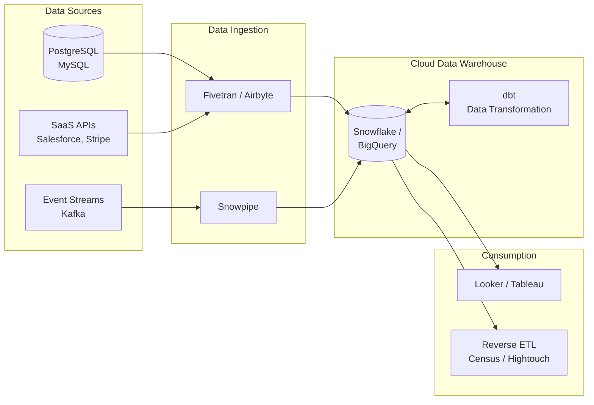
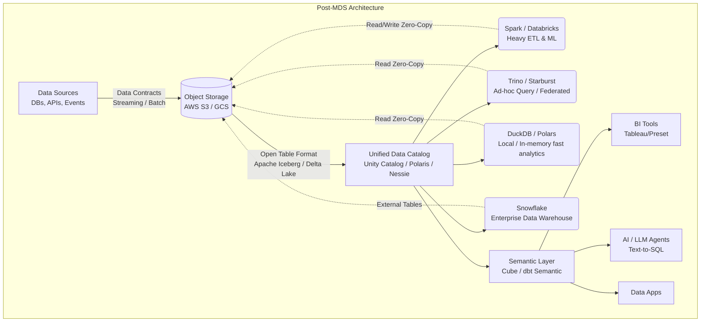

Từ năm 2012, sự bùng nổ của Cloud Computing, được dẫn dắt bởi Amazon Redshift (2012), đã khai sinh ra thuật ngữ **Modern Data Stack (MDS - Ngăn xếp Dữ liệu Hiện đại)**. MDS thống trị toàn bộ thập kỷ 2010s với lời hứa hẹn đầy sức mạnh: "Dễ dàng triển khai, Hoàn toàn trên Cloud, Khả năng mở rộng vô hạn và Trả tiền theo mức sử dụng". 

Tuy nhiên, bước sang thập niên 2020s, khi nền kinh tế vĩ mô thay đổi và các hệ thống dữ liệu phình to đến mức không thể kiểm soát, những "vết nứt" chí mạng của MDS bắt đầu lộ rõ. Hóa đơn điện toán đám mây tăng vọt, dữ liệu bị phân mảnh, và sự phức tạp của việc tích hợp hàng chục công cụ SaaS lại với nhau đã mở đường cho một kỷ nguyên mới: **Post-Modern Data Stack (Ngăn xếp Dữ liệu Hậu Hiện Đại)**.

Bài viết này sẽ đi sâu vào phân tích kiến trúc, hệ tư tưởng, những điểm nghẽn kỹ thuật của MDS, và cách mà Post-MDS đang giải quyết các vấn đề đó bằng những công nghệ đột phá như Open Table Formats (Iceberg, Delta), In-process engines (DuckDB), Data Contracts, và kiến trúc Data Lakehouse.

---

## 1. Thời Hoàng Kim Của Modern Data Stack (MDS)


### 1.1. Triết Lý Cốt Lõi Của MDS
MDS được xây dựng dựa trên ba nguyên lý chính:
1. **Cloud-Native & SaaS-First:** Mọi thứ chạy trên Cloud. Kỹ sư không cần quản lý phần cứng, hệ điều hành hay máy chủ vật lý.
2. **Modular & Best-of-Breed (Lắp ráp Lego):** Thay vì mua một nền tảng Monolithic khổng lồ "All-in-one" từ Oracle hay Teradata, các công ty chọn công cụ tốt nhất, chuyên biệt nhất cho từng khía cạnh (Ingestion, Storage, Transformation, BI).
3. **ELT thay vì ETL:** Băng thông mạng rẻ và khả năng tính toán khổng lồ của Cloud Data Warehouse (CDW) cho phép hút toàn bộ dữ liệu thô (Extract) rồi Load trực tiếp vào kho chứa. Sau đó, tận dụng sức mạnh tính toán nội tại của CDW để Transform dữ liệu bằng SQL.

### 1.2. Kiến Trúc Tiêu Chuẩn Của MDS



**Thành phần chính của kiến trúc:**
*   **Data Ingestion (EL - Data Movement):** Fivetran, Airbyte, Stitch. Chúng cung cấp hàng trăm connectors để kéo dữ liệu từ nhiều nguồn khác nhau (Database, APIs, CRM) về đích tự động.
*   **Storage & Compute (Data Warehouse):** Snowflake, Google BigQuery, Amazon Redshift. Nơi lưu trữ trung tâm và là "bộ não" xử lý mọi tác vụ tính toán. Dữ liệu bị nhốt trong kho này.
*   **Data Transformation:** dbt (Data Build Tool). Cho phép các Data Analyst/Engineer viết các model SQL để biến đổi dữ liệu, kết hợp với các best practices của Software Engineering như version control (Git), automated testing, và CI/CD.
*   **Business Intelligence & Consumption:** Looker, Tableau, Mode, hoặc các công cụ Reverse ETL (đưa dữ liệu từ Data Warehouse ngược về lại các công cụ vận hành như Salesforce, HubSpot).

### 1.3. Khủng Hoảng Tuổi Trưởng Thành: Những Vết Nứt Của MDS
Khi các công ty Scale Up cả về lượng dữ liệu lẫn số lượng nhân sự, kiến trúc "lắp ráp" bắt đầu bộc lộ 3 tử huyệt:

1.  **Cơn Ác Mộng Chi Phí (Cloud Compute & SaaS Tax):**
    * Fivetran tính tiền theo số dòng dữ liệu luân chuyển (MAR - Monthly Active Rows).
    * Snowflake tính tiền theo giây Compute (Credits).
    * dbt Cloud tính phí theo người dùng (Seat-based pricing).
    * Mô hình ELT khuyến khích việc "dump" (đổ) toàn bộ dữ liệu vào kho, sau đó chạy dbt model dính líu đến hàng tỷ dòng dữ liệu, tạo ra các chuỗi pipeline khổng lồ (DAGs) chạy lại mỗi ngày, thậm chí mỗi giờ. Các bảng phái sinh được tạo ra liên tục. Hóa đơn Snowflake có thể dễ dàng chạm mốc hàng triệu đô la mà CFO không thể giải thích được lý do.
2.  **Vendor Lock-in (Bị Khóa Chặt Vào Nền Tảng):**
    Dù mang mác "Modern", nhưng khi bạn đưa dữ liệu vào Snowflake hay BigQuery, dữ liệu đó được lưu trữ ở định dạng đóng (Proprietary Format) và bị mã hóa độc quyền. Bạn chỉ có thể dùng compute của Snowflake để đọc và tính toán chúng. Muốn dùng Spark để train model Machine Learning? Bạn phải extract (xuất) dữ liệu ra ngoài S3, tốn thêm tiền Egress (phí truyền tải mạng) và nhân đôi tiền Storage.
3.  **Sự Rải Rác (Fragmentation) & Ác Mộng Vận Hành:**
    Với 10 công cụ SaaS khác nhau kết nối chằng chịt, việc quản lý phân quyền (RBAC), Data Lineage (luồng dữ liệu), Data Governance (quản trị dữ liệu) trở thành cơn ác mộng. Bạn không biết một cột dữ liệu bị lỗi trên Dashboard ở Looker là do Fivetran kéo sai API, do dbt transform sai logic, hay do cấu trúc bảng PostgreSQL gốc bị thay đổi.

---

## 2. Kỷ Nguyên Post-Modern Data Stack: Lấy Lại Quyền Kiểm Soát

Kiến trúc Post-MDS không chối bỏ Cloud hay quay lại thời kỳ cài đặt server On-Premise cực khổ. Nó là sự **tối ưu hóa (Optimization)** và **hợp nhất (Unification)**. 

Các nguyên lý cốt lõi của Post-MDS bao gồm việc phá vỡ các silo độc quyền, đưa quyền kiểm soát thực sự về tay kỹ sư, và ưu tiên hiệu quả chi phí (FinOps for Data).

### 2.1. Sự Phân Tách Lưu Trữ Và Tính Toán Tuyệt Đối (Open Table Formats)

Trong quá khứ, Snowflake hay BigQuery tự hào về việc "Tách biệt Compute và Storage" (cho phép scale độc lập). Nhưng Post-MDS đi xa hơn một bước: **Tách biệt định dạng lưu trữ (Storage Format) khỏi Động cơ tính toán (Compute Engine)**.

Kiến trúc **Data Lakehouse** với bộ ba **Open Table Formats (OTF)**: **Apache Iceberg**, **Delta Lake**, và **Apache Hudi** đã làm thay đổi hoàn toàn cuộc chơi.

*   **Bản chất:** Dữ liệu vật lý được lưu trữ dưới định dạng mở, nén theo cột (phổ biến nhất là Apache Parquet) trên các Object Storage giá rẻ (AWS S3, GCS, Azure Blob). Lớp OTF sẽ quản lý metadata, cung cấp các tính năng như ACID transactions, Time Travel (quay ngược thời gian dữ liệu), và Schema Evolution giống hệt như một Data Warehouse truyền thống.
*   **Sức mạnh của tính mở (Zero-Copy):** Một khi dữ liệu nằm ở dạng Iceberg trên S3, bạn có thể:
    *   Dùng **Snowflake** để chạy SQL reports (nhờ tính năng External Tables/Iceberg Tables).
    *   Dùng **Apache Spark** để chạy các pipeline ETL nặng.
    *   Dùng **Trino / Starburst** để query Ad-hoc tốc độ cao.
    *   Dùng **Ray / PyTorch** để train AI models.
    **Tất cả các engines đều đọc và ghi trên cùng một bản sao vật lý duy nhất**, loại bỏ hoàn toàn việc copy dữ liệu dư thừa rải rác khắp nơi.

**Ví dụ: Khởi tạo bảng Apache Iceberg và thực hiện ACID Transaction bằng PySpark**

```python
# Cấu hình Spark session với Iceberg catalog
from pyspark.sql import SparkSession

spark = SparkSession.builder \
    .appName("LakehouseArchitectureApp") \
    .config("spark.sql.extensions", "org.apache.iceberg.spark.extensions.IcebergSparkSessionExtensions") \
    .config("spark.sql.catalog.my_catalog", "org.apache.iceberg.spark.SparkCatalog") \
    .config("spark.sql.catalog.my_catalog.type", "rest") \
    .config("spark.sql.catalog.my_catalog.uri", "http://catalog-server:8181") \
    .getOrCreate()

# Tạo bảng Iceberg với cơ chế phân vùng ẩn (Hidden Partitioning)
# Partitioning được quản lý bởi Iceberg, người dùng không cần thay đổi SQL khi truy vấn
spark.sql("""
CREATE TABLE my_catalog.sales.events (
    event_id STRING,
    user_id STRING,
    event_time TIMESTAMP,
    amount DOUBLE
)
USING iceberg
PARTITIONED BY (days(event_time))
""")

# Hỗ trợ ACID Update/Delete ngay trên Object Storage (S3/GCS) - Điều mà Data Lake truyền thống không làm được
spark.sql("""
UPDATE my_catalog.sales.events 
SET amount = amount * 1.1 
WHERE event_time >= '2024-01-01'
""")
```

### 2.2. Sự Trỗi Dậy Của In-Process Engines & Tối ưu Scale-Up (DuckDB)

Trong MDS, mọi thao tác, từ query 1GB đến 1TB đều được "ném" lên cụm Cloud đắt đỏ.
Post-MDS nhận ra rằng: Phần cứng ngày nay đã quá mạnh. Một chiếc MacBook Pro hoặc một EC2 Instance trung bình hiện tại có thể có 128GB RAM và SSD NVMe đọc/ghi tới vài GB/s. Tại sao phải khởi động một cụm cluster Spark 10 nodes phức tạp chỉ để xử lý một file dữ liệu 50GB?

Sự ra đời của **DuckDB** và **Polars** định nghĩa lại xu hướng "Scale-Up" thay vì "Scale-Out".
*   **DuckDB** là một cơ sở dữ liệu phân tích (OLAP) chạy *in-process* (tương tự SQLite nhưng thiết kế cho Data Analytics). Nó không cần server hay network overhead, chạy trực tiếp bên trong tiến trình Python/Node.js/Rust của bạn.
*   **Vectorized Execution Engine:** Tận dụng tối đa CPU cache (SIMD instructions) để xử lý hàng chục triệu dòng dữ liệu trong chớp mắt.
*   **WASM (WebAssembly):** DuckDB thậm chí có thể chạy trực tiếp ngay trên trình duyệt của người dùng (DuckDB-WASM), xử lý hàng triệu rows mà không cần gửi query về server.

**Ví dụ: Dùng DuckDB query Parquet trực tiếp từ S3 cực kỳ tối ưu**

```python
import duckdb

# Kết nối in-memory, không cần setup server
con = duckdb.connect(database=':memory:')

# Cài đặt extension AWS để đọc trực tiếp từ S3
con.execute("INSTALL httpfs; LOAD httpfs;")
con.execute("INSTALL aws; LOAD aws;")
con.execute("CALL load_aws_credentials();")

# Query phân tích trực tiếp trên hàng loạt file Parquet 
# DuckDB sẽ đẩy các bộ lọc (Predicate Pushdown & Projection Pushdown) 
# xuống S3 để chỉ tải qua mạng đúng những cột và dòng cần thiết.
query = """
SELECT 
    customer_segment,
    SUM(total_amount) as revenue
FROM read_parquet('s3://my-data-lake/sales/year=2024/**/*.parquet')
WHERE order_status = 'COMPLETED'
GROUP BY customer_segment
ORDER BY revenue DESC;
"""

result = con.execute(query).df()
print(result)
```
Sự kết hợp giữa dbt và DuckDB (dbt-duckdb) hoặc MotherDuck (Cloud Serverless DuckDB) cho phép các kỹ sư chạy pipeline dữ liệu quy mô nhỏ và vừa với chi phí gần như bằng 0 so với Snowflake.

### 2.3. Nền Tảng Hợp Nhất (Re-bundling & Unified Control Planes)

Chu kỳ lịch sử công nghệ luôn là: "Unbundle" (phân tách chuyên biệt) rồi lại "Rebundle" (hợp nhất). MDS đã phân tách quá mức, khiến chi phí vận hành đội lên. Post-MDS bắt đầu chứng kiến sự hợp nhất:
*   **Databricks** giới thiệu *Data Intelligence Platform*, bao trùm từ Ingestion, Streaming, ETL, Machine Learning (MLflow), Data Warehousing (Databricks SQL), cho đến Data Governance (Unity Catalog) trong một nền tảng duy nhất.
*   **Snowflake** đáp trả với *Snowpark* (cho phép chạy Python/Java/Scala ngay trong Snowflake engine, không cần chuyển dữ liệu ra ngoài), Container Services, và Horizon (Governance).
*   **Sự xuất hiện của Unified Data Catalogs:** Unity Catalog (Databricks), Apache Polaris (do Snowflake open-source cho Iceberg), hay AWS Glue Data Catalog trở thành bộ não trung tâm. Nó quản lý Metadata, Security, Role-Based Access Control cho mọi engine tính toán. Thay vì cấp quyền trên 10 công cụ khác nhau, bạn cấp quyền ở cấp độ Catalog.

### 2.4. Semantic Layer & Headless BI

Trong mô hình cũ, logic tính toán các chỉ số kinh doanh (Metrics như "Doanh thu thuần", "Active Users") thường bị nhúng cứng (hard-coded) vào các công cụ BI như Tableau, Looker, hoặc PowerBI. 
Hậu quả: "Cùng là khái niệm Doanh thu, nhưng Dashboard của phòng Marketing hiện con số khác Dashboard của phòng Sales".

Post-MDS khắc phục bằng khái niệm **Semantic Layer** (hoặc Metrics Store) thông qua các công cụ như Cube, dbt Semantic Layer.
*   Định nghĩa Metric ở **một nơi duy nhất** (dưới dạng Code - Metrics as Code).
*   Tất cả các công cụ (BI, Jupyter Notebooks, AI Agents) khi muốn gọi "Doanh thu thuần" đều phải gọi qua Semantic Layer API. Nó dịch ngữ nghĩa thống nhất này thành câu lệnh SQL gửi xuống Database. 
*   Điều này biến các công cụ BI trở thành "Headless" - chúng chỉ đơn thuần làm nhiệm vụ trực quan hóa (Visualization) thay vì chứa logic phức tạp.

### 2.5. Data Contracts: Dịch Chuyển Kỹ Thuật Dữ Liệu Lên Thượng Nguồn (Shift Left)

Trong MDS, Data Engineers thường đóng vai trò thụ động ở cuối nguồn. Software Engineers thay đổi cấu trúc Database (đổi tên cột, xóa cột), hoặc API trả về sai định dạng -> Pipeline ETL/ELT bị gãy hỏng lúc nửa đêm, và Data Engineer phải thức dậy đi vá lỗi. Hệ thống mang tính chất **Reactive** (Phòng thủ).

Post-MDS áp dụng tư duy **Data Contracts (Hợp đồng dữ liệu)**, mang tinh thần **Proactive** (Chủ động).
*   Data Contract là một cam kết kỹ thuật (tương tự như API Contract) giữa Software Engineer (Producer - người tạo dữ liệu) và Data Engineer (Consumer - người tiêu thụ dữ liệu).
*   Được định nghĩa rõ ràng bằng YAML/JSON schema. Nó quy định cấu trúc dữ liệu, kiểu dữ liệu, các ràng buộc (constraints), và SLA (thời gian cập nhật).
*   **Shift-Left:** Validation được đẩy lên tận nguồn. Nếu Software Engineer đẩy code mới làm vi phạm hợp đồng (ví dụ: đổi cột `user_id` từ `string` sang `int`), CI/CD pipeline của ứng dụng sẽ báo lỗi và ngăn chặn việc deploy. Dữ liệu rác sẽ bị chặn ngay từ cửa, không bao giờ lọt vào hệ thống phân tích.

**Ví dụ một Data Contract cơ bản (YAML):**

```yaml
# data_contract.yaml
dataset: user_events
version: "1.0.0"
owner: team-auth@company.com
schema:
  type: record
  fields:
    - name: user_id
      type: string
      description: "UUID của người dùng"
      constraints:
        - required: true
        - regex: "^[0-9a-f]{8}-[0-9a-f]{4}-[0-9a-f]{4}-[0-9a-f]{4}-[0-9a-f]{12}$"
    - name: event_type
      type: string
      constraints:
        - allowed_values: ["LOGIN", "LOGOUT", "SIGNUP"]
    - name: timestamp
      type: timestamp
      description: "Thời gian diễn ra event (UTC)"
service_level_agreement:
  freshness: "15 minutes"
  data_quality: "99.9% non-null user_id"
```

---

## 3. So Sánh Kiến Trúc: MDS vs Post-MDS

Dưới đây là sơ đồ kiến trúc tổng thể minh họa sự khác biệt của Post-MDS so với mô hình cũ.



| Tiêu Chí | Modern Data Stack (MDS) | Post-Modern Data Stack (Post-MDS) |
| :--- | :--- | :--- |
| **Triết lý Cốt lõi** | Lắp ráp Lego (Best-of-breed), SaaS-first, Scale-out. | Open Architecture, Hợp nhất nền tảng, Tối ưu chi phí (FinOps), Scale-up. |
| **Lưu Trữ (Storage)** | Proprietary (Độc quyền). Dữ liệu bị khóa trong định dạng của Snowflake, BigQuery. | Open Table Formats (Iceberg, Delta Lake) lưu trên Object Storage. Dữ liệu là trung tâm. |
| **Tính Toán (Compute)** | 100% Cloud Compute cho mọi tác vụ (Rất đắt đỏ). | Hybrid Compute: Cloud cho Big Data, In-process/Local (DuckDB) cho dữ liệu quy mô vừa và nhỏ. |
| **Tích hợp hệ thống** | Copy/Sao chép dữ liệu liên tục qua nhiều công cụ SaaS (Gây Data Fragmentation). | Zero-Copy: Nhiều engines tính toán dùng chung một định dạng dữ liệu vật lý qua Unified Catalog. |
| **Luồng Dữ Liệu (ETL)** | ELT nặng nề: Dump tất cả dữ liệu thô vào CDW rồi Transform bằng SQL khổng lồ. | Shift Left Data Contracts, Streaming (Kafka/Flink), Zero-ETL tích hợp thẳng từ Database (AWS Zero-ETL). |
| **Quản trị chất lượng** | Reactive (Phòng thủ, lỗi xảy ra ở cuối nguồn thì hì hục đi sửa chữa pipeline). | Proactive (Chủ động phòng ngừa, áp dụng hợp đồng dữ liệu ngay tại gốc Source Code). |
| **Metrics & Reporting** | Logic tính toán bị phân tán rải rác trên các công cụ BI (Looker, Tableau). | Semantic Layer tập trung (Headless BI), phân tách Logic nghiệp vụ khỏi lớp giao diện UI. |

---

## 4. Tác Động Của AI và LLM Lên Ngăn Xếp Dữ Liệu

Sự bùng nổ của Generative AI không chỉ là một ứng dụng tiêu thụ dữ liệu mà còn thay đổi chính bản thân Data Stack:

1.  **Sự Phục Hưng Của Dữ Liệu Phi Cấu Trúc (Unstructured Data):** MDS quá ám ảnh với bảng SQL 2 chiều (Structured Data). Trong khi đó, các mô hình ngôn ngữ lớn (LLMs) cần xử lý văn bản, PDF, file âm thanh, hình ảnh. Data Lakehouse ở Post-MDS hỗ trợ lưu trữ và quản lý Metadata cho cả dữ liệu có cấu trúc và phi cấu trúc tại cùng một chỗ.
2.  **Hệ Sinh Thái Vector Database:** Các thành phần mới như Milvus, Pinecone, hoặc các extension như pgvector trong PostgreSQL được nhúng thẳng vào Data Stack để hỗ trợ lưu trữ Embeddings cho các kiến trúc RAG (Retrieval-Augmented Generation).
3.  **AI As A Component:** 
    * AI tự động sinh Data Lineage, tự động điền Metadata và mô tả cho Data Catalog.
    * Agentic Text-to-SQL: Semantic Layer cung cấp context chuẩn xác giúp LLM dịch câu hỏi tự nhiên ("Doanh thu tháng trước của nhóm khách hàng VIP là bao nhiêu?") thành câu truy vấn SQL chuẩn xác, giảm tải cho Data Analyst.

---

## 5. Tổng Kết

Sự dịch chuyển từ Modern Data Stack sang Post-Modern Data Stack không đồng nghĩa với việc vứt bỏ toàn bộ công cụ cũ để đập đi xây lại. Thực chất, đó là một sự **tiến hóa về mặt tư duy thiết kế kiến trúc và quy trình kỹ thuật**. 

Post-MDS phản ánh sự trưởng thành sâu sắc của ngành Data Engineering:
- Chuyển từ tâm lý "Tăng trưởng bằng mọi giá, ném tiền vào Cloud" sang **"Tối ưu hóa chi phí và tính hiệu quả"** (FinOps).
- Chuyển từ "Silo hóa công nghệ, bị khóa vào một Vendor" sang **"Dữ liệu mở, tiêu chuẩn hóa và tương tác linh hoạt"** (Open Formats).
- Chuyển từ "Xử lý hậu quả, dọn rác dữ liệu" sang **"Đảm bảo chất lượng từ đầu nguồn"** (Data Contracts & Shift-Left).

Đối với các kỹ sư xây dựng hệ thống phân tán (Distributed Systems) và nền tảng dữ liệu lớn, việc hiểu rõ sự dịch chuyển kiến trúc này mang tính sống còn. Nó giúp bạn chọn đúng công cụ cho đúng bài toán: Không dùng "dao mổ trâu" (chạy Spark Cluster vài chục Nodes) để "giết gà" (xử lý vài Gigabyte data - hãy dùng DuckDB), và quan trọng nhất, không bao giờ đánh mất quyền làm chủ dữ liệu của chính công ty mình vào tay các Vendor độc quyền.

---

## Tài Liệu Tham Khảo Nâng Cao
* **Iceberg: The Definitive Guide - O'Reilly**
* [Data Engineering at Meta (Facebook)](https://engineering.fb.com/category/data-infrastructure/)
* **AWS Zero-ETL Integrations**
* [System Design Interview - Alex Xu (Vol 1 & 2)](https://bytebytego.com/)
* [Designing Data-Intensive Applications - Martin Kleppmann (Part 3: Derived Data)](https://dataintensive.net/)
* [Data Mesh: Delivering Data-Driven Value at Scale - Zhamak Dehghani](https://martinfowler.com/articles/data-monolith-to-mesh.html)
* **Uber Architecture and System Design**
* **Netflix Technology Blog: System Architecture**
