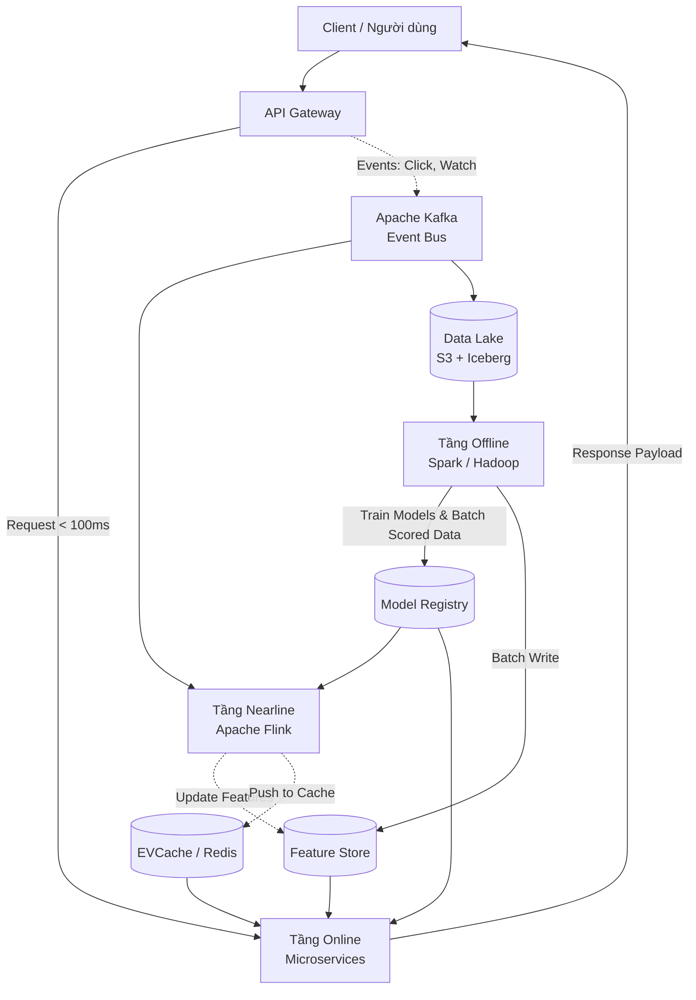
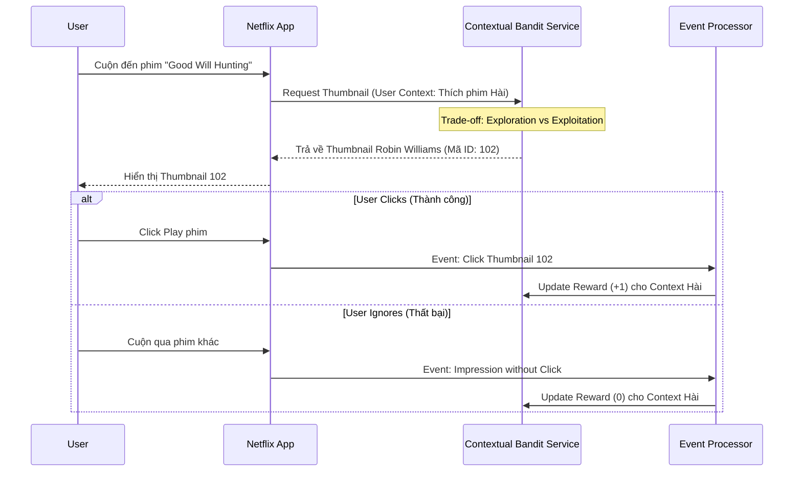

Hơn 80% thời lượng xem (watch time) trên Netflix đến từ hệ thống Recommendation (Gợi ý). Hệ thống này không chỉ đơn thuần là việc gợi ý phim, mà nó bao trùm toàn bộ trải nghiệm người dùng: từ việc sắp xếp các hàng (rows), lựa chọn phim, cho đến việc **cá nhân hóa cả ảnh bìa (thumbnail)** của phim đó dựa trên gu của bạn. 

Để phục vụ hơn 250 triệu người dùng toàn cầu với độ trễ (latency) tính bằng mili-giây, Netflix đã xây dựng một hệ thống System Design cực kỳ tinh vi. Nó là sự giao thoa hoàn hảo giữa **Data Engineering** (kéo tải Petabyte dữ liệu), **Machine Learning** (các mô hình dự đoán phức tạp) và **Microservices Architecture** (đảm bảo tính sẵn sàng cao và phản hồi tức thì).

Trong bài viết này, chúng ta sẽ "mổ xẻ" kiến trúc của Netflix, đi từ đường ống dữ liệu, thiết kế chia tầng, cho đến các thuật toán lõi.

---

## 1. Bức Tranh Toàn Cảnh: Triết Lý "Mọi Thứ Đều Là Gợi Ý"


Khi bạn mở ứng dụng Netflix, giao diện trang chủ không tĩnh (static). Hầu như mọi thành phần (pixel) trên màn hình đều được tính toán riêng cho bạn.

*   **Row Selection & Ordering:** Hàng nào được hiển thị ("Trending Now", "Because you watched X", "Top 10 in Vietnam") và thứ tự của chúng.
*   **Video Ranking:** Trong mỗi hàng, phim nào đứng đầu, phim nào đứng cuối.
*   **Artwork Personalization:** Cùng một bộ phim, nhưng người thích phim Hài sẽ thấy ảnh bìa khác với người thích phim Hành động.

:::note
**Tác động Kinh Doanh (Business Impact):**
Netflix ước tính hệ thống Recommendation giúp họ tiết kiệm hơn **1 Tỷ USD mỗi năm** nhờ vào việc giảm tỷ lệ rời bỏ dịch vụ (Churn Rate). Người dùng tìm thấy nội dung họ yêu thích nhanh hơn, giữ chân họ ở lại nền tảng lâu hơn.
:::

---

## 2. Kiến Trúc Thu Thập & Xử Lý Dữ Liệu (Data Engineering Pipeline)

Dữ liệu là nhiên liệu của mọi hệ thống ML. Netflix sinh ra hàng nghìn tỷ sự kiện (events) mỗi ngày, từ những cú click chuột, lượt xem, thời lượng xem, cho đến các hành động như tạm dừng (pause) hoặc tua lại (rewind).

Để xử lý khối lượng dữ liệu khổng lồ này, Netflix xây dựng một Data Pipeline có tên là **Keystone**.

### A. Keystone Event Streaming Pipeline

*   **Ingestion:** Các ứng dụng client (TV, Mobile, Web) gửi logs qua API Gateway.
*   **Message Broker (Apache Kafka):** Kafka đóng vai trò là "xương sống" (backbone) luân chuyển dữ liệu. Nó cho phép tách biệt (decouple) các hệ thống tạo dữ liệu và hệ thống tiêu thụ dữ liệu. Netflix chạy hàng ngàn node Kafka để chứa hàng Petabyte dữ liệu sự kiện.
*   **Stream Processing (Apache Flink):** Flink được sử dụng để đọc dữ liệu từ Kafka, xử lý làm sạch, làm giàu (enrichment) dữ liệu theo thời gian thực (real-time), và định tuyến nó tới các hệ thống đích.

### B. Data Lake với Apache Iceberg & Amazon S3

Thay vì dùng các Data Warehouse truyền thống quá đắt đỏ cho lượng dữ liệu này, Netflix sử dụng **Amazon S3** làm Data Lake. Tuy nhiên, S3 chỉ là kho lưu trữ Object đơn thuần, không hỗ trợ ACID hay các câu lệnh UPDATE/DELETE.

Đó là lý do Netflix đã tự phát triển và nguồn mở **Apache Iceberg** - một định dạng bảng (table format) dành cho Data Lake khổng lồ.

:::tip
**Tại sao lại là Iceberg?**
Apache Iceberg mang lại khả năng truy vấn như SQL (ACID transactions, Schema evolution, Time travel) trực tiếp trên file Parquet lưu ở S3. Điều này cho phép hàng ngàn Data Engineer và Data Scientist tại Netflix có thể truy vấn hàng PetaByte dữ liệu một cách nhất quán mà không lo bị lock dữ liệu khi có các job đang write.
:::

```sql
-- Ví dụ: Truy vấn dữ liệu tương tác (Implicit Feedback) của user bằng Spark SQL trên Iceberg
SELECT 
    user_id, 
    video_id, 
    SUM(watch_duration_sec) as total_watch_time,
    MAX(event_timestamp) as last_watched
FROM netflix_datalake.events.user_interactions
WHERE event_date >= '2023-01-01' 
  AND event_type IN ('PLAY', 'RESUME')
GROUP BY user_id, video_id;
```

---

## 3. Kiến Trúc 3 Tầng Hệ Thống Gợi Ý (Three-Tier Architecture)

Một trong những bài toán khó nhất của System Design là cân bằng giữa **Độ trễ thấp (Low Latency)** và **Độ phức tạp tính toán (Compute Complexity)**. 

Không có thuật toán Deep Learning nào đủ nhanh để duyệt qua hàng chục nghìn bộ phim, chấm điểm cho từng phim dựa trên lịch sử nhiều năm của user, và trả về kết quả trong vòng **< 100 mili-giây** khi người dùng mở App. 

Để giải quyết, Netflix chia quá trình tính toán thành **3 Tầng (Tiers)**:

### Bảng Tóm Tắt Đặc Điểm 3 Tầng Kiến Trúc

| Đặc điểm | Tầng Offline | Tầng Nearline | Tầng Online |
| :--- | :--- | :--- | :--- |
| **Công nghệ lõi** | Spark, Hadoop, Presto | Flink, Kafka | Spring Boot, EVCache, gRPC |
| **Tần suất chạy** | Batch (Vài giờ - Vài ngày) | Stream (Giây - Phút) | Real-time (Mili-giây) |
| **Tác vụ chính** | Huấn luyện ML model nặng (Deep Learning) | Cập nhật Session context, Incremental Training | Ráp kết quả, Lọc Business Logic (Maturity, Geo) |
| **Khối lượng dữ liệu** | Hàng Petabyte (Toàn bộ Data Lake) | Megabyte (Dòng sự kiện gần nhất) | Kilobyte (Request Payload hiện tại) |
| **Ưu tiên hàng đầu** | Độ chính xác, Khả năng mở rộng (Coverage) | Tính cập nhật (Recency) | Độ trễ cực thấp (Low Latency), HA |



### A. Tầng Offline (Lớp Tính Toán Hậu Trường)
*   **Nhiệm vụ:** Đây là nơi các mô hình AI nặng nề (Deep Neural Networks, Matrix Factorization) được huấn luyện. Lớp này cày cuốc trên toàn bộ lịch sử người dùng. 
*   **Đặc điểm:** Lớp này chạy theo dạng Batch (chu kỳ hàng ngày/tuần), không quan tâm đến thời gian chạy, ưu tiên độ chính xác tuyệt đối. Kết quả sau khi tính toán (Model Weights, hoặc danh sách gợi ý lưu sẵn) sẽ được đẩy vào Feature Store hoặc Model Registry.

### B. Tầng Nearline (Lớp Cận Thời Gian Thực)
*   **Nhiệm vụ:** Lớp Nearline giải quyết bài toán "Tính tức thời" (Recency) của dữ liệu.
*   **Ví dụ thực tế:** Bạn vừa bấm xem 10 phút đầu của một bộ phim Kinh Dị và thoát ra. Tầng Nearline bắt được sự kiện này qua Kafka, ngay lập tức kết hợp với Model từ Tầng Offline để tính toán lại điểm số đặc trưng, và đưa thêm vài bộ phim Kinh Dị vào bộ nhớ đệm (Cache) của bạn. Ở lần tải trang (F5) tiếp theo, giao diện của bạn đã được cập nhật nội dung rùng rợn.

### C. Tầng Online (Lớp Tương Tác Tức Thì)
*   **Nhiệm vụ:** Khi bạn mở App, server Online **không thực thi xử lý Machine Learning nặng**. Nó lấy các danh sách phim đã được tính sẵn (từ Cache), ráp lại với nhau, và thực hiện các bước Lọc Cuối (Final Filtering).
*   **Business Logic ở Tầng Online:**
    *   **Geo-blocking:** Loại bỏ các bộ phim không có bản quyền tại quốc gia bạn đang truy cập.
    *   **Maturity Rating:** Loại bỏ phim có rating 18+ nếu profile đang dùng là Kids.
    *   **Deduplication:** Tránh gợi ý những phim bạn vừa mới cày xong tối hôm qua.

---

## 4. Các Thuật Toán Cốt Lõi (Core Recommendation Algorithms)

Hệ thống của Netflix không phải là một mô hình nguyên khối (monolithic model), mà là một tập hợp (Ensemble) của nhiều thuật toán khác nhau:

### 4.1. Personalized Video Ranker (PVR)
PVR chịu trách nhiệm xếp hạng (ranking) toàn bộ danh mục phim của Netflix dựa trên sở thích của từng user cụ thể. Mô hình này kết hợp cả dữ liệu tường minh (Explicit data - như lượt Rate "Thumbs up") và dữ liệu ngầm định (Implicit data - như thời gian xem, lịch sử tìm kiếm).

### 4.2. Top-N Video Ranker
Thay vì xếp hạng toàn bộ danh mục như PVR, Top-N chỉ tập trung tìm ra N bộ phim "đỉnh" nhất cho bạn (thường là hàng "Top Picks for You"). Thuật toán này sử dụng các kỹ thuật Dimensionality Reduction và Deep Learning để tìm ra các Item ít phổ biến nhưng lại cực kỳ phù hợp với ngách (niche) của bạn.

### 4.3. Video-Video Similarity (Because You Watched...)
Đây là biến thể của Item-based Collaborative Filtering. Netflix tính toán một ma trận tương đồng giữa các video (thông qua embeddings hoặc Item2Vec). Nếu bạn xem xong "Stranger Things", hệ thống sẽ lookup trong không gian vector đa chiều để đề xuất "Dark" hoặc "The Umbrella Academy".

### 4.4. Trending Now
Thuật toán này bắt các xu hướng ngắn hạn. Ví dụ: Dịp Halloween, các phim kinh dị tự động trồi lên; hoặc khi có một bộ phim vừa đoạt giải Oscar. Nó kết hợp tính điểm theo thời gian phân rã (Time-decay scoring) để đảm bảo các trend cũ sẽ bị đào thải nhanh chóng theo đường cong Exponential.

---

## 5. Thử Thách Về Ảnh Bìa (Artwork Personalization)

Một trong những bài toán thú vị và độc đáo nhất của Netflix là **Cá nhân hóa Ảnh bìa (Artwork Personalization)**.
Cùng một bộ phim *Good Will Hunting*, Netflix có thể hiển thị hàng tá ảnh bìa khác nhau cho những nhóm người dùng khác nhau:
- Nếu bạn hay xem phim **Lãng mạn (Romance)**: Ảnh bìa sẽ là cảnh nam nữ chính ôm nhau.
- Nếu bạn hay xem phim **Hài (Comedy)**: Ảnh bìa sẽ tập trung vào gương mặt của diễn viên hài Robin Williams.

:::danger
**Rủi ro của sự Thiên Kiến (Bias):** Làm sao để biết bạn thực sự thích ảnh bìa nào mà không làm cho mô hình bị bias? Nếu hệ thống chỉ hiển thị mãi 1 ảnh bìa, nó sẽ không bao giờ biết liệu ảnh bìa khác có mang lại lượt click cao hơn không.
:::

### Thuật Toán Contextual Bandits (Học Tăng Cường)
Để giải quyết bài toán này, Netflix sử dụng thuật toán **Contextual Bandits** (một dạng của Reinforcement Learning). Hệ thống liên tục phải đối mặt với bài toán Đánh đổi: **Exploration vs. Exploitation** (Khám phá vs Khai thác).

*   **Exploitation:** Tối đa hóa lợi nhuận bằng cách hiển thị ảnh bìa mà hệ thống *tin rằng* bạn có xác suất click cao nhất dựa trên dữ liệu lịch sử.
*   **Exploration:** Chấp nhận rủi ro đôi khi thử hiển thị một ảnh bìa mới (chưa có nhiều dữ liệu) cho bạn để "đo lường" phản ứng thực tế (Click hay không Click) nhằm thu thập kiến thức mới cho AI.



---

## 6. MLOps: Quản Lý Vòng Đời Machine Learning với Metaflow

Hàng trăm Data Scientist tại Netflix cần huấn luyện hàng ngàn mô hình mỗi ngày. Nếu bắt họ phải tự viết code Docker, tự quản lý Kubernetes Pods để chạy train phân tán thì quá lãng phí tài nguyên chất xám.

Nhằm tối ưu hóa năng suất, Netflix đã phát triển và Open-source công cụ **Metaflow** - một framework Python giúp xây dựng và quản lý Data/ML Pipeline cực kỳ thanh lịch.

Với Metaflow, một kỹ sư AI có thể viết code Python thông thường, thêm một vài Decorator (`@batch`, `@step`), và hệ thống sẽ tự động đóng gói code, cấp phát tài nguyên trên AWS (GPU, RAM) và theo dõi vòng đời của thí nghiệm.

```python
# Đoạn code mô phỏng quy trình DAG huấn luyện mô hình với Metaflow
from metaflow import FlowSpec, step, batch, S3

class NetflixRecModelTraining(FlowSpec):

    @step
    def start(self):
        print("Bắt đầu Pipeline Huấn luyện mô hình Gợi ý...")
        self.next(self.fetch_features)

    # Tự động yêu cầu AWS cấp phát node 64GB RAM, 16 CPU để kéo dữ liệu
    @batch(memory=64000, cpu=16) 
    @step
    def fetch_features(self):
        # Kéo dữ liệu từ Feature Store (S3/Iceberg)
        self.data = fetch_from_feature_store("user_item_matrix_v2")
        self.next(self.train_model)

    # Yêu cầu cấp phát 1 GPU instance chuyên dụng để train Deep Learning
    @batch(memory=128000, gpu=1)
    @step
    def train_model(self):
        self.model = train_pytorch_dl_model(self.data)
        self.next(self.evaluate)

    @step
    def evaluate(self):
        self.metrics = evaluate_metrics(self.model)
        # Nếu chỉ số đo lường NDCG (Normalized Discounted Cumulative Gain) vượt ngưỡng 0.85
        if self.metrics['ndcg'] > 0.85:
            self.next(self.deploy)
        else:
            self.next(self.end)

    @step
    def deploy(self):
        # Lưu trữ mô hình đã kiểm duyệt lên Model Registry để Tầng Online sử dụng
        push_to_model_registry(self.model, version="v1.2.0")
        self.next(self.end)

    @step
    def end(self):
        print("Hoàn tất pipeline trơn tru.")

if __name__ == '__main__':
    NetflixRecModelTraining()
```

---

## 7. Deep Dive: Giải Quyết Các Bài Toán Hóc Búa Trong System Design

### 7.1. Caching Toàn Cầu (Global Caching) với EVCache
Với quy mô toàn cầu, việc truy vấn trực tiếp vào Database cho mỗi lượt tải trang là bất khả thi, vì chi phí I/O sẽ đánh sập hệ thống. Netflix tạo ra **EVCache** (Một Wrapper mở rộng hoạt động dựa trên Memcached) làm lớp lưu trữ bộ nhớ đệm phân tán.

EVCache được thiết kế theo kiến trúc Active-Active Multi-Region trên hạ tầng AWS. Khi một Model ở tầng Offline sinh ra danh sách gợi ý mới cho User A, danh sách này được ghi vào EVCache tại cụm AWS US-East. Ngay lập tức, cơ chế Cross-Region Replication của Netflix sẽ đồng bộ cục Cache này sang các Data Center tại AWS EU-West và AP-Southeast. Dù người dùng có bay sang quốc gia khác, hệ thống vẫn đảm bảo lấy ra được hồ sơ gợi ý cá nhân hóa dưới 50 mili-giây.

### 7.2. Bài Toán Khởi Động Lạnh (Cold Start Problem)
Hệ thống Recommendation sống nhờ dữ liệu. Vậy làm sao để gợi ý khi không có dữ liệu?
*   **New User Cold Start (Người dùng mới):** Khi bạn vừa tạo tài khoản, Netflix không có bất kỳ dữ liệu ngầm định nào về bạn. Họ vượt qua rào cản này bằng cách triển khai luồng Onboarding: Bắt bạn chọn ra tối thiểu 3 tựa phim/thể loại bạn yêu thích. Sau đó, họ kết hợp áp dụng mô hình *Popularity-based clustering* (Hiển thị phim nổi bật theo xu hướng địa lý của bạn) làm cầu nối cho đến khi hệ thống thu thập đủ click stream.
*   **New Item Cold Start (Phim mới):** Khi Netflix phát hành một Series mới, phim này chưa có bất kỳ lượt xem nào (không thể dùng Collaborative Filtering). Giải pháp là sử dụng **Content-based Filtering**: Máy học phân tích Metadata của bộ phim (Đạo diễn, Diễn viên, Thể loại, Tóm tắt kịch bản qua NLP) và nhúng (Map) nó vào một không gian vector đa chiều (Vector Space). Nếu vị trí vector của nó nằm ngay cạnh bom tấn "Breaking Bad", phim mới này sẽ được phân phối thử nghiệm tới tệp fan của bộ phim đó.

### 7.3. Nền Tảng A/B Testing Khổng Lồ (Alethea)
Văn hóa kỹ thuật tại Netflix mang đậm tính thực dụng: **Mọi thứ đều phải được chứng minh bằng A/B Testing**. Họ không bao giờ đưa một thuật toán AI lên Production chỉ vì điểm số lý thuyết (RMSE, NDCG) ở tầng Offline cao.

Nền tảng kiểm thử nội bộ có tên Alethea sẽ chia người dùng thành hàng trăm tệp (Cohorts) ngẫu nhiên bằng cơ chế Stratified Sampling. Thuật toán mới (Treatment) sẽ được so sánh song song với hệ thống hiện tại (Control) dựa trên các chỉ số thực tế mang tính sống còn đối với Business (Core Business Metrics):
- **Streaming Hours:** Số giờ xem trung bình có tăng không?
- **Engagement:** Lượt tương tác UI có tích cực không?
- **Retention Rate:** Người dùng được cung cấp thuật toán mới có tiếp tục gia hạn (renew) ở tháng tiếp theo không?

Nếu thuật toán mới thất bại trong A/B Testing, nó sẽ bị loại bỏ bất kể code ML có phức tạp đến đâu.

---

## 8. Kết Luận

Kiến trúc Recommendation của Netflix là một kiệt tác tổng hòa của ngành Kỹ thuật Phần mềm và Kỹ thuật Dữ liệu. Bằng việc chia nhỏ hệ thống thành 3 tầng (Offline - Nearline - Online), họ đã cân bằng xuất sắc sức mạnh xử lý vô tận của Machine Learning và yêu cầu khắt khe về System Latency của ứng dụng Frontend.

Bài học quý giá nhất từ Netflix không nằm ở việc họ ứng dụng những thuật toán tiên tiến nhất thế giới, mà là ở cách họ xây dựng được một nền tảng hạ tầng kỹ thuật vững chắc (với Iceberg, Kafka, Flink, EVCache và Metaflow) để đưa các "bộ não AI" đó vào vận hành và phục vụ hàng trăm triệu người dùng một cách trơn tru, bền bỉ mỗi ngày.

---

## Tài Liệu Tham Khảo Mở Rộng
*   **Netflix Technology Blog** - Kho tàng báo cáo kỹ thuật chi tiết của các kỹ sư Netflix.
*   [Metaflow by Netflix](https://metaflow.org/) - Framework mã nguồn mở cho MLOps giúp tăng năng suất làm việc của Data Scientist.
*   [System Design Interview - Alex Xu (Vol 1 & 2)](https://bytebytego.com/) - Tài liệu gối đầu giường về thiết kế hệ thống phân tán.
*   [Designing Data-Intensive Applications - Martin Kleppmann](https://dataintensive.net/) - Sách chuyên sâu về cách xây dựng các ứng dụng nặng về dữ liệu.
*   **Artwork Personalization at Netflix** - Bài viết kinh điển giải thích chi tiết về thuật toán Contextual Bandits.
