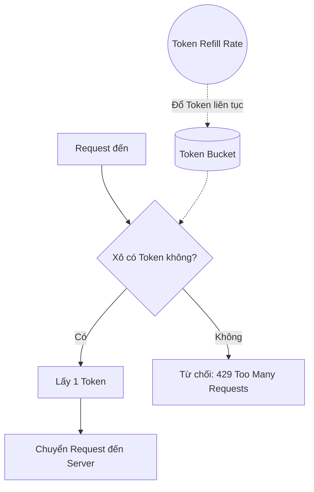
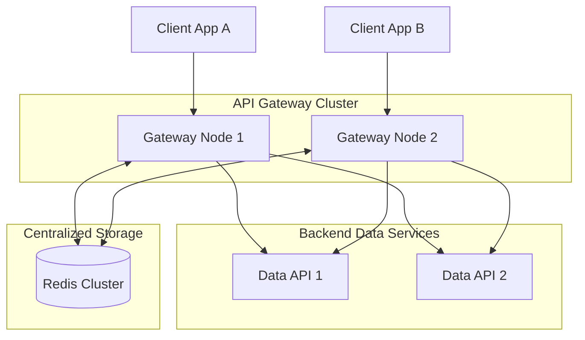

Khi bạn xây dựng một Data API để cung cấp dữ liệu cho khách hàng hoặc đối tác nội bộ, bạn không thể để họ gửi 100,000 requests mỗi giây. Bất kỳ cơ sở dữ liệu hoặc hệ thống backend nào cũng sẽ bị quá tải (DDoS, dù vô tình hay cố ý). Hơn nữa, Data APIs thường xử lý các truy vấn tốn kém (heavy computations, aggregations, quét hàng triệu bản ghi), do đó, việc giới hạn tốc độ không chỉ nhằm ngăn chặn sự cố tràn lưu lượng mà còn liên quan trực tiếp đến chi phí tính toán và bảo vệ tài nguyên hệ thống.

Để bảo vệ hệ thống, kiểm soát chi phí và đảm bảo công bằng (Fairness) cho mọi người dùng, **Rate Limiting (Giới hạn tốc độ)** là một chốt chặn kiến trúc bắt buộc trong System Design. Bài viết này sẽ đi sâu vào các khía cạnh kỹ thuật phức tạp của Rate Limiting, từ các thuật toán cốt lõi đến các thách thức trong hệ thống phân tán và ứng dụng thực tiễn trong Data Engineering.

---

## 1. Tại Sao Rate Limiting Lại Tối Quan Trọng Cho Data APIs?

Trước khi đi sâu vào thuật toán, chúng ta cần hiểu rõ tại sao Rate Limiting lại không thể thiếu:

1. **Ngăn Chặn Cạn Kiệt Tài Nguyên (Resource Starvation) & DDoS:** Một người dùng (hoặc một con bot) có thể vô tình hoặc cố ý gửi lượng lớn requests, chiếm dụng toàn bộ connection pool của Database, CPU, và Memory, làm cho API từ chối phục vụ (Denial of Service) các khách hàng hợp lệ khác.
2. **Kiểm Soát Chi Phí (Cost Control):** Các Data APIs thường gọi xuống các hệ thống tính phí theo lượng dữ liệu xử lý (như Google BigQuery, Snowflake, hoặc AWS Athena). Nếu không có giới hạn, một lỗi vòng lặp `while(true)` phía client có thể đốt sạch ngân sách hạ tầng của bạn trong vài giờ.
3. **Đảm Bảo Tính Công Bằng (Fairness):** Đảm bảo rằng tài nguyên hệ thống được phân bổ đều cho tất cả các tenants/khách hàng. Một khách hàng nhỏ không thể làm ảnh hưởng đến trải nghiệm của khách hàng Enterprise.
4. **Quản Lý Gói Dịch Vụ (Monetization & Quotas):** Rate Limiting là công cụ để thực thi các gói đăng ký (Pricing Tiers). Ví dụ: Gói Free (100 req/ngày), Gói Pro (1000 req/giây).

---

## 2. Phân Tích Chuyên Sâu 5 Thuật Toán Rate Limiting

Có 5 thuật toán phổ biến nhất để giới hạn lưu lượng. Mỗi thuật toán có ưu và nhược điểm riêng, phù hợp với các use-case khác nhau.

### 2.1. Token Bucket (Cái Xô Đựng Xu)

Đây là thuật toán phổ biến nhất, được các gã khổng lồ như Amazon, Stripe và nhiều API Gateways áp dụng.

* **Cơ chế:** Hãy tưởng tượng mỗi User được cấp 1 cái xô chứa tối đa `B` (Burst) đồng xu. Cứ mỗi `1/R` giây, hệ thống tự động thả vào xô 1 đồng xu (với `R` là Rate). Khi User gửi 1 request, họ phải lấy 1 đồng xu ra khỏi xô. Nếu xô trống rỗng, request bị chặn và trả về lỗi HTTP `429 Too Many Requests`.
* **Ưu điểm:** 
  * Cực kỳ dễ hiểu và hiệu quả về mặt bộ nhớ.
  * **Cho phép Burst (Bùng nổ tức thời):** Đây là điểm "ăn tiền" nhất. User có thể không gọi gì trong một khoảng thời gian để tích đủ số xu tối đa, sau đó gửi một loạt request cùng một lúc (hữu ích cho các kịch bản bursty traffic).
* **Nhược điểm:** Việc tinh chỉnh hai tham số (Kích thước xô và Tốc độ refill) có thể khó khăn đối với các workload phức tạp.



### 2.2. Leaky Bucket (Cái Xô Bị Rỉ)

* **Cơ chế:** Trái ngược với Token Bucket, Leaky Bucket giới hạn **tốc độ đầu ra**. Nước (Requests) từ User có thể đổ vào xô với tốc độ điên cuồng, nhưng đáy xô có một cái lỗ rỉ nước với tốc độ nhỏ giọt ĐỀU ĐẶN (Ví dụ: 10 requests/giây) chảy xuống Server để xử lý. Nếu đổ nước vào nhanh quá làm tràn xô (vượt quá dung lượng hàng đợi - Queue Size), request mới sẽ bị vứt bỏ.
* **Đặc điểm:** Nó làm "phẳng" (smooth) lưu lượng. Server đằng sau sẽ luôn luôn nhận được traffic ổn định, không bao giờ bị sốc. Nó thường được implement bằng một hàng đợi FIFO (First-In-First-Out).
* **Use-case:** Rất phù hợp cho các luồng xử lý Asynchronous Data (ví dụ: Export báo cáo hàng loạt) hoặc ghi dữ liệu vào Message Queue (như Kafka) nơi mà tốc độ tiêu thụ (Consumer) là cố định. Shopify sử dụng thuật toán này.

### 2.3. Fixed Window Counter (Cửa Sổ Cố Định)

* **Cơ chế:** Thời gian được chia thành các khung cố định (Ví dụ: 12:00:00 - 12:01:00). Trong mỗi khung, hệ thống duy trì một biến đếm đếm số lượng requests. Nếu vượt quá ngưỡng, requests bị chặn. Chuyển sang khung thời gian mới, bộ đếm reset về 0.
* **Vấn đề chí mạng (Spike at edges):** Nếu giới hạn là 100 req/phút. User gửi 100 requests lúc `12:00:59` (giây cuối cùng của phút đầu) và gửi tiếp 100 requests lúc `12:01:01` (giây đầu tiên của phút tiếp theo). Về mặt kỹ thuật, không có phút nào bị vi phạm, nhưng hệ thống phải gánh **200 requests chỉ trong vòng 2 giây**, có thể làm nghẽn cổ chai DB ngay lập tức.
* **Ưu điểm:** Ít tốn bộ nhớ, rất phù hợp cho việc giới hạn Quota kinh doanh dài hạn (VD: 50,000 API calls mỗi tháng) thay vì chống DDoS.

### 2.4. Sliding Window Log (Nhật Ký Cửa Sổ Trượt)

Để giải quyết vấn đề của Fixed Window, Sliding Window Log ra đời.
* **Cơ chế:** Hệ thống lưu lại *timestamp chính xác* của mỗi request vào một danh sách (thường sử dụng Sorted Set trong Redis). Khi có request mới đến lúc `T`, hệ thống sẽ xóa tất cả các timestamps cũ hơn `T - Window_Size`. Sau đó đếm số lượng timestamps còn lại. Nếu nhỏ hơn giới hạn, request được đi qua và ghi timestamp mới vào log.
* **Ưu điểm:** Cực kỳ chính xác. Tuyệt đối không bao giờ vượt qua giới hạn trong bất kỳ cửa sổ thời gian nào.
* **Nhược điểm:** Tốn quá nhiều Memory và chi phí tính toán. Hệ thống phải lưu timestamp của hàng triệu requests và liên tục thực hiện dọn dẹp. Chỉ phù hợp cho các APIs giá trị cao nhưng tần suất gọi thấp.

### 2.5. Sliding Window Counter (Bộ Đếm Cửa Sổ Trượt)

Đây là thuật toán "lai" (hybrid) hoàn hảo kết hợp hiệu năng cao của Fixed Window và tính mượt mà của Sliding Window Log.
* **Cơ chế:** Thay vì lưu mọi timestamp, nó chỉ lưu bộ đếm của cửa sổ hiện tại và cửa sổ trước đó. Khi đánh giá một request mới, số lượng request ước tính trong cửa sổ trượt được tính bằng công thức:
  `Requests = Requests trong cửa sổ trước * (1 - % thời gian đã trôi qua trong cửa sổ hiện tại) + Requests trong cửa sổ hiện tại`
* **Ví dụ:** Giới hạn 100 req/phút. Cửa sổ trước (12:00 - 12:01) có 84 requests. Cửa sổ hiện tại (12:01 - 12:02) đang có 36 requests. Khi request mới đến ở giây thứ 15 của phút 12:01 (tức là đã qua 25% của cửa sổ hiện tại).
  * Requests ước lượng = 84 * (1 - 0.25) + 36 = 84 * 0.75 + 36 = 63 + 36 = 99.
  * Hệ thống cho phép request đi qua.
* **Ưu điểm:** Bộ nhớ siêu nhẹ (chỉ cần lưu 2 con số), nhưng độ chính xác lên tới 99% để làm phẳng hiện tượng Spike. Thuật toán này được Cloudflare ứng dụng rất rộng rãi.

---

## 3. Kiến Trúc Phân Tán Cho Rate Limiting

Trong một hệ thống Microservices quy mô lớn, API của bạn không chỉ chạy trên 1 máy chủ mà được host trên 10-100 instances đằng sau một Load Balancer. Bài toán đặt ra là: **Làm sao để đồng bộ hóa bộ đếm giữa nhiều máy chủ?**

### 3.1. Vị Trí Đặt Rate Limiter

Có 3 vị trí phổ biến để triển khai Rate Limiting:
1. **Application Middleware:** Triển khai ngay trong code (VD: Express.js middleware, Spring Boot Filter). *Khuyết điểm:* Khó scale, mỗi service phải tự implement lại.
2. **API Gateway:** Đưa Rate Limiting ra rìa hệ thống (Edge). Đây là phương pháp **tiêu chuẩn công nghiệp** (Best Practice). Các công cụ như Kong, APISIX, AWS API Gateway hay NGINX đảm nhiệm việc này rất tốt, giúp giảm tải hoàn toàn cho backend.
3. **Service Mesh / Sidecar:** Trong kiến trúc Kubernetes hiện đại, Rate Limiting có thể được đẩy xuống các Envoy Proxy (Sidecar) chạy kèm với mỗi pod thông qua Istio.



### 3.2. Cứu Cánh Redis Và Bài Toán Concurrency (Race Conditions)

Để chia sẻ bộ đếm giữa nhiều API Gateway Nodes, không thể dùng RAM cục bộ (Local Memory) vì sẽ dẫn đến tình trạng vượt quota (Mỗi Node tự đếm riêng). Giải pháp là dùng **Redis** làm bộ đệm trung tâm (Centralized In-Memory Cache) vì Redis chạy cực nhanh và hỗ trợ TTL (Time-To-Live).

**Vấn đề Race Condition (Xung đột ghi đồng thời):**
Nếu thực hiện bằng các lệnh thông thường:
1. `GET counter` (Đọc giá trị hiện tại)
2. Nếu `counter < limit`, `counter = counter + 1`
3. `SET counter`

Trong môi trường có tính đồng thời cao, hai requests gửi đến cùng lúc sẽ đọc cùng một giá trị `GET`, sau đó cả hai cùng `SET` lại một giá trị (Mất mát dữ liệu đếm).

**Giải pháp: Redis Lua Scripts**
Redis thực thi các Lua scripts một cách **Atomic (Nguyên tử)**. Khi một script đang chạy, không có lệnh nào khác có thể chen vào (do Redis là Single-threaded core).

*Dưới đây là một ví dụ thực tế sử dụng Lua script để implement Token Bucket cho Data API:*

```lua
-- Tham số truyền vào:
-- KEYS[1]: Key chứa số lượng Token hiện tại (VD: rate_limit:user123:tokens)
-- KEYS[2]: Key chứa timestamp của lần refill cuối cùng
-- ARGV[1]: Công suất của xô (Bucket Capacity)
-- ARGV[2]: Tốc độ refill (Tokens per second)
-- ARGV[3]: Timestamp hiện tại của request (từ Gateway)
-- ARGV[4]: Số lượng tokens request yêu cầu (thường là 1)

local tokens_key = KEYS[1]
local timestamp_key = KEYS[2]

local capacity = tonumber(ARGV[1])
local rate = tonumber(ARGV[2])
local now = tonumber(ARGV[3])
local requested = tonumber(ARGV[4])

-- Đọc số token hiện tại (mặc định là full nếu chưa có)
local last_tokens = tonumber(redis.call("get", tokens_key))
if last_tokens == nil then
  last_tokens = capacity
end

-- Đọc timestamp cuối
local last_refreshed = tonumber(redis.call("get", timestamp_key))
if last_refreshed == nil then
  last_refreshed = 0
end

-- Tính toán Token được refill dựa trên thời gian trôi qua
local delta = math.max(0, now - last_refreshed)
local filled_tokens = math.min(capacity, last_tokens + (delta * rate))

-- Kiểm tra xem có đủ Token cho Request hiện tại không
local allowed = filled_tokens >= requested
local new_tokens = filled_tokens

if allowed then
  new_tokens = filled_tokens - requested
end

-- Lưu trạng thái mới vào Redis, thiết lập thời gian hết hạn (EXPIRE) để giải phóng RAM
local ttl = math.ceil(capacity / rate)
redis.call("setex", tokens_key, ttl, new_tokens)
redis.call("setex", timestamp_key, ttl, now)

-- Trả về 1 nếu cho phép, 0 nếu chặn
return allowed and 1 or 0
```

### 3.3. Tối Ưu Hóa Hiệu Năng (Tối Thiểu Hóa Độ Trễ)

Mặc dù Redis rất nhanh (phản hồi trong < 1ms), nhưng việc mỗi request đều phải thực hiện một vòng (round-trip) gọi mạng (network call) tới Redis sẽ cộng dồn độ trễ (latency). 

Để tối ưu trong các hệ thống chịu tải siêu lớn (hàng triệu RPS):
* **Local In-Memory Cache Sync (Mô hình Eventual Consistency):** Thay vì check Redis trên mỗi request, API Gateway tự duy trì một bộ đếm Local trong bộ nhớ. Mỗi giây (hoặc mỗi batch n requests), Gateway mới xả dữ liệu xuống Redis một lần một cách không đồng bộ (Asynchronously) để đồng bộ hóa. Cách này có thể khiến hệ thống "châm chước" cho vượt giới hạn một chút xíu (khoảng vài phần trăm) nhưng đổi lại hệ thống đạt hiệu năng vô cùng khủng khiếp.
* **Redis Pipelining:** Gộp nhiều lệnh Redis lại để tiết kiệm network overhead.

---

## 4. Trải Nghiệm Người Dùng (Client Experience) & HTTP Headers

Khi xây dựng Data APIs, đừng chỉ "im lặng chặn" requests. Bạn cần giao tiếp rõ ràng với Client thông qua HTTP Headers để họ biết đường cấu hình logic Retry (đặc biệt là Exponential Backoff).

Khi chặn request, hãy trả về HTTP Status Code `429 Too Many Requests` kèm theo các headers tiêu chuẩn:

| Header | Giải thích | Ví dụ |
| :--- | :--- | :--- |
| `X-Ratelimit-Limit` | Số lượng requests tối đa được phép trong một cửa sổ thời gian. | `100` |
| `X-Ratelimit-Remaining` | Số lượng requests còn lại trong cửa sổ hiện tại. | `0` |
| `X-Ratelimit-Reset` | Thời gian (Unix timestamp) khi cửa sổ hiện tại bị reset và khách hàng được cấp lại Quota. | `1685002000` |
| `Retry-After` | Số giây client phải chờ trước khi thực hiện request tiếp theo. Rất quan trọng để các thư viện như Axios tự động delay. | `15` |

---

## 5. Rate Limiting Nâng Cao Cho Data APIs

Data APIs có một điểm khác biệt lớn so với các CRUD APIs thông thường: **Một request không đại diện cho một chi phí đồng nhất.** 
Một request `GET /users/1` rất nhẹ, nhưng request `POST /analytics/export?year=2023` có thể scan 5 tỷ dòng dữ liệu, tiêu tốn 10 phút xử lý của CPU.

### 5.1. Giới Hạn Dựa Trên Chi Phí / Trọng Số (Cost-based / Weight-based Rate Limiting)
Thay vì mỗi request trừ 1 token, hệ thống cần gán "trọng số" cho từng Endpoint. Endpoint nhẹ trừ 1 token, Endpoint nặng (như chạy Machine Learning model hoặc trích xuất báo cáo lớn) có thể trừ 50 tokens một lần.
GraphQL APIs đặc biệt áp dụng kỹ thuật **Query Complexity Analysis**. Rate Limiter sẽ duyệt AST (Abstract Syntax Tree) của câu truy vấn GraphQL trước khi chạy, tính toán độ sâu và số lượng trường, sau đó trừ token tương ứng. GitHub GraphQL API dùng chính xác mô hình này.

### 5.2. Multi-tier và Multi-dimensional Rate Limiting
Bạn cần xây dựng giới hạn đa chiều để bảo vệ hệ thống toàn diện:
1. **Theo User/IP (Per User):** (VD: IP X chỉ được gọi 100 req/s). Tránh 1 user chiếm dụng tài nguyên.
2. **Theo Endpoint (Per Route):** (VD: API `/login` bị giới hạn nghiêm ngặt 5 req/s để chống Brute-force mật khẩu, trong khi API `/products` cho phép 100 req/s).
3. **Theo Toàn Hệ Thống (Global Switch):** Nếu database đang bị quá tải, có thể bật "cầu dao" (Circuit Breaker) toàn cục, giảm giới hạn của tất cả mọi người xuống còn 10% cho đến khi hệ thống ổn định.

### 5.3. Rate Limiting Trong Streaming & Data Pipelines (Data Engineering)
Trong thế giới Data Engineering, Rate Limiting còn được gọi dưới hình thái **Backpressure**.
Khi stream dữ liệu qua Apache Kafka hoặc xử lý luồng sự kiện qua Apache Flink, nếu Consumer (Hệ thống ghi vào Data Warehouse) bị chậm lại, Data API nhận dữ liệu (Producer) bắt buộc phải "Rate Limit" lại các thiết bị IoT hoặc các Service gửi dữ liệu tới nó. Nếu API vẫn tiếp tục nhận dữ liệu với tốc độ cao, Message Queue sẽ bị tràn bộ nhớ. Kỹ thuật ở đây là trả về HTTP 429 để buộc Client ngắt luồng hoặc giảm tốc độ gửi, cho phép Consumer có thời gian giải phóng dữ liệu cũ.

---

## 6. Tổng Kết

Rate Limiting không chỉ là một tính năng cấu hình thêm cho có, nó là **hệ miễn dịch** của mọi hệ thống phân tán và Data APIs. 
* Bắt đầu với **Fixed Window** nếu bài toán đơn giản là kiểm soát số dư hàng tháng.
* Cần giới hạn mượt mà, ngăn burst để bảo vệ Database? Dùng **Leaky Bucket**.
* Cần linh hoạt, thân thiện với Client và hỗ trợ bùng nổ traffic? Chắc chắn phải dùng **Token Bucket**.
* Để triển khai ở quy mô production, hãy tích hợp Rate Limiter ở **API Gateway**, lưu trữ state ở **Redis** và sử dụng **Lua Scripts** để giải quyết bài toán Concurrency một cách tối ưu.

---

## 7. Tài Liệu Tham Khảo Mở Rộng
* [Stripe Engineering: Scaling your API with rate limiters](https://stripe.com/blog/rate-limiters)
* [Cloudflare: How Rate Limiting works](https://www.cloudflare.com/learning/bots/what-is-rate-limiting/)
* [System Design Interview - Alex Xu (Vol 1 & 2)](https://bytebytego.com/)
* [Grokking the System Design Interview - Design Gurus](https://www.designgurus.io/course/grokking-the-system-design-interview)
* [Designing Data-Intensive Applications - Martin Kleppmann (Part 3: Derived Data)](https://dataintensive.net/)
