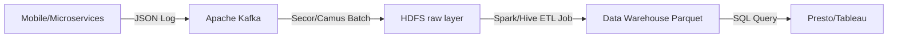
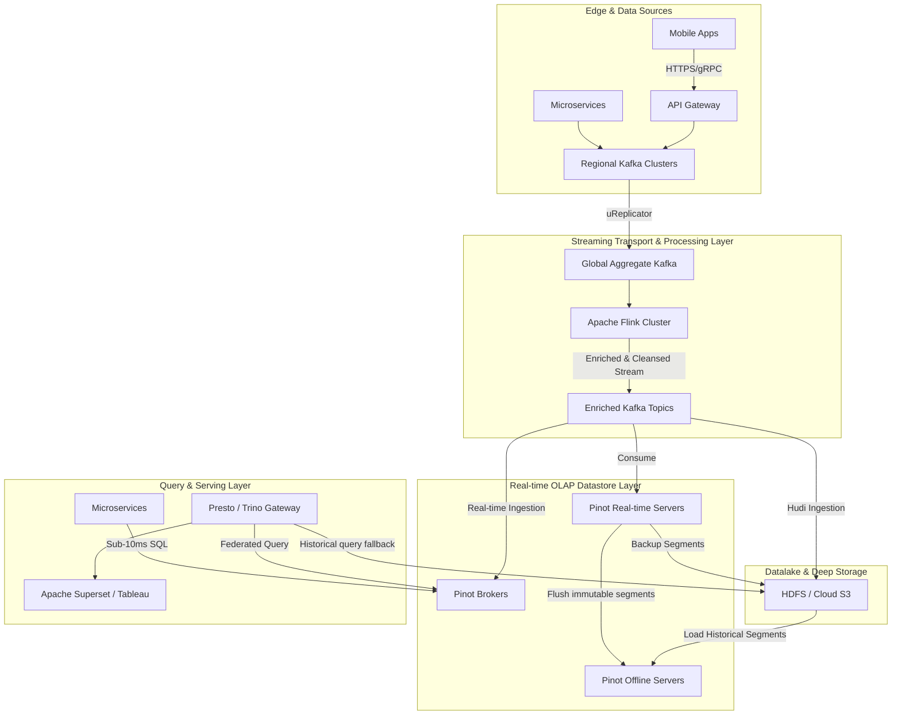
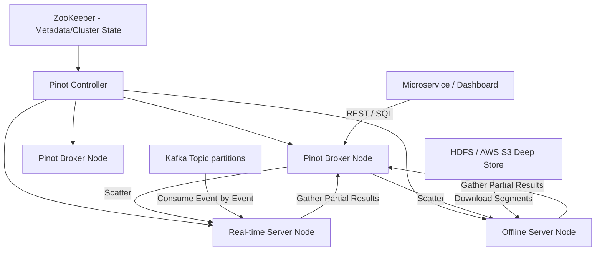

Với hàng triệu cuốc xe mỗi ngày trên toàn cầu, kết nối hàng triệu tài xế và hành khách cùng lúc, Uber không chỉ là một công ty vận tải mà cốt lõi là một cỗ máy xử lý dữ liệu khổng lồ. Hệ sinh thái của Uber tạo ra hàng ngàn Terabyte dữ liệu sự kiện (Log data) mỗi ngày: từ tín hiệu GPS di chuyển của điện thoại tài xế, thao tác chạm/vuốt trên màn hình ứng dụng của khách hàng, cho đến log lỗi hệ thống (System logs), và thông tin giao dịch thanh toán.

Việc xử lý và phân tích khối lượng khổng lồ này theo thời gian thực (Real-time Analytics) để phục vụ cho các bài toán kinh doanh sinh lời như phát hiện lừa đảo (Fraud Detection), định giá động (Surge Pricing), hay cung cấp dashboard doanh thu cho hàng triệu nhà hàng UberEats đòi hỏi một kiến trúc System Design ở đẳng cấp cao nhất. Bài viết này sẽ mổ xẻ chi tiết hành trình tiến hóa, các bài học xương máu và kiến trúc kỹ thuật sâu sắc của nền tảng Log Analytics tại Uber.

## 1. Đặc Tả Yêu Cầu Của Hệ Thống (System Requirements)


Trước khi đi vào kiến trúc cụ thể, chúng ta cần hiểu rõ bài toán cực đoan mà kỹ sư dữ liệu tại Uber phải giải quyết:

- **Data Volume (Khối lượng):** Hệ thống phải hấp thụ hàng chục triệu sự kiện mỗi giây (events per second), tương đương hàng trăm PetaByte dữ liệu mới mỗi tháng.
- **Data Velocity (Tốc độ Freshness):** Độ trễ từ lúc sự kiện xảy ra vật lý (ví dụ tài xế hoàn thành cuốc xe) cho đến khi sự kiện đó có thể truy vấn được trên Data Warehouse phải ở mức sub-second (dưới 1 giây) đến tối đa là vài phút.
- **Query Latency (Độ trễ truy vấn):** Hệ thống phục vụ cả phân tích nội bộ (Data Scientists) lẫn external user-facing dashboards (cho tài xế, nhà hàng). Do đó, query latency yêu cầu cực kỳ khắt khe: hàng ngàn QPS (Queries Per Second) với P99 latency (độ trễ của 99% request) phải dưới 100 mili-giây.
- **High Availability & Fault Tolerance:** Uber hoạt động 24/7 toàn cầu. Mất điện ở một Data Center (Availability Zone) không được phép làm gián đoạn hệ thống định giá cuốc xe (Surge Pricing). Yêu cầu SLA lên tới 99.99% Uptime.

## 2. Nỗi Đau Ban Đầu: Kỷ Nguyên Hadoop & Batch Processing

Vào những năm 2014-2015, khi Uber mới bắt đầu tăng trưởng bùng nổ, hạ tầng dữ liệu của họ chủ yếu dựa vào nền tảng Hadoop truyền thống.

### 2.1 Kiến Trúc Ban Đầu
1. **Ingestion Layer:** Các microservices và ứng dụng di động bắn log (dạng JSON) tới Apache Kafka.
2. **Archival Layer:** Công cụ Secor (hoặc Camus) được sử dụng để consume data định kỳ từ Kafka và dump (đổ) dưới dạng file text thô xuống HDFS (Hadoop Distributed File System).
3. **ETL Layer:** Các batch job (Hive/MapReduce/Spark) được lên lịch chạy định kỳ (hàng giờ hoặc hàng ngày) để transform dữ liệu, parse JSON, đổi định dạng sang Parquet/ORC (Columnar format) và nạp vào các bảng Data Warehouse trung tâm.
4. **Serving Layer:** Presto hoặc Hive được dùng để query phục vụ Data Analyst và các Dashboard Tableau.



### 2.2 Những Vấn Đề Chí Mạng

:::danger
Mặc dù Hadoop cực kỳ mạnh mẽ trong việc lưu trữ và xử lý dữ liệu lớn (Big Data), nó hoàn toàn "hụt hơi" trong bài toán thời gian thực (Real-time).
:::

- **Data Freshness cực kỳ tồi tệ:** Do dữ liệu phải đi qua nhiều bước batch processing, độ trễ từ lúc dữ liệu sinh ra đến lúc query được mất từ 12 đến 24 giờ.
- **Phát hiện gian lận (Fraud) quá muộn:** Nếu một nhóm lừa đảo dùng kỹ thuật GPS Spoofing để tạo các chuyến đi ảo ở sân bay trục lợi, hệ thống phải mất một ngày sau mới có report phát hiện. Lúc này tiền đã được thanh toán và tẩu tán, hậu quả đã xảy ra.
- **Tính toán lãng phí (I/O Bottleneck):** Để chạy một báo cáo tính tổng (`COUNT`, `GROUP BY`) số cuốc xe ở khu vực San Francisco, Hadoop/Presto phải quét qua hàng TeraByte file Parquet (Full Table Scan) do không có cơ chế Indexing mạnh mẽ. Thời gian trả kết quả tính bằng phút, thường xuyên gây timeout trên Dashboard.

## 3. Sự Chuyển Dịch: Lambda Architecture & Những Hạn Chế

Để giải cứu tình hình, Uber đã thử nghiệm **Lambda Architecture**. Ý tưởng là song song với luồng Batch chậm chạp, họ thêm một "Speed Layer" bằng cách sử dụng Apache Storm (sau này đổi sang Apache Flink) để đọc trực tiếp luồng event từ Kafka. Flink sẽ tính toán các metrics thiết yếu (counters, sum, average) trong bộ nhớ, sau đó ghi kết quả vào các cơ sở dữ liệu key-value có độ trễ thấp như Redis hoặc Cassandra để phục vụ real-time dashboard.

:::danger
**Nỗi đau của Lambda Architecture**
Việc duy trì hai codebase độc lập (một job Spark cho luồng Batch, một job Flink cho luồng Streaming) thực hiện cùng một logic nghiệp vụ là một cơn ác mộng bảo trì. Hơn nữa, nó sinh ra tình trạng Data Inconsistency – số liệu cuối ngày ở luồng batch thường bị lệch so với số liệu do luồng streaming tính ra do các xử lý late-arriving data (dữ liệu đến trễ) hoặc out-of-order.
:::

Uber nhận ra họ không thể tiếp tục "chắp vá". Họ cần một giải pháp **Real-time OLAP Database** đích thực: một cơ sở dữ liệu có khả năng "nuốt" trực tiếp stream sự kiện từ Kafka siêu tốc, đồng thời hỗ trợ SQL query linh hoạt với độ trễ tính bằng mili-giây trên hàng PetaByte dữ liệu gốc mà không cần phải viết job pre-compute mọi thứ bằng Flink. Và **Apache Pinot** đã xuất hiện như một "đấng cứu thế".

## 4. Giải Phẫu Kiến Trúc Real-time OLAP Hiện Đại Tại Uber

Kiến trúc thế hệ mới của Uber được thiết kế theo tư tưởng của mô hình **Kappa Architecture** mở rộng, loại bỏ hoàn toàn giới hạn của Batch layer truyền thống đối với các bài toán cần tốc độ.



### 4.1. Lớp Trạm Trung Chuyển (Ingestion Layer): Apache Kafka & uReplicator

Tại Uber, Kafka đóng vai trò như hệ thần kinh trung ương. Mỗi giây có hàng chục triệu tin nhắn chảy qua hệ thống này.

- **Regional vs Global Clusters:** Thay vì dồn mọi thứ vào một cụm Kafka khổng lồ (rất dễ dính Single Point of Failure), Uber chia nhỏ Kafka thành nhiều **Regional Clusters** đặt gần người dùng nhất (ví dụ Bắc Mỹ, Châu Âu, Châu Á) để giảm thiểu độ trễ mạng (Network Latency) khi thiết bị di động gửi tín hiệu.
- **Sự ra đời của uReplicator:** Thông thường, để đồng bộ dữ liệu từ Regional về một Global Cluster trung tâm, người ta dùng công cụ `MirrorMaker` có sẵn của Kafka. Tuy nhiên, MirrorMaker gặp vấn đề lớn về "Rebalancing" (tái cân bằng) khi có số lượng topics/partitions quá lớn, gây gián đoạn luồng stream hàng phút liền. Kỹ sư Uber đã tự phát triển **uReplicator** dựa trên Apache Helix để thay thế. Nó quản lý trạng thái phân phối partition thông minh hơn, đảm bảo throughput khổng lồ không bị giật lag khi mở rộng cụm (scaling).

### 4.2. Lớp Stream Processing: Apache Flink

Dữ liệu thô (raw data) trực tiếp từ thiết bị thường bị khuyết thiếu ngữ cảnh. Flink đóng vai trò như một bộ lọc và "làm giàu" (enrichment) dữ liệu theo thời gian thực (Stateful Stream Processing).

- **Data Cleansing & Deduplication:** Lọc bỏ tín hiệu GPS bị nhiễu do lỗi chip điện thoại, hoặc loại bỏ các thao tác chạm bị trùng lặp do lỗi mạng (Retry).
- **Data Enrichment & Join:** Stream sự kiện (ví dụ `trip_created`) chỉ chứa các ID cơ bản (như `rider_id`, `driver_id`). Flink sẽ join stream này trực tiếp với dữ liệu tĩnh trong Redis hoặc đọc stream CDC (Change Data Capture) từ MySQL database để bổ sung thêm tên khách hàng, loại xe, thành phố. Dữ liệu sau khi "enriched" sẽ được đẩy vào một Kafka Topic mới sạch sẽ và sẵn sàng để phân tích.

:::tip
Bằng cách chuẩn bị dữ liệu (enrichment) ngay trong luồng Flink trước khi đưa vào kho lưu trữ, Uber đẩy nặng phần xử lý I/O vào bước Ingestion, giúp cho bước Truy vấn (Query) sau này nhẹ nhàng hơn và nhanh hơn gấp nhiều lần so với việc thực hiện Join lớn (Heavy Joins) trong OLAP.
:::

```java
// Ví dụ mô phỏng Flink Code xử lý Log gian lận tại Uber
DataStream<String> rawLogs = env.addSource(
    new FlinkKafkaConsumer<>("Raw_App_Logs", new SimpleStringSchema(), kafkaProps));

DataStream<AppLog> enrichedLogs = rawLogs
    .map(json -> parseJsonToLog(json))
    // Làm giàu dữ liệu bằng cách lookup vào Redis cache
    .map(new RichMapFunction<AppLog, AppLog>() {
        transient Jedis redis;
        public void open(Configuration config) { redis = new Jedis("redis-cluster"); }
        public AppLog map(AppLog log) {
            log.setCityName(redis.get("city:" + log.getCityId()));
            return log;
        }
    })
    .filter(log -> isHighRiskEvent(log)); // Chỉ lọc ra event nghi ngờ fraud

// Đẩy dữ liệu sạch và giàu ngữ cảnh vào Kafka Topic mới
enrichedLogs.addSink(new FlinkKafkaProducer<>(
    "Enriched_Risk_Logs", new AppLogSchema(), kafkaProps));
```

### 4.3. Engine Phân Tích Siêu Tốc: Sự Lên Ngôi Của Apache Pinot

Đây chính là trái tim của kiến trúc. Uber cần một Datastore phục vụ **User-Facing Analytics** (phân tích hiển thị trực tiếp cho người dùng cuối). Tại sao lại chọn Pinot?

| Tiêu Chí So Sánh | Elasticsearch (ELK) | Apache Druid | Apache Pinot | ClickHouse |
| :--- | :--- | :--- | :--- | :--- |
| **Thế mạnh lõi** | Text Search, Debug Logs | Time-series, Dashboards | **High QPS, Real-time user-facing** | Raw compute performance, Batch |
| **Indexing** | Inverted Index (Lucene) | Bitmap Index | **Inverted, Star-Tree, Text, JSON** | Sparse Index chủ đạo |
| **Concurrency (QPS)** | Thấp - Trung bình | Trung bình | **Rất Cao (Hàng ngàn QPS)** | Cao |
| **Data Ingestion** | Bulk Insert / Logstash | Kafka Streaming | **Trực tiếp Kafka (Exactly-once)** | Batch / Kafka Engine |

Ở bài toán như tính Surge Pricing hay UberEats Dashboard, số lượng người dùng gửi request cùng lúc lên hệ thống là hàng vạn (High QPS). Pinot được sinh ra tại LinkedIn để giải bài toán tương tự (Dashboard "Ai đã xem hồ sơ của bạn"), thiết kế đặc thù tối ưu cho **High Throughput / Low Latency**.

#### Kiến Trúc Nội Bộ của Pinot



1. **Controller:** "Bộ não" quản lý cluster, phối hợp với Zookeeper để duy trì schema, cấu hình bảng, và gán phân vùng dữ liệu.
2. **Broker:** Cổng giao tiếp. Nhận câu lệnh SQL từ client, lập kế hoạch thực thi (Query Planning), phân tán truy vấn (Scatter) xuống các Servers đang nắm giữ phân vùng dữ liệu tương ứng, sau đó thu thập và gộp kết quả (Gather) trả về client.
3. **Real-time Server:** Connect trực tiếp vào Kafka partitions. Khi một event mới chui vào Kafka, Real-time Server consume nó ngay lập tức, lưu tạm trên Memory (RAM) và **lập tức có thể query được (nhỏ hơn 1 giây delay)**.
4. **Offline Server & Segments:** Dữ liệu trên RAM của Real-time Server sau một thời gian (ví dụ 100,000 rows hoặc 2 giờ) sẽ được đóng gói lại thành các khối bất biến (Immutable Segments). Quá trình này sẽ nén dữ liệu, tạo Index, rồi flush xuống ổ cứng và đẩy lên Deep Store (S3). Offline Server sẽ kéo các segments này về để phục vụ query lịch sử một cách cực kỳ tối ưu, giải phóng bộ nhớ cho luồng real-time.

## 5. Bí Mật Tốc Độ Của Pinot: Data Structures & Indexing Algorithms

Để thực thi một câu SQL phức tạp `SELECT city_id, SUM(fare) FROM trips WHERE status = 'COMPLETED' GROUP BY city_id` trong vòng chưa đầy 50ms trên hàng Tỷ dòng, Pinot không dùng phép màu. Nó dựa vào những cấu trúc dữ liệu kinh điển của Khoa học Máy tính.

### 5.1. Inverted Index (Chỉ Mục Đảo Ngược) & Bitmap
Pinot tổ chức lưu trữ dạng Cột (Columnar). Giả sử hệ thống cần lọc ra các cuốc xe `COMPLETED`. Thay vì quét toàn bộ bảng, Pinot dùng Dictionary Encoding gán `COMPLETED = 0, CANCELLED = 1`. 
Tiếp theo, nó dùng cấu trúc Bitmap (mảng các bit 0 và 1) cho Inverted Index.
- `COMPLETED`: `[1, 0, 1, 1, 0, 0, 1...]` (Bit 1 ở vị trí nào có nghĩa là dòng đó thỏa mãn).
Phép toán tìm kiếm `WHERE` giờ đây trở thành phép toán **Bitwise AND/OR** ở cấp độ phần cứng CPU. Việc lọc hàng triệu bản ghi diễn ra trong vài phần nghìn giây.

### 5.2. Vũ khí tối thượng: Star-Tree Index
Khi một Data Analyst chạy báo cáo `GROUP BY`, các hệ cơ sở dữ liệu truyền thống (thậm chí Spark hay Presto) sẽ phải nạp toàn bộ cột vào RAM và thực thi phép cộng (Aggregating on-the-fly) tiêu tốn cực nhiều CPU cycle.

Pinot cung cấp một cấu trúc gọi là **Star-Tree Index**. Nó bản chất là một cây đồ thị kết hợp với Materialized View:
- Trong quá trình Ingestion (lúc tạo Segment), Pinot sẽ tự động tính trước (Pre-compute) các tổ hợp của phép toán `SUM, MIN, MAX, COUNT` dựa trên các Dimensions quan trọng (ví dụ: `city_id, service_type`).
- Dữ liệu kết quả được lưu vào các Node lá (Leaf node) của cây Star-Tree.
- Khi user gửi query `GROUP BY city_id, service_type`, hệ thống không cần scan hàng triệu dòng thô nữa. Nó chỉ thực hiện hành động duy nhất: **Duyệt cây (Tree Traversal)** với độ phức tạp thời gian `O(1)` hoặc `O(logN)` để bốc thẳng kết quả đã được cộng sẵn ra.

:::note
Nhờ Star-Tree Index, các query cực nặng (Heavy Aggregation) vốn mất hàng chục phút trên Hadoop giờ đây trả về kết quả trong thời gian dưới 10ms. Nó thay đổi hoàn toàn cách Data Engineers thiết kế Dashboard tương tác.
:::

### 5.3. Bloom Filters & Tránh I/O Lãng Phí
Với những truy vấn kiểu "Tìm cuốc xe có `trip_uuid = XYZ`", Pinot sử dụng **Bloom Filter**. Bloom Filter là một cấu trúc dữ liệu xác suất (Probabilistic Data Structure) chiếm rất ít bộ nhớ, có khả năng trả lời cực nhanh câu hỏi: *"ID này có nằm trong Segment này không?"*. Nếu Bloom Filter trả lời "KHÔNG", Pinot sẽ bỏ qua hoàn toàn việc đọc disk (Disk I/O) trên Segment đó, tiết kiệm vô số tài nguyên phần cứng.

## 6. Đảm Bảo Tính Toàn Vẹn & Quản Lý Sự Cố (Chaos Engineering)

Với tư cách là hệ thần kinh của cả doanh nghiệp, nếu hệ thống tính Surge Pricing sụp đổ trong 1 tiếng, Uber có thể bốc hơi hàng chục triệu USD. Để đạt chuẩn 99.99% Availability, Uber áp dụng triết lý **Active-Active Architecture** khắt khe.

### 6.1. Active-Active Cross-Region Replication
Hệ thống không hoạt động theo kiểu Primary-Backup truyền thống. Thay vào đó, toàn bộ Pipeline (Kafka, Flink, Pinot) được triển khai tại tối thiểu hai Data Center địa lý riêng biệt (ví dụ US-East và US-West).
Cả hai Region đều xử lý lưu lượng thực (Active). Dữ liệu Kafka ở Region này được đồng bộ chéo (Cross-replication) sang Region kia bằng uReplicator. 

### 6.2. Disaster Recovery Mượt Mà
Điều đặc biệt của Pinot là **Segment Replication**. Các Node Pinot ở Region A và Region B đều độc lập đọc cùng một luồng Kafka Topic được nhân bản. Chúng tự tạo Index, tự sinh Segment.
Nếu một máy xúc cắt đứt cáp quang làm sập toàn bộ Region A:
- Traffic mạng toàn cầu (từ điện thoại) sẽ lập tức được định tuyến BGP/DNS chuyển sang Region B.
- Do Pinot Region B đã tiêu thụ dòng dữ liệu y hệt và lưu trong Memory của nó từ trước, các query tính giá tiền (Pricing) ngay lập tức được đáp ứng mà **không hề có độ trễ khởi động lại (Zero Warm-up time)**. Người dùng cuối hoàn toàn không cảm nhận được thảm họa vừa xảy ra.

## 7. Các Ứng Dụng Thực Tế (Real-world Use Cases) Nhờ Kiến Trúc Này

1. **Định Giá Động (Surge Pricing):** Thuật toán Machine Learning của Uber cần tính toán sự mất cân bằng giữa cung (tài xế rảnh rỗi) và cầu (khách hàng đang mở app) trong một ô tọa độ địa lý hẹp (chuẩn S2 cell) theo thời gian thực. Hệ thống gọi API vào Pinot hàng nghìn lần mỗi giây để thực thi các lệnh spatial aggregation, qua đó quyết định hệ số giá 1.5x hay 2.0x ngay chớp mắt.
2. **Phát Hiện Lừa Đảo (Fraud Detection):** Flink kết hợp với Pinot liên tục quét dấu hiệu bất thường. Ví dụ rules: "Một tài xế nhận 5 cuốc xe liên tiếp từ cùng một chuỗi IP thiết bị trong 10 phút tại sân bay". Kẻ gian lận lập tức bị block, hủy giao dịch trước khi kịp tẩu tán tài sản.
3. **UberEats Restaurant Manager Dashboards:** Hàng chục vạn chủ nhà hàng trên thế giới liên tục F5 để xem doanh thu trong ngày, món ăn nào đang bán chạy nhất, feedback khách hàng 5 phút vừa qua ra sao. Hadoop gục ngã hoàn toàn với High Concurrency này, nhưng kiến trúc Pinot thì xử lý nhẹ nhàng.
4. **Giám Sát Hạ Tầng Mạng (Network & Crash Analytics):** Khi app Uber vừa release bản cập nhật mới trên App Store, các kỹ sư theo dõi tỷ lệ Crash Rate realtime. Nếu có biến động bất thường, hệ thống tự động cảnh báo để Rollback phiên bản ngay lập tức.

## 8. Bức Tranh Hoàn Thiện: Tích hợp với Data Lakehouse (Apache Hudi)

Pinot xử lý tuyệt vời bài toán Real-time (vài ngày, vài tuần gần nhất), nhưng lưu trữ dữ liệu nhiều năm trên bộ nhớ Pinot (được tối ưu đắt tiền) là bất khả thi về mặt tài chính.
Uber giải bài toán này bằng cách triển khai một **Data Lakehouse** song song. Dữ liệu từ Kafka cũng được ghi xuống Hadoop/Cloud Storage dưới định dạng mã nguồn mở **Apache Hudi** (Hadoop Upserts Deletes and Incrementals - được chính Uber phát triển và open-source).

Hudi mang lại khả năng xử lý giao dịch ACID lên Data Lake, cho phép các Data Engineer thực thi các lệnh `UPDATE`, `DELETE` mức row-level trên dữ liệu PetaByte cũ. Điều này giải quyết trọn vẹn yêu cầu tuân thủ luật bảo vệ dữ liệu (ví dụ như GDPR "Right to be forgotten" - xóa lịch sử chuyến đi của một tài khoản) một cách hiệu quả mà định dạng Parquet thuần túy bất lực.

> Presto/Trino được sử dụng làm Federated Query Gateway bên trên: Nếu User query dữ liệu 30 ngày gần nhất, Presto tự động định tuyến xuống Pinot (tốc độ ánh sáng). Nếu query dữ liệu từ 2 năm trước, nó chuyển yêu cầu xuống Apache Hudi trên HDFS. Một trải nghiệm liền mạch cho mọi Data Analyst!

## Tổng Kết

Hành trình tiến hóa từ một hệ thống Batch Processing ì ạch sang một siêu nền tảng Real-time OLAP tại Uber là một minh chứng hùng hồn cho sự phát triển của ngành Kỹ thuật Dữ liệu (Data Engineering). Bằng cách kết hợp linh hoạt hệ sinh thái Open-Source (Apache Kafka, Flink, Pinot, Hudi) với một thiết kế kiến trúc chuẩn mực (Active-Active, Stream Enrichment, Advanced Indexing), Uber đã tạo ra một "trái tim" đập hàng triệu sự kiện mỗi giây. Nó không chỉ giải bài toán công nghệ, mà còn là công cụ cốt lõi để tối ưu hóa doanh thu kinh doanh và bảo vệ hàng tỷ USD của công ty trong thế giới thời gian thực.

## Tài Liệu Tham Khảo Nâng Cao

* [System Design Interview - Alex Xu (Vol 1 & 2)](https://bytebytego.com/)
* [Grokking the System Design Interview - Design Gurus](https://www.designgurus.io/course/grokking-the-system-design-interview)
* **Engineering the Architecture of Uber’s Real-Time Analytics (Uber Blog)**
* [Apache Pinot - Realtime Distributed OLAP Datastore](https://pinot.apache.org/)
* [Designing Data-Intensive Applications - Martin Kleppmann](https://dataintensive.net/)
* [Apache Hudi - Data Lake Platform](https://hudi.apache.org/)
